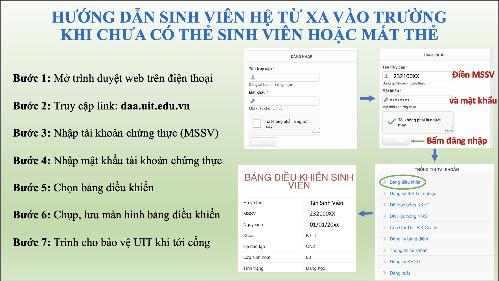

# HƯỚNG DẪN SINH VIÊN RA VÀO TRƯỜNG TẠI CƠ SỞ CHÍNH THỦ ĐỨC

- https://www.citd.vn/huong-dan-sinh-vien-ra-vao-truong-tai-co-so-thu-duc/

Trong thời gian gần đây, các bạn sinh viên thường không mang thẻ sinh viên khi ra vào trường và trong khuôn viên trường. Điều này có thể sẽ dẫn đến kẻ gian lợi dụng sơ hở để vào trường nhất là trong các hoạt động tập trung đông người. Do đó, sinh viên UIT hệ đào tạo từ xa khi ra vào Trường cần chú ý:

1. **Đeo thẻ sinh viên khi đến trường, học tập và sinh hoạt trong khuôn viên trường.**
2. **Sinh viên không đeo thẻ sinh viên, có thể sẽ bị bảo vệ từ chối hoặc kiểm tra CCCD/CMND khi ra vào vào trường.**
3. **Những sinh viên đã bị mất thẻ hoặc chưa được cấp thẻ, đăng nhập tại Cổng Thông tin Đào tạo để minh chứng là sinh viên đang theo học tại trường.**

_**Hướng dẫn chi tiết hình dưới:**_

