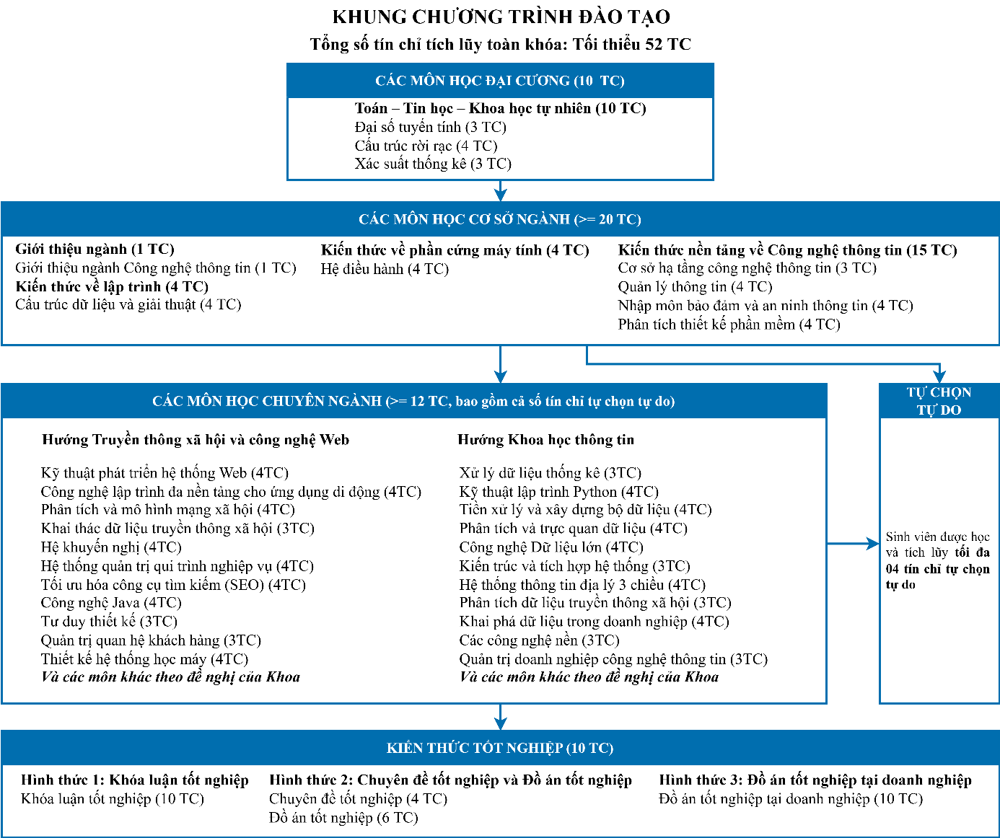

# [Chương trình đào tạo Cử nhân Liên thông Đại học ngành Công nghệ thông tin – Hình thức đào tạo từ xa (Áp dụng từ khoá tuyển 2024)](https://www.citd.vn/chuong-trinh-dao-tao-cu-nhan-lien-thong-nganh-cong-nghe-thong-tin-hinh-thuc-dao-tao-tu-xa-ap-dung-tu-khoa-tuyen-2024/)

- **Tên chương trình:** Chương trình đào tạo Cử nhân Liên thông ngành Công nghệ thông tin – Hình thức đào tạo từ xa
- **Trình độ đào tạo:** Đại học
- **Ngành đào tạo:** Công nghệ Thông tin
- **Mã ngành đào tạo:** 7480201
- **Chương trình đào tạo:** Liên thông đại học từ bậc cao đẳng
- **Loại hình đào tạo:** Đào tạo Từ xa
- **Đối tượng áp dụng:** Từ khóa tuyển năm 2024
- **Thời gian đào tạo**: 1,5 – 2 năm (04 học kỳ chính)
- **Số tín chỉ**: tối thiểu 52 tín chỉ

- **Tên văn bằng sau khi tốt nghiệp**:
  - Tiếng Việt: Cử nhân Công nghệ thông tin
  - Tiếng Anh: Bachelor of Science in Information Technology

## 1. Mục tiêu đào tạo

- Chương trình Cử nhân Công nghệ Thông tin đào tạo những cử nhân ngành Công nghệ thông tin nắm vững các kiến thức cơ bản và chuyên môn sâu về công nghệ thông tin (CNTT);
- đáp ứng các yêu cầu về nghiên cứu phát triển và ứng dụng công nghệ thông tin của xã hội;
- có năng lực tham mưu, tư vấn và có khả năng tổ chức thực hiện nhiệm vụ với tư cách của một chuyên viên trong lĩnh vực CNTT.
- CTĐT định hướng đến việc giúp người học hoàn thiện các kiến thức, kỹ năng đạt trình độ cử nhân từ cấp độ cao đẳng.
- Bên cạnh đó, trên cơ sở các kiến thức được trang bị ở trình độ đại học, người học có đủ năng lực từng bước hoàn thiện khả năng độc lập nghiên cứu, tự bồi dưỡng và tiếp tục lên học các trình độ cao hơn.

## 2. Vị trí và khả năng làm việc sau tốt nghiệp

 Sinh viên tốt nghiệp Chương trình đào tạo Cử nhân Công nghệ Thông tin có khả năng làm việc ở những phạm vi và lĩnh vực khác nhau như:

- Chuyên viên thiết kế, xây dựng và quản lý các dự án nghiên cứu và ứng dụng CNTT, chủ yếu trong lĩnh vực: giao thông, xây dựng, địa lý, môi trường, viễn thám.
- Chuyên viên quản lý, giám sát, đầu tư các dự án công nghệ thông tin.
- Chuyên viên khai thác dữ liệu và thông tin ứng dụng cho các doanh nghiệp trong vấn đề phân tích định lượng.
- Chuyên viên có kĩ năng phát triển các ứng dụng truyền thông xã hội và công nghệ
- Cán bộ giảng dạy, nghiên cứu khoa học và ứng dụng CNTT ở các trường đại học và cao đẳng trên cả nước.

## 3. Chương trình Đào tạo

### 3.1. Tỷ lệ các khối kiến thức

| **Khối kiến thức**                                | **Khối lượng**                     | $\Sigma$ | %     |
| ------------------------------------------------- | ---------------------------------- | -------- | ----- |
| **Khối kiến thức giáo dục đại cương (10 TC)**     | Toán – Tin học – Khoa học tự nhiên | 10       | 19.23 |
| **Khối kiến thức giáo dục chuyên nghiệp (32 TC)** | Gồm 2 phần:                        |          | 61.54 |
|                                                   | Cơ sở ngành                        | 20       |       |
|                                                   | Chuyên ngành (*)                   | ≥ 12     |       |
| **Khối kiến thức tốt nghiệp (10 TC)**             | Chọn 1 trong 3 hình thức sau (**): |          | 19.23 |
|                                                   | Khóa luận tốt nghiệp               | 10       |       |
|                                                   | Chuyên đề tốt nghiệp               | 4        |       |
|                                                   | Đồ án tốt nghiệp                   | 6        |       |
|                                                   | Đồ án tốt nghiệp tại doanh nghiệp  | 10       |       |
| Tổng số tín chỉ tích lũy tối thiểu toàn khóa      |                                    | ≥ 52     | 100   |

Lưu ý:

- (*) Sinh viên chọn các môn chuyên ngành theo hướng dẫn tại mục 3.4.2.
- (**) Sinh viên chọn hình thức tốt nghiệp theo hướng dẫn tại mục 3.5.

### 3.2. Phân bố các khối kiến thức

### 3.3. Khối kiến thức giáo dục đại cương

- Tổng cộng: 10 tín chỉ **.**
- Toán – Tin học – Khoa học tự nhiên

| **STT** | **Mã môn học** | **Tên môn học**   | **TC** | **LT** | **TH** |
| ------- | -------------- | ----------------- | ------ | ------ | ------ |
| 1.      | MA003          | Đại số tuyến tính | 3      | 3      | 0      |
| 2.      | MA004          | Cấu trúc rời rạc  | 4      | 4      | 0      |
| 3.      | MA005          | Xác suất thống kê | 3      | 3      | 0      |

### 3.4. Khối kiến thức giáo dục chuyên nghiệp

- Tổng cộng 32 tín chỉ.

#### 3.4.1. Nhóm các môn học cơ sở ngành

- **Bắt buộc** đối với tất cả sinh viên của ngành.
-  **Tổng cộng 20 tín chỉ**, gồm các môn học trong bảng sau:

| **STT** | **Mã môn học** | **Tên môn học**                        | **TC** | **LT** | **TH** |
| ------- | -------------- | -------------------------------------- | ------ | ------ | ------ |
| 1.      | IE005          | Giới thiệu ngành Công nghệ Thông tin   | 1      | 1      | 0      |
| 2.      | IT003          | Cấu trúc dữ liệu và giải thuật         | 4      | 3      | 1      |
| 3.      | IT007          | Hệ điều hành                           | 4      | 3      | 1      |
| 4.      | IE101          | Cơ sở hạ tầng công nghệ thông tin      | 3      | 2      | 1      |
| 5.      | IE103          | Quản lý thông tin                      | 4      | 3      | 1      |
| 6.      | IE105          | Nhập môn bảo đảm và an ninh thông tin  | 4      | 3      | 1      |
| 7.      | IE108          | Phân tích thiết kế phần mềm (Dự phòng) | 4      | 3      | 1      |
|         |                | **Tổng số tín chỉ**                    | 20     |        |        |

#### 3.4.2. Nhóm các môn học chuyên ngành

- **Bắt buộc** đối với sinh viên ngành Công nghệ thông tin (**Tối thiểu 12 tín chỉ**).
- Sinh viên được chọn môn học chuyên ngành tự do sao cho **tổng số tín chỉ ≥ 12.**
- **Trong đó, sinh viên có thể chọn học các môn học thuộc danh mục 3.4.2.3** để tích lũy **không quá 4 tín chỉ**.
- Bao gồm 02 hướng có vai trò như nhau, trong đó có một số môn thuộc 01 hướng sẽ được gom cụm.
- *Sinh viên có thể chọn các môn học thuộc cả 02 hướng, không nhất thiết cố định 01 hướng*.

##### 3.4.2.1. Hướng Truyền thông xã hội và công nghệ Web

| **STT** | **Mã môn** | **Tên môn**                                          | **TC** | **LT** | **TH** |
| ------- | ---------- | ---------------------------------------------------- | ------ | ------ | ------ |
| 1.      | IE213      | Kỹ thuật phát triển hệ thống Web                     | 4      | 3      | 1      |
| 2.      | IE307      | Công nghệ lập trình đa nền tảng cho ứng dụng di động | 4      | 3      | 1      |
| 3.      | IE233      | Phân tích và mô hình mạng xã hội                     | 4      | 3      | 1      |
| 4.      | IE403      | Khai thác dữ liệu truyền thông xã hội                | 3      | 3      | 0      |
| 5.      | DS300      | Hệ khuyến nghị                                       | 4      | 3      | 1      |
| 6.      | IE203      | Hệ thống quản trị qui trình nghiệp vụ                | 4      | 3      | 1      |
| 7.      | IE204      | Tối ưu hóa công cụ tìm kiếm (SEO)                    | 4      | 3      | 1      |
| 8.      | IE303      | Công nghệ Java                                       | 4      | 3      | 1      |
| 9.      | IE310      | Tư duy thiết kế                                      | 3      | 3      | 0      |
| 10.     | IE301      | Quản trị quan hệ khách hàng                          | 3      | 3      | 0      |
| 11.     | DS322      | Thiết kế hệ thống học máy                            | 4      | 3      | 1      |
|         |            | **Và các môn khác theo đề nghị của Khoa**            |        |        |        |

##### 3.4.2.2. Hướng Khoa học thông tin

| **STT** | **Mã môn** | **Tên môn**                               | **TC** | **LT** | **TH** |
| ------- | ---------- | ----------------------------------------- | ------ | ------ | ------ |
| 1.      | IE201      | Xử lý dữ liệu thống kê                    | 3      | 3      | 0      |
| 2.      | IE221      | Kỹ thuật lập trình Python                 | 4      | 3      | 1      |
| 3.      | DS108      | Tiền xử lý và xây dựng bộ dữ liệu         | 4      | 3      | 1      |
| 4.      | IE313      | Phân tích và trực quan dữ liệu            | 4      | 3      | 1      |
| 5.      | IE212      | Công nghệ Dữ liệu lớn                     | 4      | 3      | 1      |
| 6.      | IE302      | Kiến trúc và tích hợp hệ thống            | 3      | 3      | 0      |
| 7.      | IE402      | Hệ thống thông tin địa lý 3 chiều         | 4      | 3      | 1      |
| 8.      | DS307      | Phân tích dữ liệu truyền thông xã hội     | 3      | 3      | 0      |
| 9.      | DS317      | Khai phá dữ liệu trong doanh nghiệp       | 4      | 3      | 1      |
| 10.     | IE102      | Các công nghệ nền                         | 3      | 2      | 1      |
| 11.     | IE231      | Quản trị doanh nghiệp công nghệ thông tin | 3      | 3      | 0      |
|         |            | **Và các môn khác theo đề nghị của Khoa** |        |        |        |

##### 3.4.2.3. Tự chọn tự do

Sinh viên được học các môn học tự chọn tự do theo danh sách dưới đây để **tích lũy không quá** **4** **tín chỉ** **.** Danh sách môn tự chọn tự do gợi ý:

| **STT** | **Mã môn** | **Tên môn**                                                  | **TC** | **LT** | **TH** |
| ------- | ---------- | ------------------------------------------------------------ | ------ | ------ | ------ |
| 1.      | BUS1125    | Khởi nghiệp kinh doanh                                       | 3      | 2      | 1      |
| 2.      | TLH025     | Tâm lý học nhân cách                                         | 3      | 3      | 0      |
| 3.      | INI01      | Thực tập quốc tế                                             | 2      | 2      | 0      |
| 4.      | IE207      | Đồ án                                                        | 2      | 0      | 2      |
| 5.      | IE309      | Thực tập doanh nghiệp                                        | 2      | 2      | 0      |
| 6.      | DS323      | Viết báo cáo kỹ thuật và thuyết trình                        | 3      | 3      | 0      |
| 7.      | SE113      | Kiểm chứng phần mềm (Có môn học trước)                       | 4      | 3      | 1      |
| 8.      | NT212      | An toàn dữ liệu, khôi phục thông tin sau sự cố (Có môn học trước) | 3      | 2      | 1      |
| 9.      | NT213      | Bảo mật web và ứng dụng (Có môn học trước)                   | 3      | 2      | 1      |
|         |            | **Và các môn khác theo đề nghị của Khoa**                    |        |        |        |

### 3.5. Khối kiến thức tốt nghiệp

- Tổng cộng 10 tín chỉ.

Sinh viên chọn **một trong ba** hình thức tốt nghiệp sau:

- Hình thức 1: **Khóa luận tốt nghiệp (10 tín chỉ)**;
- Hình thức 2: **Chuyên đề tốt nghiệp (4 tín chỉ)** và **Đồ án tốt nghiệp (6 tín chỉ)**;
- Hình thức 3: **Đồ án tốt nghiệp tại doanh nghiệp (10 tín chỉ)** .

#### 3.5.1. Hình thức 1: Khóa luận tốt nghiệp

- Sinh viên thực hiện **Khóa luận tốt nghiệp (10 tín chỉ)**.

| **STT** | **Mã môn học** | **Tên môn học**      | **TC** | **LT** | **TH** |
| ------- | -------------- | -------------------- | ------ | ------ | ------ |
| 1.      | IE505          | Khóa luận tốt nghiệp | 10     | 10     | 0      |

- **Lưu ý:** Sinh viên đủ điều kiện làm Khóa luận tốt nghiệp theo quy chế của trường mới có thể đăng ký làm Khóa luận tốt nghiệp.

#### 3.5.2. Hình thức 2: Chuyên đề tốt nghiệp và Đồ án tốt nghiệp

- Sinh viên thực hiện:
  - **Chuyên đề tốt nghiệp (4 tín chỉ)** và
  - **Đồ án tốt nghiệp (6 tín chỉ)**.

| **STT** | **Mã môn học** | **Tên môn học**      | **TC** | **LT** | **TH** |
| ------- | -------------- | -------------------- | ------ | ------ | ------ |
| 1.      | IE400          | Chuyên đề tốt nghiệp | 4      | 4      | 0      |
| 2.      | IE501          | Đồ án tốt nghiệp     | 6      | 6      | 0      |

#### 3.5.3. Hình thức 3: Đồ án tốt nghiệp tại doanh nghiệp

- Sinh viên thực hiện **Đồ án tốt nghiệp tại doanh nghiệp (10 tín chỉ)** .

| **STT** | **Mã môn học** | **Tên môn học**                   | **TC** | **LT** | **TH** |
| ------- | -------------- | --------------------------------- | ------ | ------ | ------ |
| 1.      | IE502          | Đồ án tốt nghiệp tại doanh nghiệp | 10     | 10     | 0      |

### 3.6. Quy định đối với sinh viên từ khóa 2023 trở về trước

* Sinh viên từ khóa 2023 trở về trước chọn môn học đã cập nhật mới theo bảng quy đổi tương đương sau:

| **STT** | **Môn học trong chương trình đào tạo cũ** |                       |            | **Môn học tương đương mới**               |
| ------- | ----------------------------------------- | --------------------- | ---------- | ----------------------------------------- |
|         | **Mã môn**                                | **Tên môn học**       | **Mã môn** | **Tên môn học**                           |
| 1.      | IE202                                     | Quản trị doanh nghiệp | IE231      | Quản trị doanh nghiệp Công nghệ thông tin |
| 2.      | IS353                                     | Mạng xã hội           | IE233      | Phân tích và mô hình mạng xã hội          |
| 3.      | IE224                                     | Phân tích dữ liệu     | IE313      | Phân tích và trực quan dữ liệu            |

## 4. KẾ HOẠCH GIẢNG DẠY 

### 4.1. Sơ đồ mối liên hệ thứ tự học giữa các môn học

Được trình bày qua sơ đồ dưới đây:

### 4.2. Kế hoạch giảng dạy mẫu

Kế hoạch giảng dạy mẫu được áp dụng cho kế hoạch học theo chuyên ngành có định hướng và tích lũy tín chỉ để tốt nghiệp.

#### HK1

| **Học kỳ** | **Mã môn** | **Tên môn học**                      | **TC** | **LT** | **TH** |
| ---------- | ---------- | ------------------------------------ | ------ | ------ | ------ |
| Học kỳ 1   | IE005      | Giới thiệu ngành Công nghệ Thông tin | 1      | 1      | 0      |
| Học kỳ 1   | IE101      | Cơ sở hạ tầng Công nghệ thông tin    | 3      | 2      | 1      |
| Học kỳ 1   | IE103      | Quản lý thông tin                    | 4      | 3      | 1      |
| Học kỳ 1   | MA003      | Đại số tuyến tính                    | 4      | 3      | 0      |
| Học kỳ 1   | IT007      | Hệ điều hành                         | 4      | 3      | 1      |
| Học kỳ 1   |            | **Tổng số tín chỉ HK1**              | 15     |        |        |

#### HK2

| **Học kỳ** | **Mã môn** | **Tên môn học**                       | **TC** | **LT** | **TH** |
| ---------- | ---------- | ------------------------------------- | ------ | ------ | ------ |
| Học kỳ 2   | IT003      | Cấu trúc dữ liệu và giải thuật        | 4      | 3      | 1      |
| Học kỳ 2   | MA004      | Cấu trúc rời rạc                      | 4      | 4      | 0      |
| Học kỳ 2   | IE105      | Nhập môn bảo đảm và an ninh thông tin | 4      | 3      | 1      |
| Học kỳ 2   | MA005      | Xác suất thống kê                     | 3      | 3      | 0      |
|            |            | **Tổng số tín chỉ HK2**               | 15     |        |        |

#### HK3

| **Học kỳ** | **Mã môn**          | **Tên môn học**                                              | **TC** | **LT** | **TH** |      |
| ---------- | ------------------- | ------------------------------------------------------------ | ------ | ------ | ------ | ---- |
| Học kỳ 3   | IE400               | Chuyên đề tốt nghiệp (**) (Bắt buộc nếu chọn hình thức 2 ở khối kiến thức tốt nghiệp) | 4      | 4      | 0      |      |
| Học kỳ 3   |                     | **Các môn học chuyên ngành (\*)**                            | ≥ 12   |        |        |      |
| Học kỳ 3   | Tổng số tín chỉ HK3 | – Nếu không tính Chuyên đề tốt nghiệp: ≥ 12 TC               | ≥ 12   |        |        |      |
| Học kỳ 3   |                     | – Nếu tính Chuyên đề tốt nghiệp: ≥16 TC                      | >= 16  |        |        |      |

#### HK4

* Sinh viên chọn 1 trong 3 hình thức sau (\**\*):

| **Học kỳ** | **Mã môn** | **Tên môn học**                                              | **TC** | **LT** | **TH** |
| ---------- | ---------- | ------------------------------------------------------------ | ------ | ------ | ------ |
| Học kỳ 4   |            |                                                              |        |        |        |
| Học kỳ 4   |            | Hình thức 1: Khóa luận tốt nghiệp                            |        |        |        |
| Học kỳ 4   | IE505      | Khóa luận tốt nghiệp                                         | 10     | 30     | 0      |
| Học kỳ 4   |            | Hình thức 2: Chuyên đề tốt nghiệp và Đồ án tốt nghiệp (riêng Chuyên đề tốt nghiệp (4 TC) đã hoàn thành ở học kỳ 3) |        |        |        |
| Học kỳ 4   | IE501      | Đồ án tốt nghiệp                                             | 6      | 6      | 0      |
| Học kỳ 4   |            | Hình thức 3: Đồ án tốt nghiệp tại doanh nghiệp               |        |        |        |
| Học kỳ 4   | IE502      | Đồ án tốt nghiệp tại doanh nghiệp                            | 10     | 10     | 0      |

- Tổng số tín chỉ HK4:
  - Nếu chọn hình thức 1 hoặc 3: 6 TC.
  - Nếu chọn hình thức 2: 10 TC.
- Tổng số tín chỉ học toàn khóa: $\ge$ 52.

Lưu ý:

- (\*) Các môn học chuyên ngành được hướng dẫn tại mục 3.4.2.
- (\*\*) Sinh viên bắt buộc chọn môn Chuyên đề tốt nghiệp nếu chọn hình thức 2 (Chuyên đề tốt nghiệp và Đồ án tốt nghiệp) ở khối kiến thức tốt nghiệp. Trong trường hợp sinh viên chọn hình thức 1 hoặc 3 ở khối kiến thức tốt nghiệp thì môn Chuyên đề tốt nghiệp sẽ được tích lũy vào khối kiến thức chuyên ngành.
- (\*\*\*) Các hình thức tốt nghiệp được hướng dẫn tại mục 3.5.

## 5. ĐIỀU KIỆN TỐT NGHIỆP

Công nhận tốt nghiệp:

- Sinh viên đã tích lũy **tối thiểu 52 tín chỉ** và đã hoàn thành các môn học bắt buộc của chương trình đào tạo tương ứng với chuyên ngành.
- Ngoài ra, sinh viên phải đáp ứng đủ các điều kiện khác theo Quy chế đào tạo hiện hành của Trường Đại học Công nghệ Thông tin.