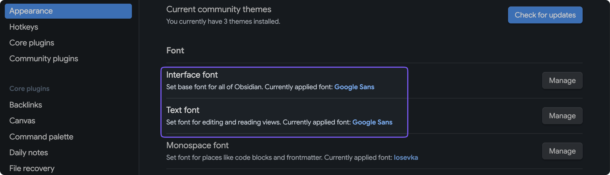
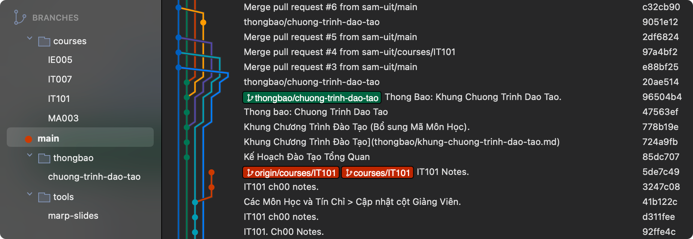

# HOW TO

## Fonts

- Google Sans: https://fonts.google.com/specimen/Google+Sans
- This is the font for both Obsidian UI font and document font.
- You're free to pick any other font you want actually.



## Getting Started

1. Clone this repo.
2. Install [Obsidian](https://obsidian.md/).
3. Open the repo folder as vault.
4. Install necessary [tools](tools.md) if needed.
5. Enjoy.

## Quick Start Templates

Copy đoạn này vào đầu mỗi file note mới để đảm bảo đúng chuẩn:

```yaml
---
id:
type: Note
created: 2025-MM-DD
tags:
  - UIT/
---

# Tiêu đề

(Nội dung...)

```

## Setup Môi trường (Automated)

Để không phải chỉnh tay các thông số Tab/EOL:

1. Cài đặt VS Code (hoặc Editor hỗ trợ EditorConfig).
2. Đảm bảo file `.editorconfig` đã có trong thư mục gốc (nếu chưa, hãy pull về).
3. Editor sẽ tự động format theo chuẩn Unix (`\n`) và 4 spaces tab.

## Contribution

1. Fork this repo.
2. Commit.
3. Create Pull Request (PR)s.
4. Get approved and merged.

Chuẩn hóa:

- Mỗi môn nên có một branch riêng, nằm trong thư mục `courses`.
    - Vì mỗi môn là duy nhất (tham chiếu tới mã môn) nên không cần thư mục cha của `courses`, ví dụ `uit/courses`, vì khi nhìn vào `courses/IE005` hoàn toàn biết đó là (course) của UIT.
- Tương tự, các thư mục con tương ứng nên có các thư mục/branch tương ứng:
    - Ví dụ `tools/marp-slides`: đây là branch để cập nhật hướng dẫn về plugin `marp-slides` thuộc thư mục `tools`.

Trực quan hóa:


