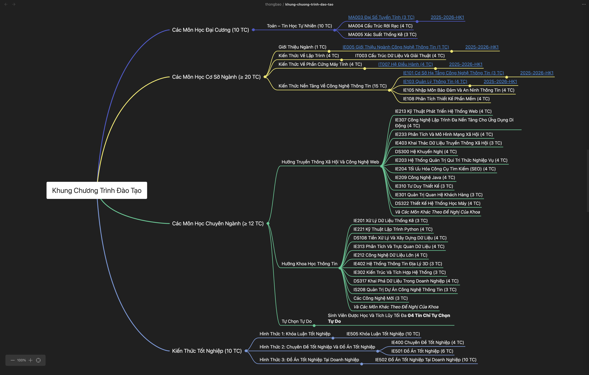
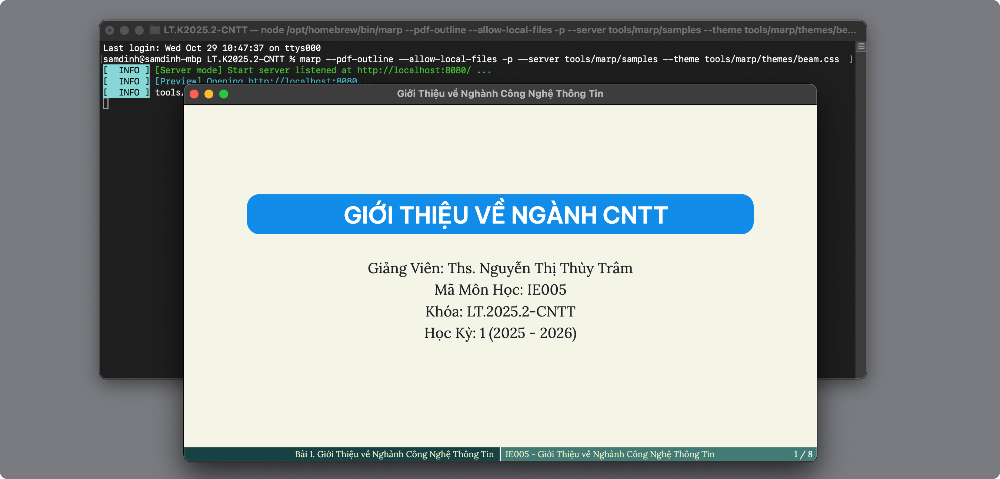

# Tools

* Tools that support to create/modify/manage the materials.

## Thông Tin Chung

**Obsidian Plugins (Essential)**

- **Dataview:** Biến kho dữ liệu thành cơ sở dữ liệu. Giúp tạo bảng danh sách các bài học, bài tập dựa trên YAML header đã quy định.
- **Templater:** Tự động chèn YAML header mẫu và ngày giờ khi tạo file mới, đảm bảo đúng format của `CONTRIBUTION.md`.
- **Linter:** Tự động format file (chuẩn hóa YAML, xóa khoảng trắng thừa) mỗi khi lưu, giúp tuân thủ quy tắc EOL/EOF.

**Development Tools**

- **VS Code:** Editor mạnh mẽ thay thế Typora khi cần chỉnh sửa hàng loạt hoặc code. Cài extension `EditorConfig for VS Code`.
- **Git Graph (VS Code Ext):** Để trực quan hóa các nhánh `courses/...` như mô tả trong file HOWTO.

## Obsidian

- [https://obsidian.md/](https://obsidian.md/)
- A Personal Knowledge Base (PKB) software.

## Typora

- A Markdown Editor.
- https://typora.io/
- Theme: [Newsprint (default) with Lora font](Typora/themes)

## MarkMap

- Homepage: https://markmap.js.org/
- Tạo mindmap từ Markdown.
- Trích xuất SVG hoặc HTML.
- Ví dụ:
    - Download và mở trong trình duyệt: [khung-chuong-trinh-dao-tao.html](../thongbao/khung-chuong-trinh-dao-tao.html)
    - (TODO: bổ sung ví dụ SVG)

## MarkMind

- Một plugin của Obsidian.
- Tạo mindmap từ Markdown notes, tương tự với MarkMap, nhưng ngay bên trong Obsidian.
- Homepage: https://github.com/MarkMindCkm/obsidian-markmind
- Ví dụ:



## Marpit

- Homepage: https://marpit.marp.app/
- Markdown slide deck framework.

How to:

1. Install the `marp-cli`.
2. Run the command:

```bash
marp --pdf-outline --allow-local-files -p --server path/to/md-folder/ --theme path/to/them-file.css
```

Ví dụ:

```bash
marp --pdf-outline --allow-local-files -p --server tools/marp/samples --theme tools/marp/themes/beam.css
```

In action:



## Marp Slides (obsidian-marp-slides)

* Name: [obsidian-marp-slides](https://github.com/samuele-cozzi/obsidian-marp-slides)
* An [Obsidian plugin](https://github.com/samuele-cozzi/obsidian-marp-slides) that helps to generate slides from a [MarpIt](https://marpit.marp.app/) format.
* Settings:
    * Theme folder: `tools/marp/themes`
* Check out a sample here:
    * The Markdown file: [l01](marp/samples/l01.md)
    * The generated PDF file: [l01](marp/samples/l01.pdf)

## Diagram

- Dot/Graphviz
    - https://rsms.me/graphviz/
    - https://edotor.net/
    - https://www.devtoolsdaily.com/graphviz/
    - https://magjac.com/graphviz-visual-editor
- D2
    - https://play.d2lang.com/
- PlantUML
    - [https://www.planttext.com/](https://www.planttext.com/)
    - https://editor.plantuml.com/
