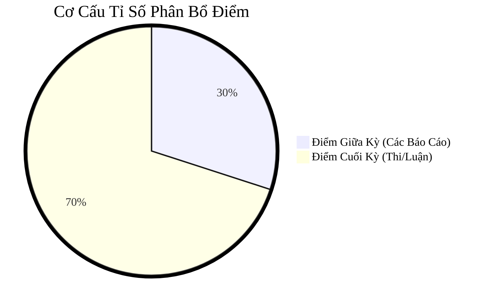

# IE005 - Giới Thiệu Nghành Công Nghệ Thông Tin

- [Học Kỳ 1, 2025 - 2026 ](../../../2025-2026-HK1.md)
- Group Zalo Môn IE005: [https://zalo.me/g/rdvfes097](https://zalo.me/g/rdvfes097)
* [(Google Sheets) ĐĂNG KÝ NHÓM](https://docs.google.com/spreadsheets/d/1l7vLO6uBur1V_M1XRv_kjETJpmH5bEGKbCgRSGL2PRI/edit?usp=sharing)
* Group Zalo Nhóm 01: [https://zalo.me/g/hwavpi232](https://zalo.me/g/hwavpi232)

## Lưu Ý

- (Trống/chưa bổ sung)

## Cơ Cấu Tỉ Số Phân Bổ Điểm

## Giáo Trình & Tài Liệu

### Đề Cương

- [IE005-Introduction-to-Information-Technology](syllabus/IE005-Introduction-to-Information-Technology.pdf)

### Slides/Bài Giảng

1. [Bài 1. Giới thiệu về Công nghệ thông tin](lectures/l01.pdf)
2. [Bài 2. Tổng Quan Chương Trình Đào Tạo](lectures/l02.pdf)

### Notes

1. [l01](notes/l01.md)
2. [l02](notes/l02.md)

## Reports / Báo Cáo

### Buổi 2 (251028)

- Yêu cầu: [report-buoi-2](reports/buoi-2/report-buoi-2.md)
- Nhóm 1:
    - [Slides PDF](reports/buoi-2/IE005-reports-buoi-2-Nhom-1.pdf)
    - [Slides PPTX](reports/buoi-2/IE005-reports-buoi-2-Nhom-1.pptx)

## Tiểu Luận Kết Môn

1. Mỗi nhóm thực hiện 1 nội dung. Mỗi người có một ý.
2. Tất cả mọi người đều phải trình bày. Mỗi người tối đa 2 phút trình bày.
3. Quay và làm/nối thành video.
4. Video + nói Slides càng tốt. Video có khuôn mặt thì cộng điểm.
5. Nộp video + slides.
6. Cô sẽ cung cấp nội dung sau khoảng 2 tuần nữa.
7. Nộp bài vào khoảng 1 tuần trước hoặc sau khi thi cuối kỳ.
