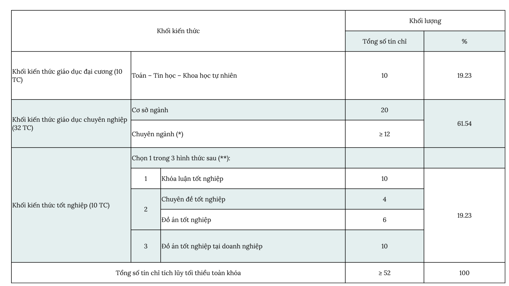

# Bài 2. Tổng Quan Về Chương Trình Đào Tạo

Thông tin môn học:

-   Giảng Viên: Ths. Nguyễn Thị Thùy Trâm
-   Mã Môn Học: IE005
-   Khóa: LT.2025.2-CNTT
-   Học Kỳ: 1 (2025 - 2026)

Nội dung môn học: Giới Thiệu về Nghành Công Nghệ Thông Tin.

1. Giới thiệu về Công nghệ thông tin
2. Tổng quan về chương trình đào tạo
3. Học CNTT như thế nào để đạt hiệu quả
4. Các Công nghệ đang hót trong ngành CNTT
5. Ngành CNTT có nghiên cứu khoa học hay không
6. Các phẩm chất cần có của 1 cử nhân CNTT

## Nội dung Bài 2.

1.   Tổng quan
2.   Chương trình đào tạo chi tiết
3.   Điều kiện tốt nghiệp
4.   Các môn học đặc thù của ngành CNTT
5.   Con đường nghề nghiệp

## A. Tổng quan

### Mục tiêu đào tạo

Đào tạo cử nhân ngành Công nghệ thông tin.

* Có phẩm chất chính trị tốt, có đạo đức nghề nghiệp, có ý thức trách nhiệm tổ chức, và có sức khỏe tốt ➔ thái độ tốt.
* Nắm vững các kiến thức cơ bản và chuyên môn sâu về công nghệ thông tin (CNTT) ➔ kiến thức tốt.
* Có đủ năng lực từng bước hoàn thiện khả năng độc lập nghiên cứu, tự bồi dưỡng và tiếp tục lên học các trình độ cao hơn ➔ kỹ năng tốt.

*Năng lực bản thân = Thái độ + kiến thức + Kỹ năng.*

### Vị trí việc làm

- Chuyên viên thiết kế, xây dựng và quản lý các dự án nghiên cứu và ứng dụng CNTT, chủ yếu trong lĩnh vực: giao thông, xây dựng, địa lý, môi trường, viễn thám.
- Chuyên viên quản lý, giám sát, đầu tư các dự án công nghệ thông tin.
- Chuyên viên khai thác dữ liệu và thông tin ứng dụng cho các doanh nghiệp trong vấn đề phân tích định lượng.
- Chuyên viên có kĩ năng phát triển các ứng dụng truyền thông xã hội và công nghệ
- Cán bộ giảng dạy, nghiên cứu khoa học và ứng dụng CNTT ở các trường đại học và cao đẳng trên cả nước.

### Vị trí việc làm

Ngoài ra hiện nay mở ra các vị trí việc làm mới phù hợp với thực tế:

- Kỹ sư Cloud Computing (điện toán đám mây)
- Chuyên viên UX/UI Design (trải nghiệm người dùng)
- Kỹ sư Blockchain
- Kỹ sư IoT (Internet of Things)
- Chuyên viên chuyển đổi số (Digital Transformation Officer)

### Quan điểm xây dựng chương trình đào tạo ngành CNTT

- Đảm bảo: *độ sâu và độ phủ*.
- Thiết kế, xây dựng dựa vào *tầm nhìn* và *sứ mệnh* nhà trường.

## B. Chương trình đào tạo chi tiết

Các Văn Bằng:

1. Cử nhân Văn bằng 1
2. Cử nhân Văn bằng 2
3. Liên thông Đại học

Nội Dung:

1. Tỷ lệ khối kiến thức
2. Phân bố khối kiến thức
3. Khối kiến thức giáo dục đại cương
4. Khối kiến thức giáo dục chuyên nghiệp

### Tỷ lệ khối kiến thức văn bằng 1

(bỏ qua)

### Tỷ lệ khối kiến thức văn bằng 2

(bỏ qua)

### Tỷ lệ khối kiến thức Liên Thông

### Phân bổ khối kiến thức Liên Thông

### Khối kiến thức giáo dục đại cương Liên Thông

| **STT** | **Mã môn học** | **Tên môn học**   | **TC** | **LT** | **TH** |
| ------- | -------------- | ----------------- | ------ | ------ | ------ |
| 1.      | MA003          | Đại số tuyến tính | 3      | 3      | 0      |
| 2.      | MA004          | Cấu trúc rời rạc  | 4      | 4      | 0      |
| 3.      | MA005          | Xác suất thống kê | 3      | 3      | 0      |

### Các môn học cơ sở ngành liên thông đại học Liên Thông

| **STT** | **Mã môn học** | **Tên môn học**                        | **TC** | **LT** | **TH** |
| ------- | -------------- | -------------------------------------- | ------ | ------ | ------ |
| 1.      | IE005          | Giới thiệu ngành Công nghệ Thông tin   | 1      | 1      | 0      |
| 2.      | IT003          | Cấu trúc dữ liệu và giải thuật         | 4      | 3      | 1      |
| 3.      | IT007          | Hệ điều hành                           | 4      | 3      | 1      |
| 4.      | IE101          | Cơ sở hạ tầng công nghệ thông tin      | 3      | 2      | 1      |
| 5.      | IE103          | Quản lý thông tin                      | 4      | 3      | 1      |
| 6.      | IE105          | Nhập môn bảo đảm và an ninh thông tin  | 4      | 3      | 1      |
| 7.      | IE108          | Phân tích thiết kế phần mềm (Dự phòng) | 4      | 3      | 1      |
|         |                | **Tổng số tín chỉ**                    | 20     |        |        |

### Chuyên Ngành: Truyền thông xã hội và công nghệ Web

| **STT** | **Mã môn** | **Tên môn**                                          | **TC** | **LT** | **TH** |
| ------- | ---------- | ---------------------------------------------------- | ------ | ------ | ------ |
| 1.      | IE213      | Kỹ thuật phát triển hệ thống Web                     | 4      | 3      | 1      |
| 2.      | IE307      | Công nghệ lập trình đa nền tảng cho ứng dụng di động | 4      | 3      | 1      |
| 3.      | IE233      | Phân tích và mô hình mạng xã hội                     | 4      | 3      | 1      |
| 4.      | IE403      | Khai thác dữ liệu truyền thông xã hội                | 3      | 3      | 0      |
| 5.      | DS300      | Hệ khuyến nghị                                       | 4      | 3      | 1      |
| 6.      | IE203      | Hệ thống quản trị qui trình nghiệp vụ                | 4      | 3      | 1      |
| 7.      | IE204      | Tối ưu hóa công cụ tìm kiếm (SEO)                    | 4      | 3      | 1      |
| 8.      | IE303      | Công nghệ Java                                       | 4      | 3      | 1      |
| 9.      | IE310      | Tư duy thiết kế                                      | 3      | 3      | 0      |
| 10.     | IE301      | Quản trị quan hệ khách hàng                          | 3      | 3      | 0      |
| 11.     | DS322      | Thiết kế hệ thống học máy                            | 4      | 3      | 1      |
|         |            | **Và các môn khác theo đề nghị của Khoa**            |        |        |        |

### Chuyên Ngành: Khoa học thông tin

| **STT** | **Mã môn** | **Tên môn**                               | **TC** | **LT** | **TH** |
| ------- | ---------- | ----------------------------------------- | ------ | ------ | ------ |
| 1.      | IE201      | Xử lý dữ liệu thống kê                    | 3      | 3      | 0      |
| 2.      | IE221      | Kỹ thuật lập trình Python                 | 4      | 3      | 1      |
| 3.      | DS108      | Tiền xử lý và xây dựng bộ dữ liệu         | 4      | 3      | 1      |
| 4.      | IE313      | Phân tích và trực quan dữ liệu            | 4      | 3      | 1      |
| 5.      | IE212      | Công nghệ Dữ liệu lớn                     | 4      | 3      | 1      |
| 6.      | IE302      | Kiến trúc và tích hợp hệ thống            | 3      | 3      | 0      |
| 7.      | IE402      | Hệ thống thông tin địa lý 3 chiều         | 4      | 3      | 1      |
| 8.      | DS307      | Phân tích dữ liệu truyền thông xã hội     | 3      | 3      | 0      |
| 9.      | DS317      | Khai phá dữ liệu trong doanh nghiệp       | 4      | 3      | 1      |
| 10.     | IE102      | Các công nghệ nền                         | 3      | 2      | 1      |
| 11.     | IE231      | Quản trị doanh nghiệp công nghệ thông tin | 3      | 3      | 0      |
|         |            | **Và các môn khác theo đề nghị của Khoa** |        |        |        |

### Tự Chọn Tự Do

| **STT** | **Mã môn** | **Tên môn**                                                  | **TC** | **LT** | **TH** |
| ------- | ---------- | ------------------------------------------------------------ | ------ | ------ | ------ |
| 1.      | BUS1125    | Khởi nghiệp kinh doanh                                       | 3      | 2      | 1      |
| 2.      | TLH025     | Tâm lý học nhân cách                                         | 3      | 3      | 0      |
| 3.      | INI01      | Thực tập quốc tế                                             | 2      | 2      | 0      |
| 4.      | IE207      | Đồ án                                                        | 2      | 0      | 2      |
| 5.      | IE309      | Thực tập doanh nghiệp                                        | 2      | 2      | 0      |
| 6.      | DS323      | Viết báo cáo kỹ thuật và thuyết trình                        | 3      | 3      | 0      |
| 7.      | SE113      | Kiểm chứng phần mềm (Có môn học trước)                       | 4      | 3      | 1      |
| 8.      | NT212      | An toàn dữ liệu, khôi phục thông tin sau sự cố (Có môn học trước) | 3      | 2      | 1      |
| 9.      | NT213      | Bảo mật web và ứng dụng (Có môn học trước)                   | 3      | 2      | 1      |
|         |            | **Và các môn khác theo đề nghị của Khoa**                    |        |        |        |

## Điều kiện tốt nghiệp

### Liên Thông Đại Học

- Để được công nhận tốt nghiệp **“Cử nhân ngành Công nghệ Thông tin”**, sinh viên phải thỏa tích lũy tối thiểu **52 tín chỉ** đối với sinh viên tốt nghiệp đúng chuyên ngành theo Chương trình Đào tạo. Đối với sinh viên tốt nghiệp ngành gần sẽ học bổ sung môn học theo yêu cầu của Hội đồng tuyển sinh.

## Con đường nghề nghiệp

(bỏ qua)

## Mục tiêu sau khi học xong ngành CNTT

- Nâng cao trình độ học vấn và chuyên môn.
- Hiểu biết sâu rộng về các lĩnh vực của ngành
- Khả năng phân tích, thiết kế, phát triển hệ thống
- Nghiên cứu và phát triển.
- Kỹ năng giải quyết vấn đề.
- Cải thiện khả năng làm việc nhóm và quản lý dự án.
- Phát triển kỹ năng lãnh đạo.

## Tài liệu tham khảo

1. Chương trình đào tạo Cử nhân liên thông ngành Công nghệ thông tin, Khoa Khoa học và Kỹ thuật thông tin (2024).
2. https://www.citd.vn/chuong-trinh-dao-tao-cu-nhan-cong-nghe-thong-tin-hinh-thuc-dao-tao-tu-xa-ap-dung-tu-khoa-tuyen-2024/
