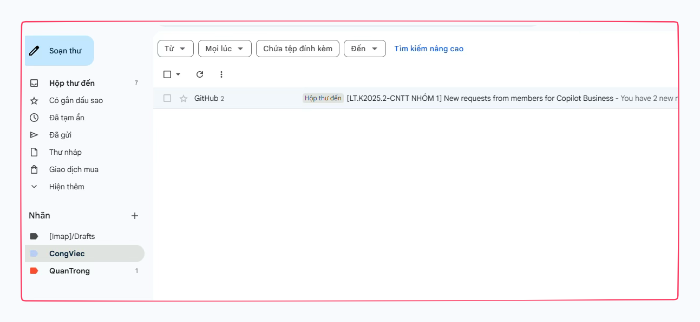
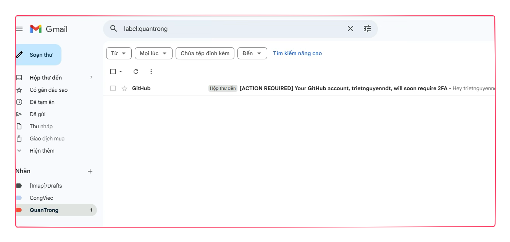
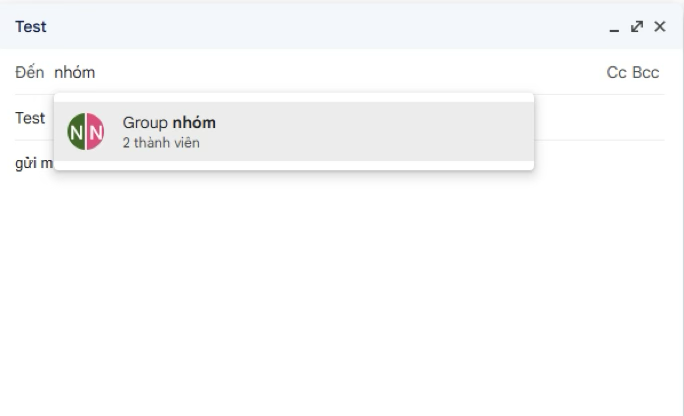
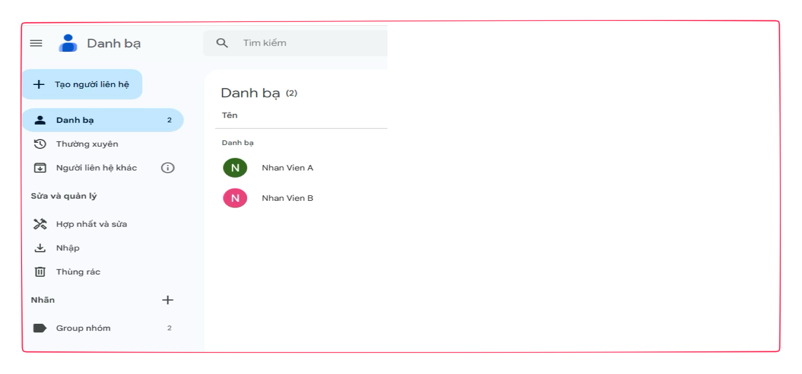
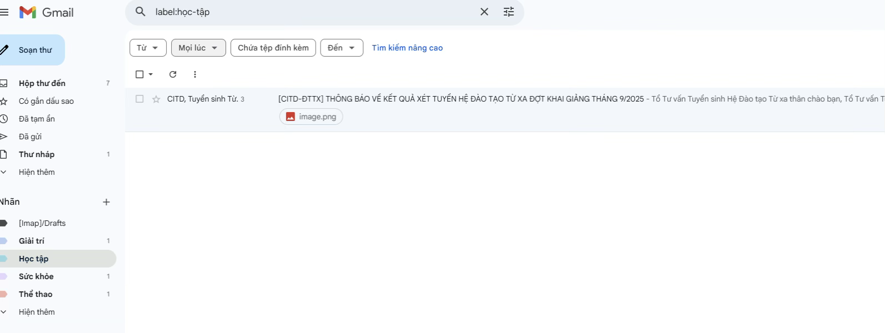
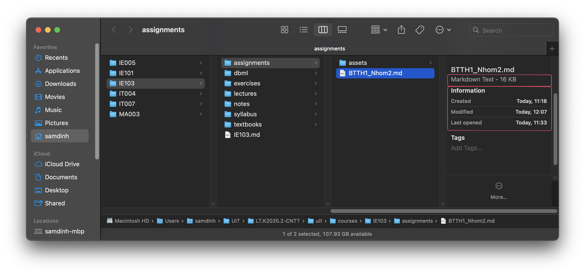
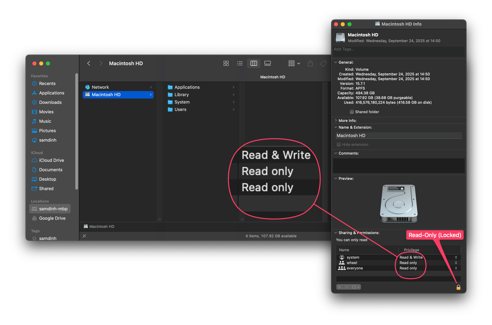
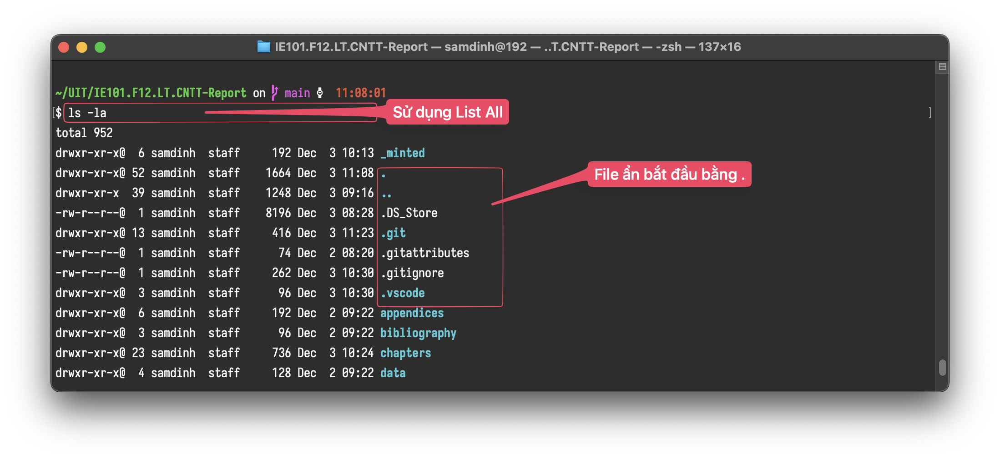

# IE103 - BÀI TẬP THỰC HÀNH 1 - NHÓM 2

- Mã Lớp: IE103.F12.LT.CNTT
- Mã Môn: IE103 - Quản Lý Thông Tin
- Giảng Viên: ThS. Nguyễn Thành Luân
- Nhóm: 2 (Omega)

## Nhóm 2 (Omega)

| No   | MSSV     | Họ và Tên             |
| ---- | -------- | --------------------- |
| 1    | 25410291 | Đinh Xuân Sâm         |
| 2    | 25410319 | Đặng Hữu Toàn         |
| 3    | 25410321 | Nguyễn Điền Triết     |
| 4    | 25410204 | Trương Xuân Hậu       |
| 5    | 25410338 | Lê Anh Vũ             |
| 6    | 25410176 | Trần Sơn Bình         |
| 7    | 25410247 | Lê Kim Long           |
| 8    | 25410337 | La Anh Vũ             |
| 9    | 25410209 | Lê Ngọc Hiệp          |
| 10   | 25410271 | Nguyễn Thị Ngọc Nhung |

## Mục Lục

[TOC]

## Câu 1 (Gmail)

### Câu Hỏi

Trong Gmail, anh/chị hãy cho biết:

1. Gmail đã cung cấp các tính năng gì để phục vụ cho việc tổ chức tốt các mails?
2. Cấu trúc đầy đủ của một email.
3. Phân loại mails.
4. Khái niệm mailgroup.
5. Hãy tạo thêm các thư mục (Label) sau: Giải Trí, Sức Khỏe, Thể Thao, Học Tập.
6. Hãy đánh dấu và di chuyển các mails vào các thư mục vừa tạo tương ứng.
7. Một account hiện tại có dung lượng tối đa bao nhiêu?
8. Hãy tạo ra một mailgroup trong gmail và cho biết lợi ích của nó? Tìm hiểu các tính năng admin/member.
9. Các tính năng tìm kiếm mail.
10. Tìm hiểu tính năng: Filter message like this.

### Bài Làm

#### Các tính năng tổ chức mail

Gmail cung cấp các tính năng hỗ trợ công việc như:

- Tổ chức email bằng bộ lọc (Filter) và nhãn (Label),
- Tìm kiếm nhanh,
- Chặn spam hiệu quả và lưu trữ an toàn.
- Ngoài ra còn tích hợp Drive/Meet để chia sẻ tài liệu và trao đổi thuận tiện.

##### Cấu trúc đầy đủ của một email

###### Header (Phần tiêu đề)

| Thành phần | Ý Nghĩa           | Mục đích                                                     | Lưu ý                                                        |
| ---------- | ----------------- | ------------------------------------------------------------ | ------------------------------------------------------------ |
| From       | Người gửi         | Địa chỉ email của bạn.                                       | Nên sử dụng một địa chỉ email chuyên nghiệp (ví dụ: `[tên].[họ]@congty.com`). |
| To         | Người nhận        | Địa chỉ email của người/tổ chức bạn muốn gửi thư.            | Kiểm tra kỹ lưỡng, tránh gửi nhầm hoặc thiếu người quan trọng. |
| Cc         | Carbon Copy       | Gửi bản sao cho những người cần nắm thông tin nhưng không cần phản hồi trực tiếp. | Sử dụng khi cần thông báo cho cấp trên, đồng nghiệp liên quan. |
| Bcc        | Blind Carbon Copy | Gửi bản sao bí mật. Người nhận trong mục To và Cc sẽ không thấy danh sách email trong mục Bcc. | Sử dụng để bảo mật danh sách người nhận (ví dụ: gửi email marketing). |
| Subject    | Tiêu đề           | Tóm tắt nội dung email một cách ngắn gọn, rõ ràng, và thu hút. | Quan trọng nhất! Cần rõ ràng, tối đa 5-7 từ, ví dụ: "*Báo cáo tiến độ dự án A1 – Tuần 3*" hoặc "*Đề xuất họp khẩn về chiến lược kinh doanh*". |

###### Các phần khác:

- **Salutation:** Lời chào.
- **Body:** Nội dung chính.
- **Closing:** Lời kết.
- **Signature:** Chữ ký.
- **Attachments:** Tệp đính kèm.

##### Phân loại mails

Phân loại mail là sắp xếp email theo nhãn (Label), thư mục hoặc tiêu chí nhất định để dễ quản lý.

- Công Việc



- Quan Trọng



##### Khái niệm Mail Group

Mail group là nhóm gồm nhiều địa chỉ email được gom lại dưới một tên chung. Khi gửi email đến mail group, hệ thống sẽ tự động gửi cho tất cả các thành viên trong nhóm.





#### Tạo thư mục (Label) và di chuyển mail

Đã thực hiện tạo các nhãn: Giải Trí, Sức Khỏe, Thể Thao, Học Tập và di chuyển mail tương ứng.



#### Dung lượng tối đa

- **Gmail miễn phí:** 15 GB (dùng chung cho Gmail, Drive, Photos).
- **Google Workspace (Trả phí):** Từ 30 GB đến 5 TB hoặc không giới hạn tùy gói.

#### Mail Group (Lợi ích và Vai trò)

##### Cách tạo

* **Truy cập: groups.google.com** và đăng nhập bằng tài khoản Google của bạn.
* **Tạo nhóm:** Nhấp vào **"Create group"**.
* **Thiết lập cơ bản:**
  * **Tên nhóm:** Tên hiển thị (**ví dụ: "Ban Phát triển Sản phẩm"**).
  * **Địa chỉ Email Nhóm:** Địa chỉ email độc nhất (ví dụ: `pds@googlegroups.com`).
  * **Mô tả:** Giải thích mục đích của nhóm.
* **Thiết lập quyền riêng tư:** Chọn giữa các loại nhóm:
  * **Công khai (Public):** Bất kỳ ai cũng có thể tìm kiếm và xem cuộc hội thoại.
  * **Đồng bộ riêng tư (Private):** Chỉ các thành viên mới được xem, yêu cầu phải mời hoặc phải duyệt.

##### Lợi ích

- **Giao tiếp Tập trung:**
    - Chỉ cần gửi thư đến một địa chỉ nhóm để tiếp cận tất cả thành viên, lý tưởng cho thông báo toàn công ty, phòng ban, hoặc dự án.

- **Kho lưu trữ Thảo luận:**
    - Tất cả email gửi đến nhóm được tự động lưu trữ trong Kho lưu trữ (Archive) của Google Groups, tạo một cơ sở kiến thức có thể tìm kiếm.

- **Quản lý Quyền truy cập:**
    - Dùng địa chỉ nhóm làm đối tượng cấp quyền truy cập vào các tài nguyên khác của Google (Google Drive, Calendar, Sites) thay vì cấp quyền cho từng cá nhân.

- **Tính linh hoạt:**
    - Thành viên có thể tùy chỉnh cách họ nhận thư (nhận ngay lập tức, tổng hợp hàng ngày, tổng hợp ngắn gọn, hoặc không nhận qua email mà chỉ đọc trên web).


##### Vai trò Admin vs Member:

Tổng quan:

| **Vai trò** | Diễn Giải     | **Tính năng chính**                                                                                     |
| ----------- | ------------- | ------------------------------------------------------------------------------------------------------- |
| **Admin**   | Manager/Owner | Quản lý thành viên (Thêm/Xóa/Ban), Kiểm duyệt bài đăng, Cài đặt footer/auto-reply, Phân quyền truy cập. |
| **Member**  | Thành viên    | Đăng bài (Post), Truy cập kho lưu trữ (Archive), Tùy chỉnh tần suất nhận mail (Tóm tắt/Từng thư).       |

###### Admin

| **Tính năng**               | Miêu Tả                                                      |
| --------------------------- | ------------------------------------------------------------ |
| **Quản lý Thành viên**      | Thêm/Xóa thành viên, Cấm (Ban) người dùng, Đặt vai trò (Owner, Manager, Member), Duyệt yêu cầu tham gia. |
| **Kiểm duyệt (Moderation)** | Đặt cài đặt cho phép/không cho phép thành viên đăng bài, Phê duyệt/Từ chối các bài đăng đang chờ. |
| **Quản lý Cài đặt Thư**     | Đặt chân chữ ký (footer) chung cho tất cả email của nhóm, cấu hình phản hồi tự động (auto-reply). |
| **Cài đặt Quyền**           | Quyết định ai có thể Xem thành viên, ai có thể Đăng bài, ai có thể Xem Kho lưu trữ. |

###### Member

| **Tính năng**            | Miêu Tả                                                      |
| ------------------------ | ------------------------------------------------------------ |
| **Đăng bài (Post)**      | Gửi email đến địa chỉ nhóm để bắt đầu cuộc thảo luận mới hoặc trả lời các cuộc thảo luận hiện có. |
| **Truy cập Kho lưu trữ** | Tìm kiếm và xem lại toàn bộ lịch sử thảo luận của nhóm trên giao diện web của Google Groups (nếu được phép). |
| **Tùy chọn Email**       | Thay đổi tần suất nhận thư (mỗi thư, tóm tắt, tổng hợp), Rời nhóm (Leave group). |

#### Tính năng tìm kiếm

Để tìm kiếm hiệu quả trong vô số email, Gmail cung cấp các tính năng sau:

##### Thanh tìm kiếm thông minh

* **Tìm kiếm ngữ cảnh:** Tự động đề xuất các từ khóa, người gửi hoặc nhãn liên quan khi bạn g**õ.**
* **Tìm kiếm nhanh:** Gõ từ khóa và Gmail tìm kiếm trong Chủ đề, Nội dung thư, Tên người gửi/người nhận, và cả Nội dung tệp đính kèm (đối với các định dạng phổ biến như PDF, Docx).

##### Toán tử Tìm kiếm Chính xác (Search Operators)

Cách để thu hẹp kết quả tìm kiếm một cách chính xác nhất.

* **Kết hợp điều kiện:**
    * Sử dụng khoảng trắng (Space) hoặc `AND` để tìm thư khớp với tất cả các điều kiện.
    * Sử dụng `OR` để tìm thư khớp với một trong các điều kiện.
* **Tìm kiếm chính xác cụm từ:** Đặt cụm từ khóa trong dấu ngoặc kép (`"..."`).
    * *Ví dụ:* `"Báo cáo tài chính Q3"`
* **Tìm kiếm thời gian:**
    * `after:YYYY/MM/DD` và `before:YYYY/MM/DD`: Lọc theo ngày.
    * `older_than:3d` hoặc `newer_than:2m`: Lọc theo khoảng thời gian tương đối (**ngày 'd', tháng 'm', năm 'y'**).
* **Tìm kiếm theo kích thước:**
    * `size:10m`: Tìm thư có kích thước lớn hơn 10MB.
    * `larger:5m` hoặc `smaller:20k`.

#### Tính năng "Filter messages like this"

Tính năng "**Filter messages like this**" được thiết kế để tạo bộ lọc nhanh dựa trên email hiện tại, nhằm **Tự động hóa việc quản lý email**.

##### Cơ chế Tạo Bộ lọc

- Bạn chọn một **email** và kích hoạt tính năng này từ Menu.
- **Gmail** tự động điền các **tiêu chí tìm kiếm** vào công cụ **Tìm kiếm Nâng cao**.
    - **Ví dụ:** Nếu bạn chọn thư từ `john.doe@email.com`, Gmail sẽ điền ngay `from:john.doe@email.com` vào tiêu chí tìm kiếm**.**
    - Bạn có thể thay đổi hoặc thêm các tiêu chí khác **(ví dụ: chỉ lọc thư từ John có kèm tệp đính kèm).**

##### Các Hành động Tự động của Bộ lọc (Quan trọng)

Sau khi định nghĩa tiêu chí tìm kiếm, bạn chọn một hoặc nhiều hành động để áp dụng cho các email mới và (tùy chọn) các email cũ khớp với tiêu chí:

- **Lưu trữ (Archive):** Bỏ qua Hộp thư đến (**Skip the Inbox**).
    - Thư sẽ không hiển thị trong hộp thư chính nhưng vẫn có thể tìm thấy.
- **Gán Nhãn:** Tự động áp dụng một nhãn cụ thể (**Label**) để phân loại.
- **Đánh dấu quan trọng:** Đánh dấu là đã đọc, đã gắn sao, hoặc qua**n trọng.**
- **Chuyển tiếp (Forward):** Tự động gửi bản sao email đó đến một địa chỉ khác.
- **Xóa:** Tự động chuyển thư vào thùng rác.


## Câu 2 (Explorer/Finder)

### Câu Hỏi

Tìm hiểu cách thức tổ chức dữ liệu của Explorer/Finder:

1. Explorer dùng mô hình gì để tổ chức dữ liệu?
2. Explorer mô tả một ổ đĩa, folder, file bằng những thuộc tính gì? Ích lợi?
3. Phân biệt sự giống và khác nhau giữa các thuộc tính?
4. Read-only và hidden.
5. Các chức năng xử lý một folder, file.

### Bài Làm

#### Giới thiệu

File Explorer (Trình quản lý files) là một chương trình có chức năng làm việc với Files System (Hệ Thống Files) để giúp người dùng quản lý files nói chung và dữ liệu trên một hệ điều hành cụ thể.

Explorer hay File Explorer (Trình quản lý files) là một chương trình đồ họa của Windows, nằm trong bộ Desktop Experience. Explorer là một phần không tách rời của Hệ Điều Hành Windows Desktop, phục vụ mục đích quản lý file, tức là tương tác với Hệ Thống Files (Files System). Ngoài ra, Explorer còn có một số chức năng khác như Desktop Management (Quản lý các tiến trình liên quan đến giao diện đồ họa của Windows), Window Manager (Quản lý cửa sổ).

Các chương trình tương tự như:

- Finder (macOS)
- Nautilus (GNOME, Linux)
- Dolphin (KDE, Linux).
- [ranger.fm](http://ranger.fm) (Python, Terminal, Curses, Linux)

Tuy nhiên, có thể có vài khác biệt, ví dụ như Nautilus trên GNOME chỉ là một File Manager (Trình quản lý File) thuần túy, không có chức năng Window Manager hay Desktop Management, nên có thể được gỡ bỏ, thay thế tùy ý. Explorer (Windows), hay Finder (macOS) thì không.

Trong bài này, xin phép được trình bày các câu trả lời sử dụng Finder của macOS, một chương trình tương đương về chức năng và nhiệm vụ, chỉ khác hệ điều hành.

#### Mô hình tổ chức dữ liệu

Finder sử dụng mô hình Cây thư mục (Directory Tree) hay đầy đủ hơn là Hệ Thống File Phân Cấp (Filesystem Hierarchy Standard (FHS)) để tổ chức dữ liệu, với gốc là thư mục `/` (root).

Lưu ý: root trong trường hợp này là tên của thư mục gốc/rễ, không phải là tên của người dùng tối cao trong hệ thống Unix-based/Unix-like.

Ví dụ:

- Finder với giao diện đồ họa, biểu diễn Cây thư mục như dưới đây, bắt đầu từ `/` tới `System` > `Volumes`.

    ```ini
    /System/Volumes/
    ```


- Để đối chiếu, đây là đường dẫn khi ở chế độ dòng lệnh (CLI).


- Lưu ý: macOS hay bất kỳ hệ điều hành POSIX (Unix-like/Unix-based) nào đều phân biệt HOA/thường trong đường dẫn, vì vậy hãy đảm bảo các ký tự luôn chính xác, vì HOA/Hoa/hoa là các từ hoàn toàn khác nhau.

#### Thuộc tính và Ý nghĩa

Mỗi đối tượng (File, Folder, Volume) đều có metadata (siêu dữ liệu).

- **Ý nghĩa:**
    - Giúp định danh, quản lý vị trí.
    - Xác định ứng dụng mở mặc định và kiểm soát bảo mật.

- **Lợi ích:**
    - Hỗ trợ tìm kiếm (theo ngày, loại),
    - Quản lý dung lượng.
    - Bảo vệ dữ liệu (phân quyền).

#### Thuộc tính của Ổ đĩa, Thư mục và File

Bảng so sánh nhanh các thuộc tính của các đối tượng khác nhau.

| **Thuộc tính**          | **Ổ đĩa (Volume/Drive)**          | **Thư mục (Folder)**             | **Tập tin (File)**                   |
| ----------------------- | --------------------------------- | -------------------------------- | ------------------------------------ |
| **Tên (Name)**          | Tên phân vùng (VD: Macintosh HD). | Tên thư mục.                     | Tên file + Đuôi mở rộng (Extension). |
| **Loại (Kind)**         | Định dạng (APFS, NTFS...).        | Folder.                          | Định dạng (PDF, JPG, Docx...).       |
| **Kích thước (Size)**   | Dung lượng tổng / Khả dụng.       | Tổng kích thước nội dung.        | Kích thước thực của file.            |
| **Ngày tháng**          | Ngày tạo phân vùng.               | Ngày tạo, ngày sửa đổi nội dung. | Ngày tạo, sửa đổi, mở gần nhất.      |
| **Quyền (Permissions)** | Quản trị hệ thống (System R/W).   | Read/Write/Execute (truy cập).   | Read/Write/Execute (thao tác).       |
| **Khác**                | Mount point, thông tin phần cứng. | Số lượng mục con (items count).  | App mặc định (Open with).            |

Ví dụ:

- Thuộc tính của một file được tô đỏ như trong hình, bao gồm:

    - Thể loại (MIME type).
    - Dung lượng.
    - Ngày tạo.
    - Ngày chỉnh sửa.
    - Lần cuối truy cập.



- Thuộc tính của một ổ đĩa (Volume):
    - Loại.
    - Ngày tạo.
    - Định dạng.
    - Dung lượng.
    - Tên.
    - Phân quyền.
    - vv…


#### Read-only và Hidden

- **Read-only (Chỉ đọc / Locked):**
    - Người dùng chỉ có thể xem, *không thể sửa hoặc xóa*.
    - Trên macOS, tính năng này gọi là "Locked" trong cửa sổ **Get Info**.

- **Hidden (Ẩn):**
    - Các file/folder dùng cho hệ thống hoặc cấu hình, *có thể sửa hoặc xóa*.
    - Thường chỉ có ý nghĩa về mặt hiển thị, bị ẩn để tránh xóa nhầm.
    - Trên macOS, file có tên bắt đầu bằng dấu chấm (`.`) sẽ tự động ẩn (ví dụ: `.Trash`, `.DS_Store`).


Ví dụ:

- Read-only.



- Hidden.



#### Các thao tác trên Folder, File

Finder cung cấp các nhóm chức năng chính:

1. **Cơ bản:**
    - Open (Mở)
    - New Folder (Tạo mới)
    - Rename (Đổi tên - phím Enter).

2. **Tổ chức:**
    - Move (Di chuyển),
    - Copy (Sao chép),
    - Delete (Chuyển vào thùng rác),
    - Duplicate (Nhân bản).

3. **Nâng cao:**
    - **Get Info (`Cmd + I`):** Xem thuộc tính chi tiết.
    - **Quick Look (`Space`):** Xem trước nội dung nhanh không cần mở app.
    - **Tags:** Gán thẻ màu để tìm kiếm.
    - **Compress:** Nén file/folder thành `.zip` để tiện di chuyển hoặc copy.

Ví dụ:

- Thao tác trên File trong Menu ngữ cảnh.


## Câu 3 (Hệ Thống Tập Tin)

### Câu Hỏi

Tìm hiểu cách tổ chức dữ liệu của FAT32, NTFS và so sánh. HĐH dùng nguyên lý nào để khôi phục tập tin đã xóa?

### Bài Làm

#### Cách tổ chức dữ liệu (Windows)

Hệ điều hành Windows tổ chức dữ liệu theo mô hình **Cấu trúc cây phân cấp (Hierarchical Tree Structure)**.

- **Gốc (Root):** Là các ổ đĩa logic (C:, D:, E:).
- **Nhánh (Branches):** Là các thư mục (Folders/Directories). Thư mục đóng vai trò là vật chứa logic để nhóm các tệp tin lại với nhau.
- **Lá (Leaves):** Là các tệp tin (Files), đơn vị lưu trữ thông tin cơ bản chứa dữ liệu thực tế.

#### So sánh FAT32 và NTFS

FAT32 và NTFS là hai hệ thống tệp tin (File System) quy định cách dữ liệu được ghi và quản lý trên đĩa vật lý.

| Đặc điểm                  | FAT32 (File Allocation Table 32)                             | NTFS (New Technology File System)                            |
| ------------------------- | ------------------------------------------------------------ | ------------------------------------------------------------ |
| **Kích thước tệp tối đa** | Giới hạn ở **4 GB**. Không thể lưu các file video 4K hay file ISO lớn. | Lý thuyết lên tới **16 Exabytes** (gần như vô hạn với nhu cầu hiện tại). |
| **Kích thước phân vùng**  | Giới hạn phổ biến là 2TB (Windows thường giới hạn format ở 32GB). | Hỗ trợ phân vùng cực lớn (lên tới 8 Petabytes).              |
| **Bảo mật**               | Không hỗ trợ phân quyền truy cập hay mã hóa.                 | Hỗ trợ **ACL (Access Control List)** để phân quyền người dùng và mã hóa tệp tin (EFS). |
| **Độ an toàn**            | Dễ bị lỗi dữ liệu khi mất điện đột ngột.                     | Có tính năng **Journaling (Ghi nhật ký)**: Tự động ghi lại thay đổi trước khi thực hiện để phục hồi nếu gặp lỗi hệ thống. |
| **Tương thích**           | Cao (Windows, Mac, Linux, Game Consoles, USB).               | Tối ưu cho Windows; Mac/Linux có thể chỉ đọc được mà không ghi được (cần phần mềm hỗ trợ). |

#### Nguyên lý khôi phục tệp tin đã xóa

Khi xóa một tệp tin (và dọn sạch Thùng rác), hệ điều hành **không** xóa dữ liệu vật lý khỏi ổ cứng ngay lập tức. Quá trình diễn ra như sau:

-  **Đánh dấu trong MFT:**
    - Đối với NTFS, hệ thống sử dụng **Master File Table (MFT)** để quản lý tệp.
    - Khi xóa, HĐH chỉ đơn giản là thay đổi trạng thái của bản ghi tệp đó trong MFT từ "In-Use" (Đang dùng) sang **"Free" (Trống)**.
- **Dữ liệu vẫn tồn tại:**
    - Các bit dữ liệu thực tế của tệp tin vẫn nằm nguyên vẹn trên bề mặt đĩa từ hoặc chip nhớ.
-  **Cơ chế khôi phục:**
    - Các phần mềm khôi phục dữ liệu sẽ quét bảng MFT để tìm các mục được đánh dấu là "Free" này.
    - Nếu vùng không gian đĩa chứa dữ liệu cũ chưa bị tệp tin mới ghi đè lên, phần mềm có thể khôi phục lại tệp tin đó hoàn toàn.

**Lưu ý quan trọng:**

- Nguyên lý này dẫn đến việc dữ liệu sẽ bị mất vĩnh viễn nếu bị **ghi đè (Overwritten)**.
- Nếu bạn chép dữ liệu mới vào ổ đĩa, HĐH sẽ thấy vùng "Free" đó và ghi dữ liệu mới lên, lúc này cấu trúc từ tính cũ bị thay đổi và không thể khôi phục bằng phần mềm thông thường.

Ví dụ:

- Chương trình khôi phục dữ liệu `testdisk`: [TestDisk](https://www.cgsecurity.org/wiki/TestDisk)
- Một quá trình khôi phục dữ liệu dùng `testdisk`.
    - (Sử dụng một USB FAT32, format, copy file vào, xóa, và chạy testdisk để thử tìm kiếm/khôi phục lại, vv..)


## Câu 4 (Trigger & View)

### Câu Hỏi

- Vai trò của Trigger, View?
- Phân loại Trigger?
- Tất cả hệ quản trị CSDL quan hệ có hỗ trợ Trigger không?

### Bài Làm

Trong kiến trúc CSDL hiện đại, việc lưu trữ dữ liệu (trong các bảng - Table) chỉ là phần nổi của tảng băng chìm. Để đảm bảo tính bảo mật, hiệu năng và toàn vẹn dữ liệu, View và Trigger đóng vai trò như những công cụ kiểm soát và điều hướng logic nghiệp vụ ngay tại tầng dữ liệu (Data Tier).

#### Vai trò của View (Khung nhìn)

View thực chất là một "bảng ảo" (virtual table). Nó không lưu trữ dữ liệu vật lý (trừ Materialized View) mà chỉ lưu trữ câu lệnh truy vấn định nghĩa nên nó.

- **Tính trừu tượng hóa và đơn giản hóa (Abstraction & Simplification):**
    - View giúp che giấu sự phức tạp của cấu trúc bảng bên dưới.
    - Thay vì yêu cầu lập trình viên viết những câu lệnh `JOIN` phức tạp giữa 5-6 bảng mỗi lần truy xuất, ta có thể gói gọn logic đó vào một View.
    - Ví dụ: `CREATE VIEW v_BaoCaoDoanhThu AS...` giúp tầng ứng dụng chỉ cần `SELECT * FROM v_BaoCaoDoanhThu` mà không cần quan tâm đến các bảng hóa đơn chi tiết bên dưới.
- **Cơ chế bảo mật (Security Layer):**
    - Đây là vai trò quan trọng nhất.
    - View cho phép quản trị viên (DBA) giới hạn quyền truy cập. Bạn có thể cho phép người dùng xem dữ liệu qua View nhưng không cấp quyền truy cập trực tiếp vào bảng gốc (Base Table).
    - Điều này giúp ẩn đi các cột nhạy cảm (như lương, mật khẩu, thông tin cá nhân).
- **Tính độc lập logic (Logical Data Independence):**
    - Khi cấu trúc bảng vật lý thay đổi (ví dụ: tách bảng), ta chỉ cần sửa lại định nghĩa View.
    - Các ứng dụng đang gọi View đó sẽ không bị ảnh hưởng (không bị gãy code).

#### Vai trò của Trigger

Trigger là một thủ tục lưu trữ đặc biệt (special stored procedure) được hệ thống tự động thực thi khi có một sự kiện thay đổi dữ liệu (`INSERT`, `UPDATE`, `DELETE`) xảy ra.

- **Đảm bảo toàn vẹn dữ liệu (Data Integrity):**
    - Trong khi `CONSTRAINT` (ràng buộc) chỉ kiểm tra được các quy tắc tĩnh (ví dụ: số dương, không trùng lặp), Trigger có thể thực thi các quy tắc nghiệp vụ phức tạp liên quan đến nhiều bảng.
    - Ví dụ: Khi bán một sản phẩm, Trigger tự động kiểm tra kho hàng (bảng Inventory). Nếu số lượng `< 0`, nó sẽ chặn giao dịch (*Rollback*).
- **Tự động hóa và Đồng bộ hóa (Automation):**
    - Trigger giúp tự động tính toán hoặc cập nhật dữ liệu liên quan.
    - Ví dụ: Khi thêm chi tiết hóa đơn, Trigger tự động cộng dồn vào tổng tiền của hóa đơn chính.
- **Kiểm toán và Giám sát (Auditing & Logging):**
    - Trigger là công cụ đắc lực để theo dõi "ai làm gì, khi nào".
    - Khi dữ liệu bị thay đổi, Trigger có thể âm thầm ghi lại giá trị cũ và mới vào một bảng lịch sử (History Log) để phục vụ tra soát sau này.

#### Phân loại Trigger

Trong chuẩn SQL và các hệ quản trị lớn (Oracle, SQL Server, PostgreSQL), Trigger được phân loại dựa trên thời điểm kích hoạt và cấp độ tác động.

##### Phân loại theo thời điểm (Timing)

1. **`BEFORE` Trigger:**
    - Cơ chế: Chạy *trước* khi dữ liệu thực sự được ghi vào bảng.
    - Mục đích: Dùng để xác thực dữ liệu (Validation) hoặc chuẩn hóa dữ liệu đầu vào.
    - Đây là chốt chặn đầu tiên, nếu logic trong Before Trigger thất bại, lệnh SQL sẽ bị hủy bỏ ngay lập tức.
2. **`AFTER` Trigger:**
    - Cơ chế: Chạy *sau* khi dữ liệu đã được ghi vào bảng thành công (nhưng vẫn nằm trong transaction).
    - Mục đích: Dùng để cập nhật các bảng khác (Cascading updates), gửi thông báo, hoặc ghi log kiểm toán.
3. **`INSTEAD OF` Trigger:**
    - Cơ chế: Thay thế hoàn toàn câu lệnh SQL gốc bằng logic được định nghĩa trong Trigger.
    - Mục đích: Thường dùng cho View. Vì View là bảng ảo nên ta không thể INSERT trực tiếp vào View phức tạp. `INSTEAD OF` Trigger sẽ đón nhận dữ liệu đó và phân phối chúng vào các bảng gốc tương ứng một cách chính xác.

##### Phân loại theo cấp độ (Scope)

1. **Row-Level Trigger** (Kích hoạt theo dòng):
    - Thực thi một lần cho *mỗi dòng* dữ liệu bị ảnh hưởng.
    - Ví dụ: Nếu bạn UPDATE 1000 dòng lương nhân viên, Trigger này sẽ chạy 1000 lần. Nó cho phép truy cập vào giá trị cũ (OLD) và giá trị mới (NEW) của từng dòng.
2. **Statement-Level Trigger** (Kích hoạt theo câu lệnh):
    - Thực thi đúng một lần cho *mỗi câu lệnh* SQL, bất kể câu lệnh đó ảnh hưởng đến bao nhiêu dòng (thậm chí là 0 dòng).
    - Mục đích: Thường dùng cho các tác vụ quản trị hoặc kiểm tra tổng quát.

**Lưu ý chuyên sâu:** Ngoài ra, một số hệ quản trị như Oracle còn hỗ trợ DDL Triggers (bắt sự kiện `CREATE`, `DROP`, `ALTER` bảng) hoặc System Triggers (bắt sự kiện đăng nhập/đăng xuất database), mở rộng khả năng quản trị hệ thống.

#### Mức độ hỗ trợ của các Hệ quản trị CSDL

- Câu trả lời là: **KHÔNG.**

Mặc dù Trigger là một phần của chuẩn SQL (SQL:1999), nhưng mức độ hỗ trợ và việc có hỗ trợ hay không phụ thuộc hoàn toàn vào nhà phát triển của RDBMS đó và mục đích sử dụng của hệ quản trị.

Phân tích chi tiết sự khác biệt:

1. **Nhóm Enterprise RDBMS** (Oracle, SQL Server, PostgreSQL, MySQL, DB2):
    - Hỗ trợ: Có, hỗ trợ đầy đủ và mạnh mẽ.
    - Đây là các hệ thống được thiết kế cho các ứng dụng phức tạp, yêu cầu tính toàn vẹn dữ liệu cao. Trigger là thành phần bắt buộc trong các hệ thống này.
2. **Nhóm Lightweight/Embedded RDBMS** (SQLite):
    - Hỗ trợ: Có, nhưng hạn chế.
    - SQLite hỗ trợ Trigger, nhưng cú pháp và chức năng giới hạn hơn nhiều so với các "đàn anh". Ví dụ, SQLite Trigger chỉ có thể thực thi các câu lệnh SQL đơn giản, không thể gọi các thủ tục lưu trữ (Stored Procedures) phức tạp hay thực hiện các logic điều khiển dòng (IF/ELSE, LOOPS) mạnh mẽ như PL/SQL của Oracle hay T-SQL của Microsoft.
    - Lý do: Giữ cho bộ máy database nhỏ gọn, nhanh và nhẹ.
3. **Nhóm Desktop/Legacy Databases** (Microsoft Access, FoxPro cũ):
    - Hỗ trợ: Không hoặc rất khác biệt.
    - Microsoft Access (các phiên bản cũ) không hỗ trợ Trigger theo chuẩn SQL. Đến các phiên bản mới hơn (từ Access 2010), nó giới thiệu khái niệm "Data Macros" có chức năng tương tự Trigger, nhưng không phải là SQL Trigger chuẩn mực.
    - Các hệ thống cũ như dBase, FoxPro thời đầu hoàn toàn không có khái niệm Trigger tại tầng CSDL; việc kiểm tra logic hoàn toàn phụ thuộc vào code của ứng dụng (Application Level).
4. **Các hệ thống NewSQL/NoSQL** (Mở rộng):
    - Dù câu hỏi tập trung vào RDBMS, nhưng cần lưu ý rằng nhiều hệ thống dữ liệu phân tán hiện đại (như Google Cloud Spanner hay CockroachDB - vốn tương thích SQL) có hỗ trợ Trigger nhưng đi kèm khuyến cáo hạn chế sử dụng do ảnh hưởng nghiêm trọng đến hiệu năng trong môi trường phân tán (Distributed Systems).

Kết luận:

- Không phải mọi RDBMS đều hỗ trợ Trigger.
- Sự hỗ trợ này tỷ lệ thuận với quy mô và mục đích của hệ quản trị: Hệ thống càng lớn, càng hướng tới doanh nghiệp (Enterprise) thì hỗ trợ Trigger càng mạnh.
- Các hệ thống nhúng hoặc hướng người dùng cá nhân thường cắt giảm hoặc thay thế tính năng này để tối ưu tài nguyên.

### Ví dụ

#### `AFTER` Trigger

Miêu tả: Cho mỗi câu lệnh `INSERT` vào bảng `BankAccounts`, tạo một bản ghi tương ứng trong `UserLogs` ghi lại các thay đổi bao gồm:

- Ai thực hiện?
- Thực hiện gì?

DBMS: PostgreSQL

```sql
-- Create an after-insert trigger for UserLogs
CREATE FUNCTION after_insert_trigger_function()
RETURNS TRIGGER AS $$
BEGIN
    -- Perform some action, like logging the insert
    INSERT INTO UserLogs (account_number, action)
    VALUES (NEW.account_number, CONCAT('New record inserted for ', NEW.account_holder));
    RETURN NEW;
END;
$$ LANGUAGE plpgsql;

-- Attach the trigger to the BankAccounts table
CREATE TRIGGER after_insert_trigger
AFTER INSERT ON BankAccounts
FOR EACH ROW
EXECUTE PROCEDURE after_insert_trigger_function();
```

