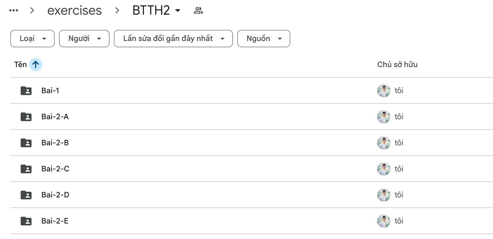
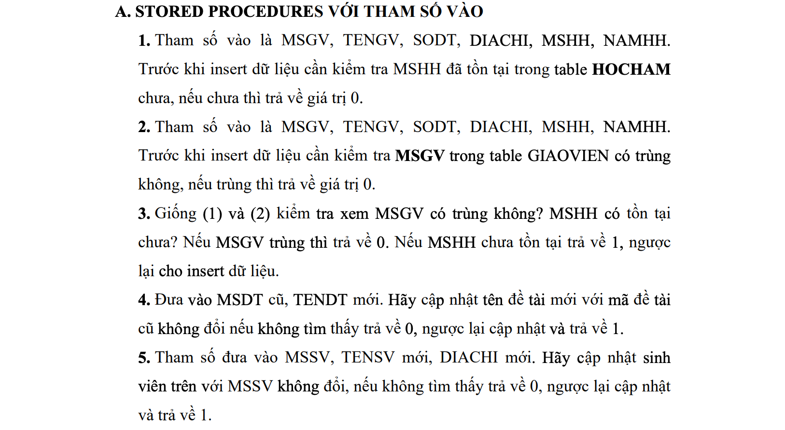
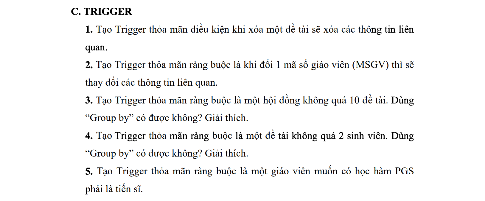
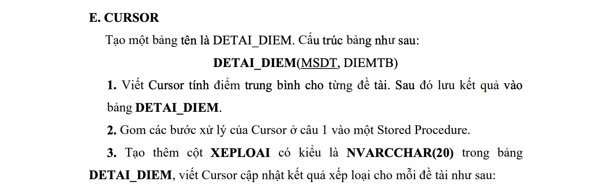

# IE103 - Nhóm 2 - Meeting 251213

TL;DR:

- Chỉ có 2 bạn (Sâm + Triết) tham gia Meeting, các bạn khác hoặc không phản hồi, hoặc vắng mặt có lý do.
- Thống nhất tập trung và phân công BTTH2 trước.
    - Bạn Triết sẽ hoàn thành các phần:
        - BTTH2 Phần 1.
        - BTTH2 Phần 2.A
    - Các bạn khác (những ai có tương tác) sẽ được phân công tương ứng các phần còn lại của BTTH2 Phần 2: B, C, D, E.
    - Sâm: tổng hợp và xuất báo cáo.
- BTTH3 sẽ để dành cho phiên Meet tiếp theo, dự kiến Thứ 4, 17/12.

[TOC]

## Nội Dung

- Cả BTTH2 và BTTH3 có chung deadline: 24/12.
- Phương án đề xuất:
    - A. Song song thực hiện cả 2 bài nếu đủ 10 người tham gia (lý tưởng), hoặc
      - B. Hoàn thành BTTH2 trước rồi phân công lại và làm tiếp BTTH3.
- Hiện tại:
    - Phải theo phương án B. vì chỉ có 5-6 người tham gia tương tác.

## Phân Công Công Việc BTTH2

File đề bài: [BTTH2 - Xử lý thông tin.pdf](https://elearning.citd.edu.vn/pluginfile.php/84629/mod_resource/content/1/BTTH2%20-%20Xu%CC%9B%CC%89%20ly%CC%81%20tho%CC%82ng%20tin.pdf)

- Phần 1.
    - Triết Nguyễn
- Phần 2.A
    - Triết Nguyễn
- Phần 2.B
    - Lê Long
- Phần 2.C
    - Hữu Toàn
- Phần 2.D
    - Lê Hiệp
- Phần 2.E
    - Hậu Trương
- Tổng hợp
    - Xuân Sâm

## Quy Cách

- Thư mục làm việc: [BTTH2](https://drive.google.com/drive/folders/1n910Rjf_O-1prfzZcBegtm419G0GYijM?usp=drive_link).
- (Lý tưởng) Mỗi người có một file markdown ví dụ `Bai-2-A.md` bên cạnh các file `.sql` của mình, vì sẽ có những câu hỏi cần trả lời.
    - Nếu không dùng markdown, có thể dùng Google docs.
    - Lưu ý cách đánh heading, không cần dùng ordered list, chỉ cần đúng thứ tự và cấp bậc heading.
- Mỗi người tạo các file `.sql` hoặc ảnh chụp (nếu cần) tương ứng cho mỗi bài/phần và lưu vào thư mục tương ứng: Bai-1, Bai-2-A, Bai-2-B, vv..
    - Tên file (naming) nên là: `btth2-bai2-A.sql`, không dấu, viết liền.
    - Có comment/giải thích trong code, ví dụ:

```sql
-- Tạo mới VIEW (hoặc thay thế)
CREATE OR REPLACE VIEW account_activity_view AS
SELECT
  ba.account_number,
  ba.account_holder,
  ba.balance,
  ul.action AS latest_action,
  ul.timestamp AS latest_action_time
FROM
  BankAccounts ba
-- Join nhiều bảng
LEFT JOIN
  (
      -- Một truy vấn cụ thể
      SELECT DISTINCT ON (account_number)
          account_number,
          action,
          timestamp
      FROM
          UserLogs
      ORDER BY
          account_number,
          timestamp DESC
  ) ul ON ba.account_number = ul.account_number;
```

Thư mục làm việc và các thư mục con:



## Đề bài

- Phòng trường hợp mọi người nhầm lẫn, sẽ cap lại như ví dụ.

### Phần 2. A



### Phần 2.B


### Phần 2.C



### Phần 2.D


### Phần 2.E


