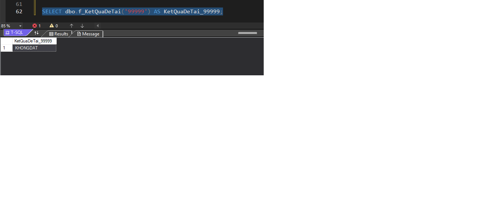
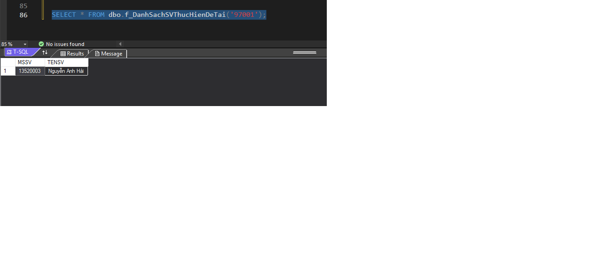

# P2

## FUNCTION

## 1. Viết hàm tính trung bình của một đề tài. Giá trị trả về là điểm trung bình ứng với mã số đề tài nhập vào.

```sql
-- Tạo Function

IF OBJECT_ID('f_TinhDiemTB', 'FN') IS NOT NULL
    DROP FUNCTION f_TinhDiemTB;
GO

CREATE FUNCTION f_TinhDiemTB (@MSDT char(6))
RETURNS float
AS
BEGIN
    IF NOT EXISTS (SELECT 1 FROM DETAI WHERE MSDT = @MSDT)
        RETURN 0;

    DECLARE @DiemTB float;


    SELECT @DiemTB = AVG(DIEM)
    FROM (
        SELECT DIEM FROM GV_HDDT WHERE MSDT = @MSDT
        UNION ALL
        SELECT DIEM FROM GV_PBDT WHERE MSDT = @MSDT
        UNION ALL
        SELECT DIEM FROM GV_UVDT WHERE MSDT = @MSDT
    ) AS TongHopDiem;

    RETURN ROUND(ISNULL(@DiemTB, 0), 3);
END;
GO
```

### Ví dụ gọi và thực thi (tính điểm tất cả đề tài trong bảng DETAI)

```sql
SELECT 
    MSDT,
    TENDT,
    dbo.f_TinhDiemTB(MSDT) AS DiemTrungBinh
FROM DETAI;
```


### Ví dụ gọi và thực thi (tính điểm của 1 đề tài nhập vào)

```sql
SELECT dbo.f_TinhDiemTB('97001') AS DiemTrungBinh_97001;
```


### Ví dụ gọi và thực thi (tính điểm của 1 đề tài không tồn tại)
```sql
    SELECT dbo.f_TinhDiemTB('99999') AS DiemTrungBinh_99999;
```


---------

## 2. Trả kết quả của đề tài theo MSDT nhập vào. Kết quả là DAT nếu như điểm trung bình từ 5 trở lên, và KHONGDAT nếu như điểm trung bình dưới 5.
```sql
-- Tạo Function

IF OBJECT_ID('f_KetQuaDeTai', 'FN') IS NOT NULL
    DROP FUNCTION f_KetQuaDeTai;
GO

CREATE FUNCTION f_KetQuaDeTai (@MSDT char(6))
RETURNS NVARCHAR(20)
AS
BEGIN
    DECLARE @DiemTB float;
    DECLARE @KetQua NVARCHAR(20);

    SET @DiemTB = dbo.f_TinhDiemTB(@MSDT);

    IF (@DiemTB >= 5)
        SET @KetQua = N'DAT';
    ELSE
        SET @KetQua = N'KHONGDAT';

    RETURN @KetQua;
END;
GO
```

### Ví dụ gọi và thực thi (kết quả của 1 đề tài nhập vào)

```sql
    SELECT dbo.f_KetQuaDeTai('97001') AS KetQuaDeTai_97001;
```


```sql
    SELECT dbo.f_KetQuaDeTai('99999') AS KetQuaDeTai_99999;
```


----------

## 3. Đưa vào MSDT, trả về mã số và họ tên của các sinh viên thực hiện đề tài.
```sql
-- Tạo Function

IF OBJECT_ID('f_DanhSachSVThucHienDeTai', 'IF') IS NOT NULL
    DROP FUNCTION f_DanhSachSVThucHienDeTai;
GO

CREATE FUNCTION f_DanhSachSVThucHienDeTai (@MSDT char(6))
RETURNS TABLE
AS
RETURN (
    SELECT 
        SV.MSSV, 
        SV.TENSV
    FROM SINHVIEN SV
    JOIN SV_DETAI SD ON SV.MSSV = SD.MSSV
    WHERE SD.MSDT = @MSDT
);
GO
```

### Ví dụ gọi và thực thi
```sql
SELECT * FROM dbo.f_DanhSachSVThucHienDeTai('97001');
```


```sql
SELECT * FROM dbo.f_DanhSachSVThucHienDeTai('97006');
```


--------------