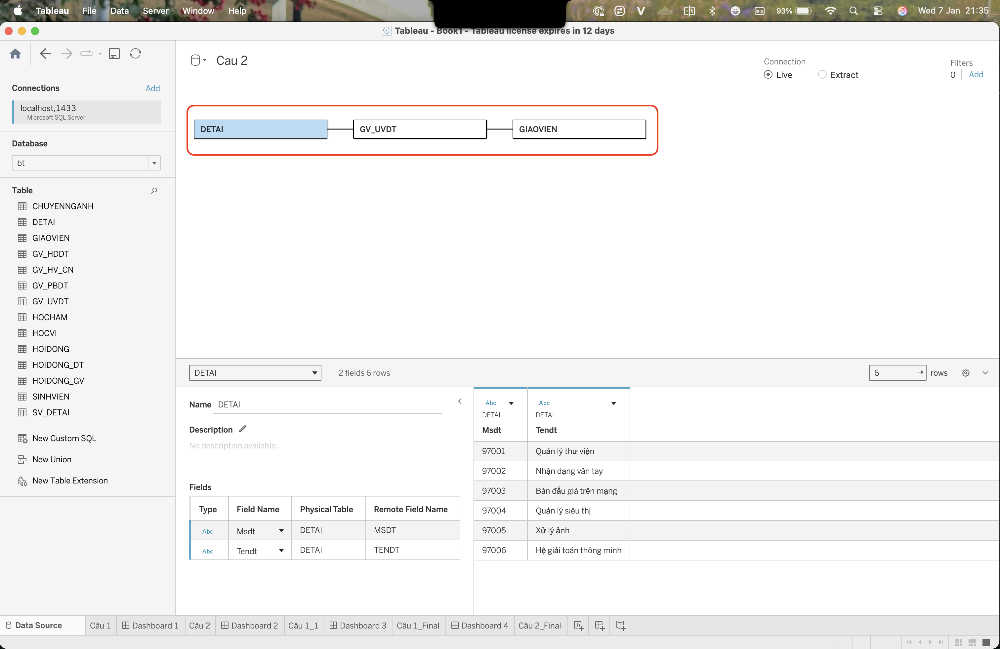
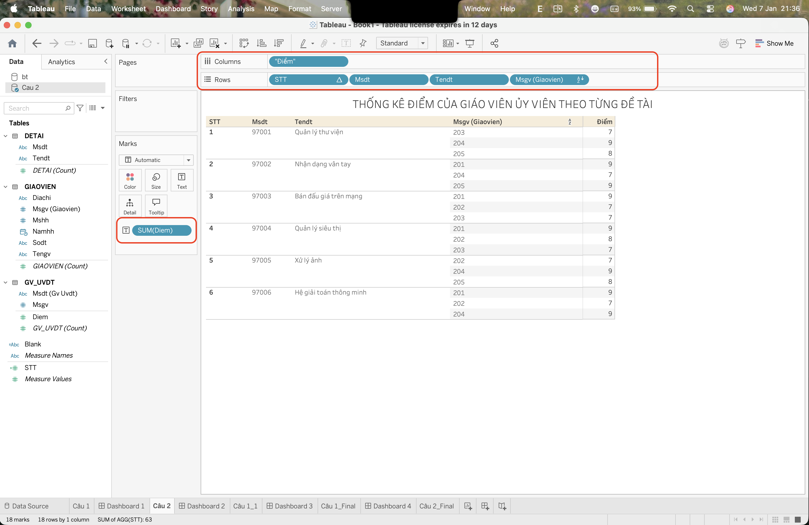
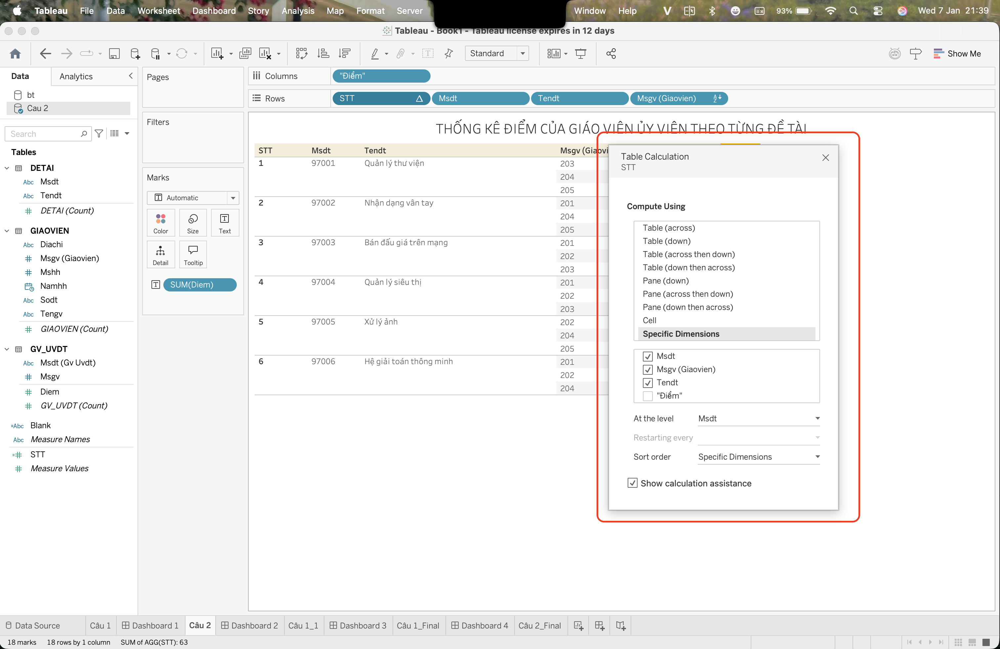
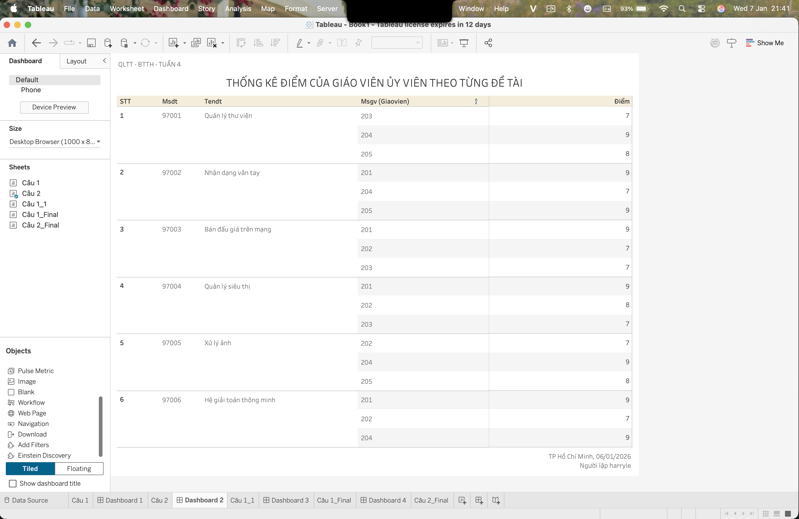

## Bài 1B. Thống kê điểm của giáo viên ủy viên theo từng đề tài

### 1. Kết nối database

### 2. Kết nối các fields và data liên quan vào columns và rows panels

### 3. Config STT field để group theo từng đề tài

### 4. Thiết kế Dashboard

