## Bài 1C: Cho CSDL Quản lý bán hàng đính kèm bên dưới
    Hãy dùng Tableau để thiết kế một báo cáo cho biết Doanh thu theo tháng
    của từng nhân viên trong năm 2006. Yêu cầu gồm có 2 phần sau:
    ▪ Phần Biểu đồ đường (Line Chart): Cho biết sự biến động về doanh số bán được của từng nhân viên qua các tháng trong năm 2006.
        o Trục X là các tháng trong năm 2006, trục Y là doanh số bán được.
        o Mỗi đường biểu thị một nhân viên tương ứng.
    ▪ Phần Bảng số liệu chi tiết: Cho biết doanh thu cụ thể của tháng đó với từng nhân viên. Trong đó có:
        o Tổng doanh thu theo từng nhân viên.
        o Tổng doanh thu của tất cả nhân viên trong năm 2006.
        o Lưu ý: Một số tháng không được hiển thị là do bảng HOADON không có số liệu bán hàng của tháng đó.

### 1C.1 Tạo View cho doanh thu năm 2006

```sql
-- Tạo View để tổng hợp doanh thu theo nhân viên và tháng trong năm 2006

CREATE OR ALTER VIEW V_BAOCAO_DOANHTHU_2006 AS
WITH 
NhanVienActive AS (
    SELECT DISTINCT NV.MANV, NV.HOTEN 
    FROM NHANVIEN NV
    JOIN HOADON HD ON NV.MANV = HD.MANV
    WHERE YEAR(HD.NGHD) = 2006
),

CacThangActive AS (
    SELECT DISTINCT MONTH(NGHD) AS Thang
    FROM HOADON
    WHERE YEAR(NGHD) = 2006
),
\
Data AS (
    SELECT NV.MANV, NV.HOTEN, T.Thang
    FROM NhanVienActive NV
    CROSS JOIN CacThangActive T
)
SELECT 
    K.MANV,
    K.HOTEN,
    K.Thang,
    ISNULL(SUM(HD.TRIGIA), 0) AS TongTien
FROM 
    Data K
LEFT JOIN 
    HOADON HD ON K.MANV = HD.MANV 
              AND K.Thang = MONTH(HD.NGHD) 
              AND YEAR(HD.NGHD) = 2006
GROUP BY 
    K.MANV, K.HOTEN, K.Thang
GO

```

### Kiểm tra kết quả của view vừa tạo

```sql
   SELECT * FROM V_BAOCAO_DOANHTHU_2006  ORDER BY MANV, Thang;
```
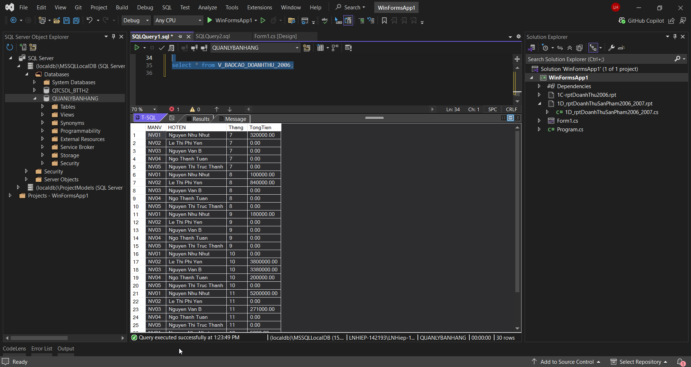

### Kết nối SQL Server với Tableau
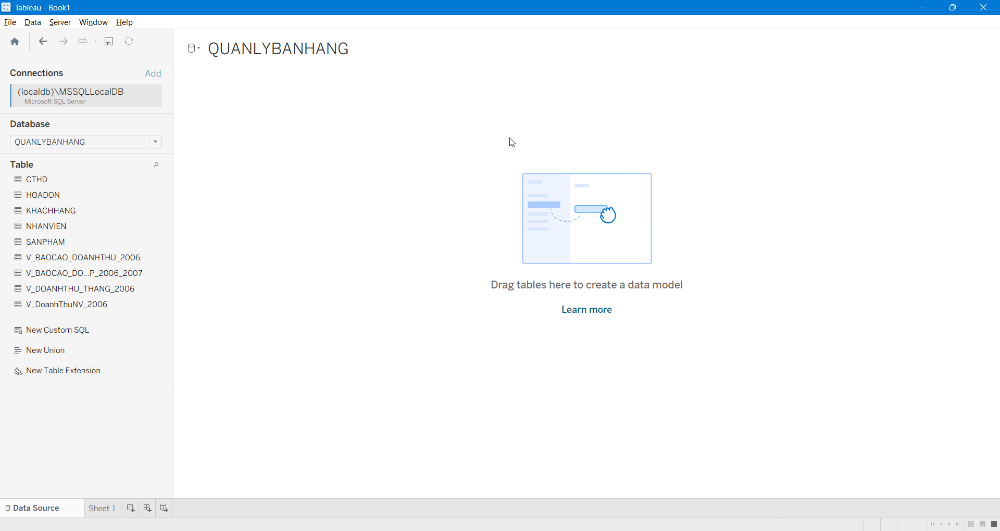

### Kéo VIEW V_BAOCAO_DOANHTHU_2006 vào trong Worksheet để tạo chart line
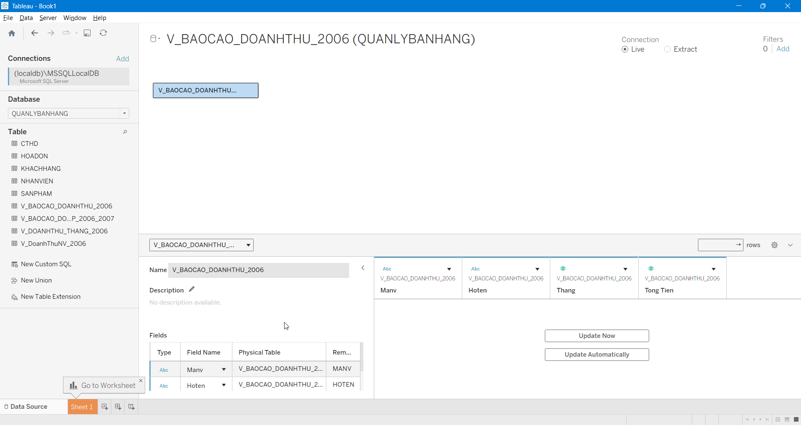

### Mapping dữ liệu từ View V_BAOCAO_DOANHTHU_2006 đã tạo theo trục X và Y
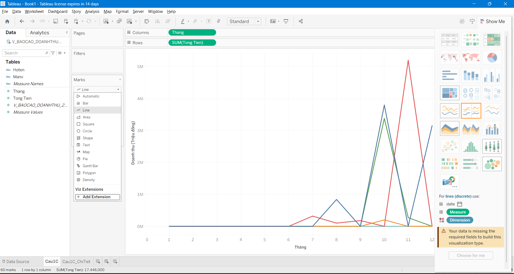

### Format và chỉnh sửa lại các tiêu đề trên chart
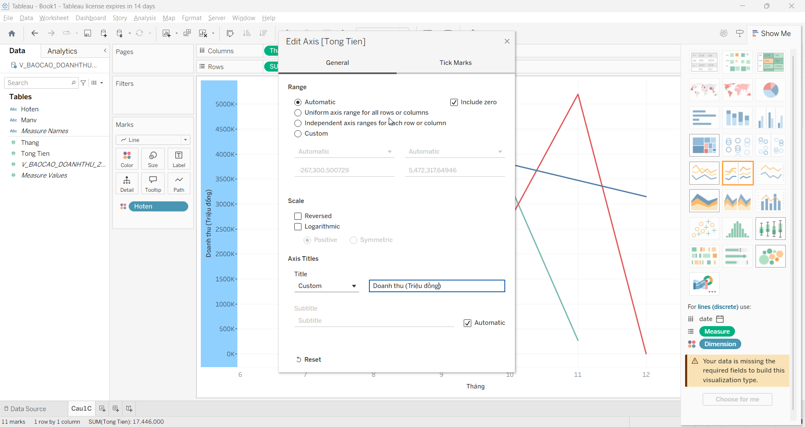

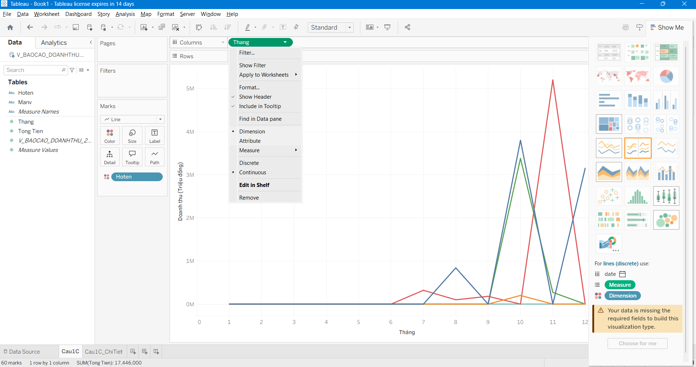

### Màn hình design và preview của chart sau khi chỉnh sửa 
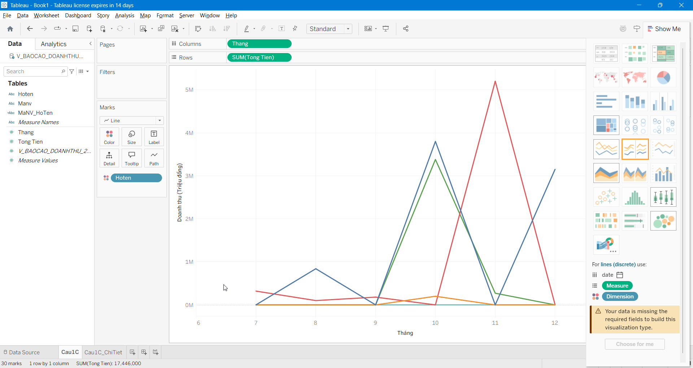

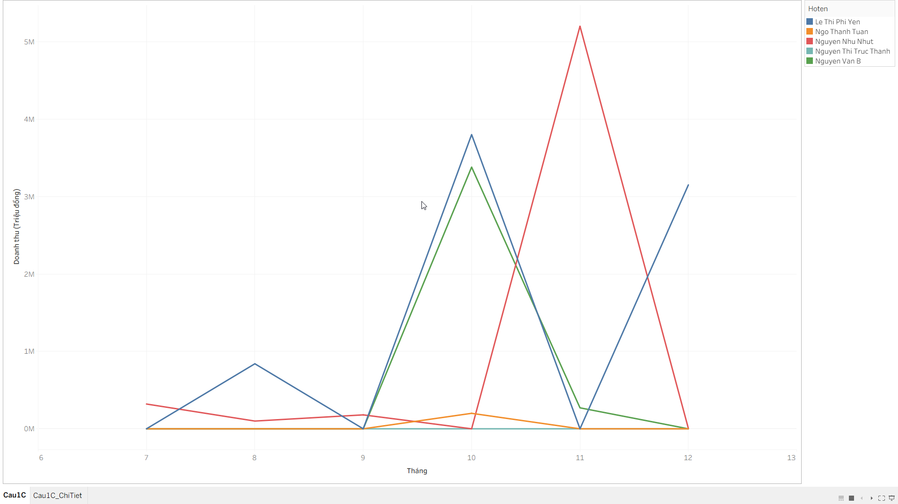

### 1C.2 Bảng số liệu chi tiết - tạo thêm 1 sheet cho chi tiết và mapping dữ liệu từ view V_BAOCAO_DOANHTHU_2006
   
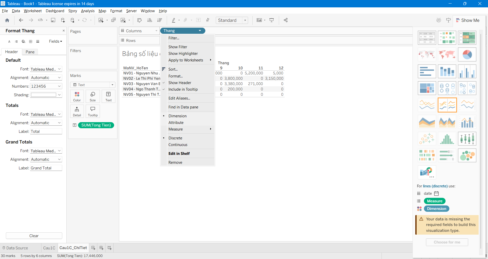

### Tạo label để hiển thị dạng MaNV - HoTen
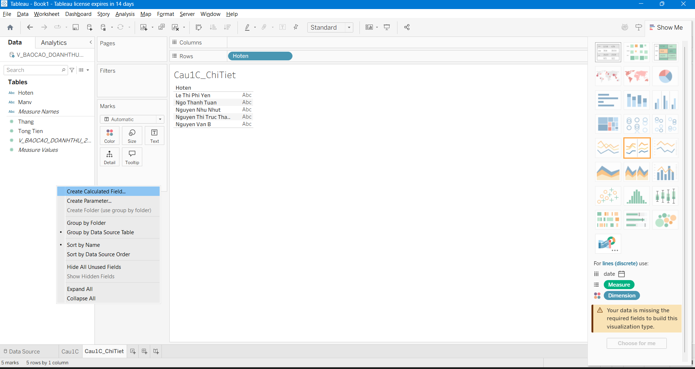

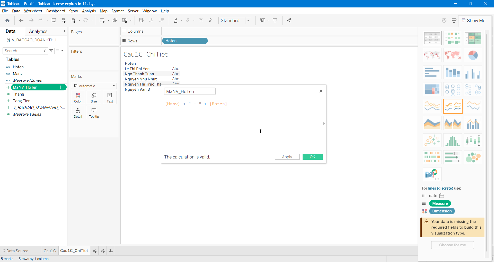

### Format các cột tính tổng, vị trí hiển thị
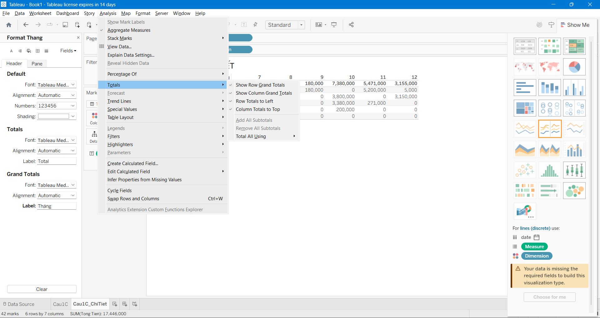

### Màn hình design và preview của table chi tiết

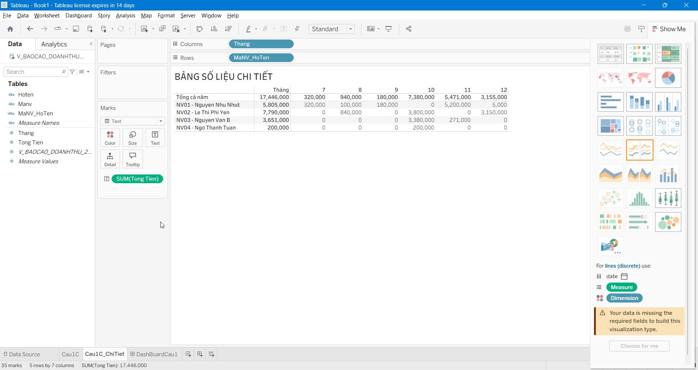

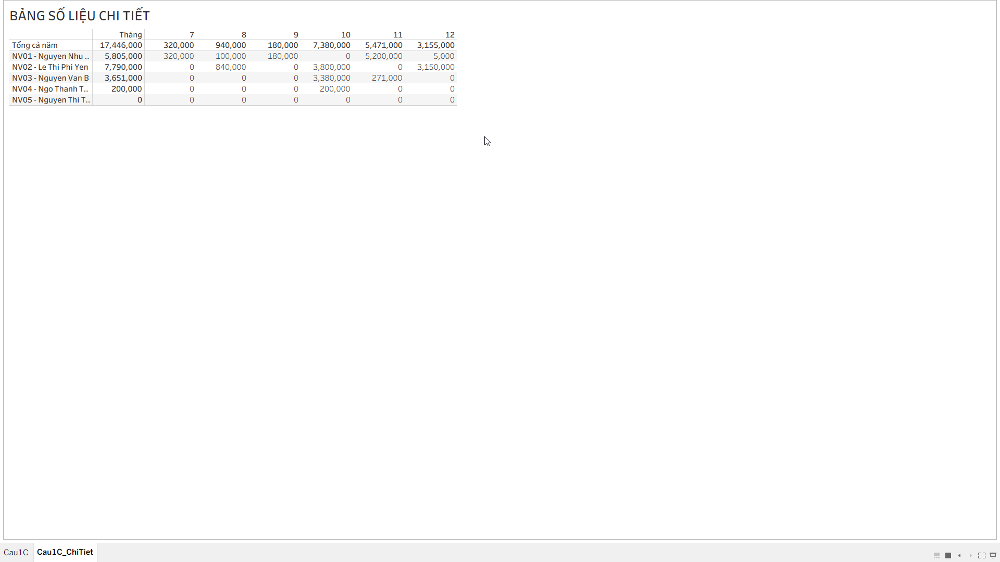

### Tạo thêm 1 dashboard để hiển thị biểu đồ và chi tiết
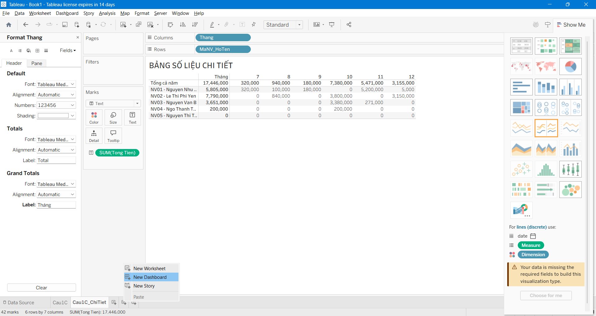

### Format dashboard
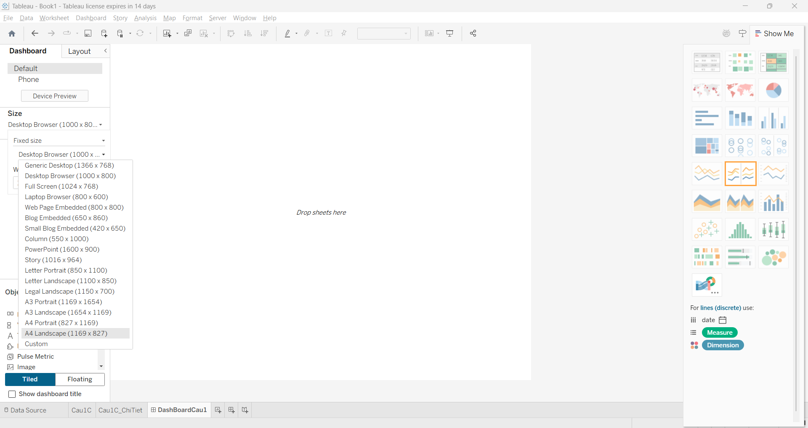

### Màn hình design và preview cuối
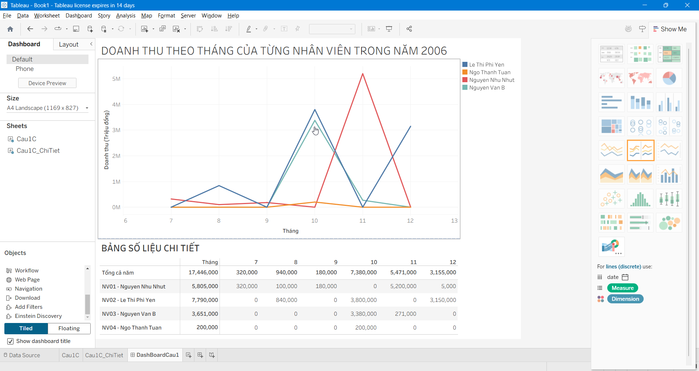

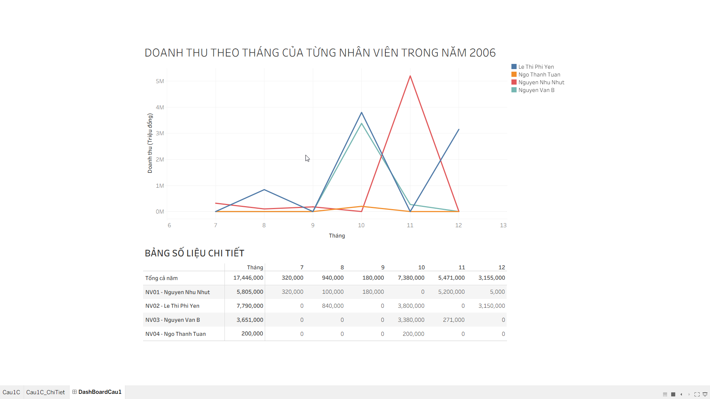

--------------