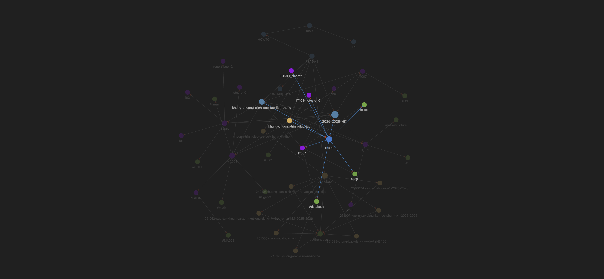

# IE103 - Bài Tập Quá Trình 1 - Nhóm 2

- Mã Lớp:
- Mã Môn:
- Tên Môn:
- Giảng Viên:
- Nhóm:

## Nhóm 2 (Omega)

Thành viên của nhóm 2:

| MSSV     | Họ và Tên             |
| -------- | --------------------- |
| 25410291 | Đinh Xuân Sâm         |
| 25410319 | Đặng Hữu Toàn         |
| 25410321 | Nguyễn Điền Triết     |
| 25410204 | Trương Xuân Hậu       |
| 25410338 | Lê Anh Vũ             |
| 25410176 | Trần Sơn Bình         |
| 25410247 | Lê Kim Long           |
| 25410337 | La Anh Vũ             |
| 25410209 | Lê Ngọc Hiệp          |
| 25410271 | Nguyễn Thị Ngọc Nhung |

## Yêu Cầu

1. Hãy tổ chức các folder trên máy tính thể hiện tính khoa học với các hoạt động phổ biến của một sinh viên.
2. Hãy tổ chức các thư nhận và gửi trên gmail đảm bảo tính khoa học với các hoạt động phổ biến của một sinh viên.
3. Cho biết các file quan trọng phổ biến nào mà một sinh viên cần backup.
4. Sự khác nhau giữa việc lưu trữ dữ liệu trên CD và USB?

## Kết Quả

### Yêu cầu 1

Hãy tổ chức các folder trên máy tính thể hiện tính khoa học với các hoạt động phổ biến của một sinh viên.

Cách tổ chức:

- Theo dạng cây thư mục.
- Các thư mục cùng cấp có cùng vai trò tương đương, chỉ khác trách nhiệm.
    - Ví dụ: Đều chứa học liệu của môn học nhưng dành cho các môn học khác nhau.
- Các thư mục đặt tên theo tính duy nhất.
    - Ví dụ: Sử dụng Mã Môn.
- Cho phép viết tắt nhưng vẫn dễ dàng hiểu nội dung.
    - Ví dụ: `ch` = `chapter`, `l` = `lesson`, vv..
    - Nếu viết tắt có nguy cơ khó hiểu/hiểu nhầm, hạn chế hoặc không sử dụng.
- Sắp xếp theo thứ tự:
    - Numeric: `01`, `02`, `03`, …
        - Lý do: có `0` ở trước để phân biệt `1-xx` vs `10-xx` khi sắp xếp, tránh trường hợp chúng cạnh nhau vì đều bắt đầu bằng `1`, thực tế cách nhau 8-9 đơn vị/file khác.
    - Alphabet: `a`, `b`, `c`, … `A`, `B`, `C`, …
    - Date time: `251025`, `251026`, … (`yymmdd` tương đương: `2025-10-25`, `2025-10-26`).
        - Ý đồ: Năm trước, tháng sau, ngày cuối cùng.
        - (Ưu tiên) Chỉ dùng 2 ký tự cho Năm, vì không cần lo lắng nhầm lẫn đó là `2025`, hay `1925`, hay `2125`, vì có lẽ chúng ta không sống đủ lâu để quan tâm `2125`, và không đủ sớm để quan tâm `1925`.
- Sử dụng chữ thường, không khoảng trắng, không có dấu tiếng Việt (hoặc bất kỳ tiếng khác), không ký tự đặc biệt (chỉ dùng bảng ASCII):
    - Ví dụ: `thongbao/250105-huong-dan-sinh-vien-ra-vao-cong-thu-duc`
    - Ngoại trừ: Cụm từ có ý nghĩa đặc biệt, ví dụ Mã Môn, toàn bộ CHỮ HOA; hoặc "CPU", "GPU", "AI", "NASA", vv.. nếu có.
- Tên file/folder nên có tính miêu tả, không cần quá tường minh.
    - Ví dụ 1: `thongbao/250105-huong-dan-sinh-vien-ra-vao-cong-thu-duc.md`, biết đây là một file Markdown, một thông báo, ngày tháng, và hình dung qua nội dung (Hướng dẫn sinh viên ra vào cổng cơ sở Thủ Đức, xuất bản 2024-01-05).
    - Ví dụ 2: `uit/courses/IE005/`, biết đây là thư mục của một môn học thuộc UIT; đây là môn gì, hãy tham chiếu chéo tới Kế Hoạch Đào Tạo, hoặc Khung Đào Tạo, hoặc Danh Sách Môn Học để có thêm thông tin chi tiết.

Kết quả:

- Tạo thành một cấu trúc cây chặt chẽ với đường dẫn hoàn toàn liền mạch.
- Ví dụ:
    - `uit/courses/IE005/lectures/l01.pdf`
    - `uit/courses/IE005/reports/buoi-2/IE005-reports-buoi-2-Nhom-1.pdf`
- Hạn chế/không cần dùng Shift để viết Hoa khi nhập tên file hoặc điền đường dẫn.
- Không cần bao hàm đường dẫn/tên file/tên thư mục bằng các ký tự như `'` hoặc `"` khi làm việc.

Ví dụ 1:

Ví dụ 2:

Ví dụ 3:

- Đồ họa cho biết môn IE103:
    - phụ thuộc môn IT004 (Databases);
    - thuộc chương trình liên thông;
    - thuộc học kỳ 1 2025 - 2026;
    - có các nội dung tương ứng (ch01);
    - có bài tập tương ứng (BTQT1);
    - và môn này liên quan đến *database*, *SQL*, vv..

