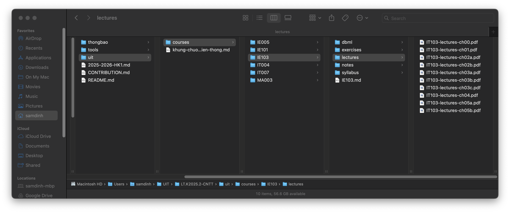
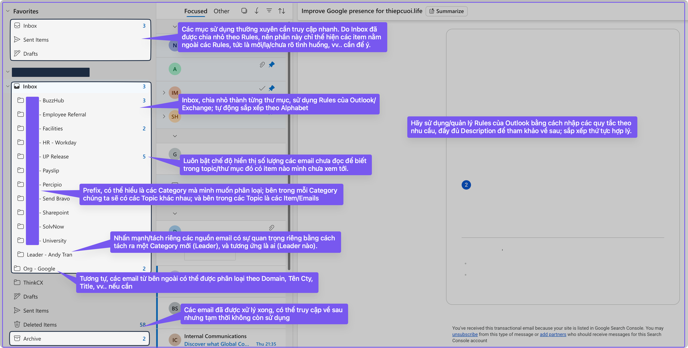

# IE103 - Bài Tập Quá Trình 1 - Nhóm 2

- Mã Lớp: IE103.F12.LT.CNTT
- Mã Môn: IE103
- Tên Môn: Quản Lý Thông Tin
- Giảng Viên: ThS. Nguyễn Thành Luân
- Nhóm: 2 (Omega)

## Nhóm 2 (Omega)

Thành viên của nhóm 2:

|  No |   MSSV   | Họ và Tên             |
| --: | :------: | :-------------------- |
|   1 | 25410291 | Đinh Xuân Sâm         |
|   2 | 25410319 | Đặng Hữu Toàn         |
|   3 | 25410321 | Nguyễn Điền Triết     |
|   4 | 25410204 | Trương Xuân Hậu       |
|   5 | 25410338 | Lê Anh Vũ             |
|   6 | 25410176 | Trần Sơn Bình         |
|   7 | 25410247 | Lê Kim Long           |
|   8 | 25410337 | La Anh Vũ             |
|   9 | 25410209 | Lê Ngọc Hiệp          |
|  10 | 25410271 | Nguyễn Thị Ngọc Nhung |

## Yêu Cầu

1. Hãy tổ chức các folder trên máy tính thể hiện tính khoa học với các hoạt động phổ biến của một sinh viên.
2. Hãy tổ chức các thư nhận và gửi trên gmail đảm bảo tính khoa học với các hoạt động phổ biến của một sinh viên.
3. Cho biết các file quan trọng phổ biến nào mà một sinh viên cần backup.
4. Sự khác nhau giữa việc lưu trữ dữ liệu trên CD và USB?

## Kết Quả

### Yêu cầu 1

**Hãy tổ chức các folder trên máy tính thể hiện tính khoa học với các hoạt động phổ biến của một sinh viên.**

Cách tổ chức:

- Theo dạng cây thư mục. Từ tổng quan cho tới đơn vị, chi tiết.
    - Ví dụ: Trường > Khóa Học > Môn; Năm > Tháng > Ngày. Tỉnh > Huyện > Xã.
- Các thư mục cùng cấp có cùng vai trò tương đương, chỉ khác trách nhiệm.
    - Ví dụ: Đều chứa học liệu của môn học nhưng dành cho các môn học khác nhau.
- Các thư mục đặt tên theo tính duy nhất.
    - Ví dụ: Sử dụng Mã Môn.
- Cho phép viết tắt nhưng vẫn dễ dàng hiểu nội dung.
    - Ví dụ: `ch` = `chapter`, `l` = `lesson`, vv..
    - Nếu viết tắt có nguy cơ khó hiểu/hiểu nhầm, hạn chế hoặc không sử dụng.
- Sắp xếp theo thứ tự:
    - Numeric: `01`, `02`, `03`, …
        - Lý do: có `0` ở trước để phân biệt `1-xx` vs `10-xx` khi sắp xếp, tránh trường hợp chúng cạnh nhau vì đều bắt đầu bằng `1`, thực tế cách nhau 8-9 đơn vị/file khác.
    - Alphabet: `a`, `b`, `c`, … `A`, `B`, `C`, …
    - Date time: `251025`, `251026`, … (`yymmdd` tương đương: `2025-10-25`, `2025-10-26`).
        - Ý đồ: Năm trước, tháng sau, ngày cuối cùng.
        - (Ưu tiên) Chỉ dùng 2 ký tự cho Năm, vì không cần lo lắng nhầm lẫn đó là `2025`, hay `1925` (vì quá lâu), hay `2125` (vì quá xa).
- Sử dụng chữ thường, không khoảng trắng, không có dấu tiếng Việt (hoặc bất kỳ tiếng khác), không ký tự đặc biệt (chỉ dùng bảng ASCII):
    - Ví dụ: `thongbao/250105-huong-dan-sinh-vien-ra-vao-cong-thu-duc`
    - Ngoại trừ: Cụm từ có ý nghĩa đặc biệt, ví dụ Mã Môn, toàn bộ CHỮ HOA; hoặc "CPU", "GPU", "AI", "NASA", vv.. nếu có.
- Tên file/folder nên có tính miêu tả, không cần quá tường minh.
    - Ví dụ 1: `thongbao/250105-huong-dan-sinh-vien-ra-vao-cong-thu-duc.md`, biết đây là một file Markdown, một thông báo, ngày tháng, và hình dung qua nội dung (Hướng dẫn sinh viên ra vào cổng cơ sở Thủ Đức, xuất bản 2024-01-05).
    - Ví dụ 2: `uit/courses/IE005/`, biết đây là thư mục của một môn học thuộc UIT; đây là môn gì, hãy tham chiếu chéo tới Kế Hoạch Đào Tạo, hoặc Khung Đào Tạo, hoặc Danh Sách Môn Học để có thêm thông tin chi tiết.

Kết quả:

- Tạo thành một cấu trúc cây chặt chẽ với đường dẫn hoàn toàn liền mạch.
- Ví dụ:
    - `uit/courses/IE005/lectures/l01.pdf`
    - `uit/courses/IE005/reports/buoi-2/IE005-reports-buoi-2-Nhom-1.pdf`
- Hạn chế/không cần dùng Shift (thêm một thao tác bấm) để viết Hoa ký tự khi nhập tên file hoặc điền đường dẫn.
- Không cần bao hàm đường dẫn/tên file/tên thư mục bằng các ký tự như `'` hoặc `"` khi làm việc.

Ví dụ 1:



Ví dụ 2:


Ví dụ 3:

- Đồ họa cho biết môn IE103:
    - phụ thuộc môn IT004 (Databases);
    - thuộc chương trình liên thông;
    - thuộc học kỳ 1 2025 - 2026;
    - có các nội dung tương ứng (ch01);
    - có bài tập tương ứng (BTQT1);
    - và môn này liên quan đến *database*, *SQL*, vv..


Ví dụ 4: Cây Thư Mục

Lệnh:

```bash
tree -L 6 -C --dirsfirst
```

Kết quả:

```
.
├── 2025-2026-HK1.md
├── CONTRIBUTION.md
├── README.md
├── thongbao
│   ├── 240105-huong-dan-sinh-vien-ra-vao-tai-thu-duc.md
│   ├── 240125-huong-dan-sinh-nhan-the.md
│   ├── 251005-cac-moc-thoi-gian.md
│   ├── 251007-ke-hoach-hoc-ky-1-2025-2026.md
│   ├── 251007-xac-nhan-dang-ky-hoc-phan-hk1-2025-2026.md
│   ├── assets
│   │   ├── 240105-huong-dan-ra-vao-thu-duc.png
│   │   ├── 251012-thoi-khoa-bieu-lt.2025.02-cntt.jpeg
│   ├── attachments
│   │   ├── KE-HOACH-DAO-TAO-HK-I-NAM-HOC-2025-2026-1.pdf
│   │   └── THOI-KHOA-BIEU-HK1-2025-2026-TAN-SINH-VIEN.pdf
│   └── thongbao.md
├── tools
│   ├── assets
│   │   ├── git-branches-samples.png
│   │   ├── tools-markmind-example.png
│   │   └── tools-marp-in-action-sample.png
│   ├── HOWTO.md
│   ├── marp
│   │   ├── samples
│   │   │   ├── l01.md
│   │   │   └── l01.pdf
│   │   └── themes
│   │       ├── beam-bg-img.svg
│   │       └── beam.css
│   └── tools.md
└── uit
    ├── courses
    │   ├── IE005
    │   │   ├── IE005.md
    │   │   ├── lectures
    │   │   ├── notes
    │   │   ├── reports
    │   │   └── syllabus
    │   ├── IE101
    │   │   ├── IE101.md
    │   │   ├── lectures
    │   │   ├── notes
    │   │   └── syllabus
    │   ├── IE103
    │   │   ├── dbml
    │   │   ├── exercises
    │   │   ├── IE103.md
    │   │   ├── lectures
    │   │   ├── notes
    │   │   └── syllabus
    │   ├── IT004
    │   │   ├── IT004.md
    │   │   ├── lectures
    │   │   ├── notes
    │   │   └── syllabus
    │   ├── IT007
    │   │   ├── exercises
    │   │   ├── IT007.md
    │   │   ├── lectures
    │   │   ├── syllabus
    │   │   └── textbook
    │   └── MA003
    │       ├── exercises
    │       ├── lectures
    │       ├── MA003.md
    │       ├── notes
    │       ├── syllabus
    │       └── textbook
    └── khung-chuong-trinh-dao-tao-lien-thong.md
```

### Yêu Cầu 2

**Hãy tổ chức các thư nhận và gửi trên gmail đảm bảo tính khoa học với các hoạt động phổ biến của một sinh viên.**

Cách tổ chức:

- Cùng với ý tưởng và các quy tắc trước đó về cách sắp xếp.
- Từ từ tổng quan đến đơn vị
    - String/Chữ: Sắp xếp theo Alphabet.
    - Số/Numeric: Sắp xếp theo Bé Đến Lớn.
    - Ngày Tháng: Sắp xếp theo Cũ tới Mới, chronologically.
- Phân loại theo Mục Đích và Thể Loại, rồi Topic.
    - Favorites chỉ nên chứa những cái thực và thường dùng nhất.
    - Inbox nên được chia nhỏ ra tùy thể loại, mục đích.
    - Archive là lưu trữ, nên được tách hẳn thành không gian riêng.
    - Tương tự với Delete. Cơ bản là vì ý nghĩa, mục đích là hoàn toàn khác nhau, không có giao thoa.

Hình ảnh diễn giải trực quan:



### Yêu Cầu 3

**Cho biết các file quan trọng phổ biến nào mà một sinh viên cần backup.**

Đánh giá:

- Có thể mở rộng thêm khái niệm này, không chỉ các file mà các thông tin hoặc bất kỳ tài liệu/học liệu nào có ý nghĩa tới quá trình học của sinh viên.

Quy tắc chung:

- Lưu trữ ở nhiều nơi, có tính phân tán nhưng khả năng đồng bộ cao.
    - Một bản lưu offline/online cho thường xuyên truy cập chỉnh sửa.
    - Một bản lưu Online; có thể đồng bộ thời gian thực hoặc thường xuyên hoặc định kỳ.
    - Một bản lưu offline (HDD rời, hoặc HDD khác/USB, vv..), đồng bộ định kỳ.
- Phân loại và nhất quán theo loại, mục đích, vv.. theo quy tắc sắp xếp ở Yêu cầu 1 có đề cập.
- Theo dõi được sự thay đổi qua thời gian, vì vậy cần/nên được quản lý bởi một Revision management software (Quản lý phiên bản).

Các file/thông tin cần được lưu giữ:

- Các thông tin chung liên quan đến quá trình học tập:
    - Thông báo nhập học.
    - Thông báo các mốc thời gian quan trọng.
    - Khung chương trình học tập.
    - Kế hoạch đào tạo.
    - Thời Khóa Biểu.
    - Và các tài liệu liên quan khác.
    - Bảng điểm (có thể tách riêng thành mục Quá Trình hoặc Kết Quả Học Tập).
- Các thông tin liên quan đến từng khóa học cụ thể:
    - Các bài giảng.
    - Các bài tập.
    - Các bài lab.
    - Các bài đọc thêm.
    - Các bài luận, nghiên cứu, vv..
    - Và các nội dung khác liên quan, phát sinh từ môn học, ví dụ Bảng phân công công việc, hình ảnh thực tập, vv...
- Các thông tin liên quan cá nhân nhưng có liên hệ tới quá trình học:
    - Hình ảnh, video quan trọng.
    - Ảnh thẻ, ảnh/scan các chứng từ (biên lai nộp học phí, vv...).
    - CV, portfolio.
    - Có thể quản lý tập trung chung với các nội dung bên trên, hoặc tách riêng nhưng có liên kết tới, ví dụ sử dụng git submodule.
- Các công cụ hỗ trợ quá trình học tập:
    - Các phần mềm, công cụ khác.
    - Quan trọng học: Cấu hình của các phần mềm đó nếu cần (ví dụ các `.dotfile`);
    - Các tài liệu, dữ liệu liên quan đến các phần mềm được sử dụng.
    - Các tài liệu, dữ liệu liên quan đến các bài tập, lab, được triển khai trên phần mềm.

Các công cụ gợi ý cho mục đích lưu trữ/đồng bộ dữ liệu:

| Tên            | Thể Loại          | Đánh giá                                                                                                           | Chi phí                                                                     |
| -------------- | ----------------- | ------------------------------------------------------------------------------------------------------------------ | --------------------------------------------------------------------------- |
| Google Drive   | Lưu Trữ           | Tiện lợi, dễ dùng. Nhưng không thể hoặc khó theo dõi phiên bản.                                                    | Miễn phí với dung lượng giới hạn.                                           |
| `rsync`        | Đồng Bộ           | Dễ dùng với người đã quen, có thể sử dụng script để tối ưu hóa quy trình đồng bộ.                                  | Miễn phí, nguồn mở.                                                         |
| FreeFileSync   | Đồng Bộ           | Dễ dùng, đặc biệt đối với người đã có khái niệm về `rsync`.                                                        | Miễn phí, nguồn mở.                                                         |
| `git` + Github | Quản Lý Phiên Bản | `git` là về quản lý phiên bản, nhưng dùng chung với Github cho phép khả năng lưu trữ, đồng bộ và hợp tác.          | `git` là miễn phí, nguồn mở. Github có miễn phí với các chức năng giới hạn. |
| Typora         | Editor            | Là một Markdown editor mạnh mẽ và đơn giản.                                                                        | 15$ sau thời gian dùng thử.                                                 |
| Google Docs    | Word Processsor   | Thay thế bộ Microsoft Office nếu bạn cần. Kết hợp với Google Drive là một lựa chọn đem đến trải nghiệm cực kỳ tốt. | Miễn phí và có thể nâng cấp thành trả phí.                                  |
| Obsidian       | PKM               | Rất dễ dùng, khả năng mở rộng về chức năng lớn.                                                                    | Miễn phí. Tương tự Github, có phiên bản trả phí với nhiều chức năng hơn.    |
- PKM: Personal Knowledge Management.

### Yêu Cầu 4

**Sự khác nhau giữa việc lưu trữ dữ liệu trên CD và USB?**


#### So sánh nhanh

| Đặc Tính                              | CD                                                                                                                                                                                                                                                                                     | USB                                                                                                                                                                                                                                                                                             |
| ------------------------------------- | -------------------------------------------------------------------------------------------------------------------------------------------------------------------------------------------------------------------------------------------------------------------------------------- | ----------------------------------------------------------------------------------------------------------------------------------------------------------------------------------------------------------------------------------------------------------------------------------------------- |
| Tên gọi                               | CD ROM (Compact Disc Read Only Memory).                                                                                                                                                                                                                                                | USB Storage; Mass Storage.                                                                                                                                                                                                                                                                      |
| Kích thước                            | Cố định, khá lớn, đường kính khoảng 8-10cm.                                                                                                                                                                                                                                            | Nhiều loại, nhưng thường rất nhỏ, tiện lợi di chuyển, từ 2-4cm chiều dài trở lên.                                                                                                                                                                                                               |
| Quy cách lưu trữ                      | Sử dụng các rãnh/track có độ lồi lõm khác nhau, phản xạ tia sáng để chuyển đổi thành tín hiệu điện.                                                                                                                                                                                    | Sử dụng các ô nhớ (memory cell) và kết hợp với bộ điều khiển (controller) để lưu trữ.                                                                                                                                                                                                           |
| Khả năng đọc                          | Nhiều lần, phụ thuộc nhiều vào độ bền của chất phủ hóa học.                                                                                                                                                                                                                            | Nhiều, tới rất nhiều. Phụ thuộc vào chất lượng của ô nhớ và bộ điều khiển.                                                                                                                                                                                                                      |
| Khả năng ghi                          | Một lần, rất ít trường hợp cho 2 lần. Phụ thuộc vào: chất phủ hóa học; chất lượng của rotor, vv.. thậm chí không thể hoàn thành quá trình ghi dữ liệu.                                                                                                                                 | Nhiều, tới rất nhiều. Phụ thuộc vào chất lượng của ô nhớ và bộ điều khiển.                                                                                                                                                                                                                      |
| Kiểu lưu trữ                          | Analog, quang học. TUẦN TỰ theo track.                                                                                                                                                                                                                                                 | Điện tử. Ngẫu nhiên.                                                                                                                                                                                                                                                                            |
| Cách lưu trữ                          | Cơ học (chuyển động quay), quang học (chiếu - thu phản xạ ánh sáng).                                                                                                                                                                                                                   | Điện tử.                                                                                                                                                                                                                                                                                        |
| Cách truy cập                         | Tuần tự, theo track.                                                                                                                                                                                                                                                                   | Ngẫu nhiên.                                                                                                                                                                                                                                                                                     |
| Khả năng phân vùng                    | Gần như không có.                                                                                                                                                                                                                                                                      | Phân vùng (partitioning) và Định dạng (format) tương tự một SSD/HDD.                                                                                                                                                                                                                            |
| Dung lượng                            | Nhỏ, hạn chế, thường khoảng 650MB cho một CD. Nhưng nếu chỉ ghi một lần và nếu không dùng hết thì không được ghi tiếp.                                                                                                                                                                 | Lý thuyết là không hạn chế, từ hàng trăm MB tới hàng trăm GB thậm chí hơn. Chỉ giới hạn vì khả năng thương mại.                                                                                                                                                                                 |
| Hướng nâng cấp                        | Loại CD cho phép ghi tiếp nối, nhiều lần. Hoặc DVD cho phép ghi nhiều track, hoặc/và nhiều mặt, nhằm tăng dung lượng. Blu-ray DVD.                                                                                                                                                     | Thay đổi chuẩn USB (1, 2, 3, 4), thay đổi Controller, thay đổi ô nhớ; tiệm cận tới SSD (thunderbolt, NVME).                                                                                                                                                                                     |
| Cách ghi dữ liệu                      | Sử dụng ánh sáng quang học để đốt (burn) các chất phủ hóa học, tạo các rãnh/vết lõm cụ thể.                                                                                                                                                                                            | Các tín hiệu điện được chuyển từ CPU/RAM tới controller (bộ điều khiển) và tới các ô nhớ (memory cell).                                                                                                                                                                                         |
| Cách đọc dữ liệu                      | Cho đĩa quay quanh một trục, đầu đọc chiếu tia sáng (quang) theo track và nhận lại phản xạ và chuyển thành tín hiệu điện. Cơ học + quang học.                                                                                                                                          | Các tín hiệu điện được chuyển tới từ các ô nhớ tới controller và vào RAM/CPU.                                                                                                                                                                                                                   |
| Tốc độ                                | Chậm, và phụ thuộc vào tốc độ quay của rotor. Vài tới vài chục MB/s.                                                                                                                                                                                                                   | Nhanh tới rất nhanh; tùy phiên bản USB (1, 2, 3, 3.1, 3.2, 3.2 Gen2, vv..) dung lượng; và loại file lưu trữ. Vài chục tới hằng trăm MB/s.                                                                                                                                                       |
| Tính dễ tổn thương                    | Dễ, cần bảo quản cẩn thận; dễ bị trầy xước bề mặt, gây lỗi quá trình đọc (phản xạ tia sáng).                                                                                                                                                                                           | Bền bỉ hơn rất nhiều, có thể chịu va đập, thậm chí kháng nước/lửa tùy tình huống.                                                                                                                                                                                                               |
| Các bảo quản                          | Nơi khô ráo, tránh các bề mặt thô ráp, nên có túi mềm bọc ngoài.                                                                                                                                                                                                                       | Nơi khô ráo, không quá khắt khe trong bảo quản; ưu tiên tránh tiếp xúc môi trường khắc nghiệt, cực đoan.                                                                                                                                                                                        |
| Khả năng tương thích                  | Thấp, gần như chỉ còn tồn tại ở các thiết bị cũ, hoặc cấu hình đặc thù.                                                                                                                                                                                                                | Cao, rộng; có tính tương thích ngược, xuyên suốt quá trình phát triển của thiết bị điện tử.                                                                                                                                                                                                     |
| Chi phí                               | Có thể nói là rẻ hoặc rất rẻ.                                                                                                                                                                                                                                                          | Biên độ lớn, nhưng cũng có thể nói là rẻ tới trung bình.                                                                                                                                                                                                                                        |
| Phù hợp cho                           | Dữ liệu analog (âm thanh, phim ảnh); các loại dữ liệu khác có mục đích lưu trữ. Không yêu cầu tốc độ đọc/ghi cao.                                                                                                                                                                      | Hầu hết tất cả các loại dữ liệu, nhưng không ưu tiên có tính lưu trữ lâu dài, nên là dữ liệu mang tính chất dự phòng, hoặc/và truy cập thường xuyên.                                                                                                                                            |
| Ứng dụng phổ biến                     | CD Audio Album; Bootable Recovery Disk; Recovery Media vv...                                                                                                                                                                                                                           | Hầu hết các nhu cầu lưu trữ; bao gồm cả Bootable Recovery Disk, Recovery Media; vv...                                                                                                                                                                                                           |
| Ứng dụng khác                         | Do tính chất phản quang, có thể dùng để trang trí, vì từ ánh sáng trắng có thể được phản xạ thành nhiều màu sắc khác.                                                                                                                                                                  | Đồ trang trí nhỏ gọn có tố chất công nghệ.                                                                                                                                                                                                                                                      |
| Tips & Tricks                         | Có thể đóng gói thư mục dữ liệu thành một file `.iso` để dùng cho quá trình ghi tiện lợi hơn. Tương tự, có thể đọc/rip CD thành file `.iso` tận dụng sự tuần tự vốn có thay vì đọc riêng lẻ từng file, đọc riêng lẻ từng file sau khi có file `.iso` được mount/ánh xạ trong máy tính. | Tương tự, có thể đóng gói thành file `.iso` vì có thể mount/ánh xạ, rất tiện lợi để đọc/ghi, không cần giải nén. Hoặc nén/gom file thành các file lớn dạng `.zip` (tỉ số nén thấp), để tiện copy và tối ưu tốc độ. Không lưu quá nhiều file quá nhỏ, ví dụ hàng nghìn file chỉ vài kb mỗi file. |
| Mở rộng trong môi trường Doanh Nghiệp | Các Tape Library/Tape Backup, mục đích lưu trữ dữ liệu lâu dài cho mục đích Audit/Compliance; ưu tiên chi phí thấp, lưu trữ lâu và không cần tốc độ cao, đọc/ghi tuần tự.                                                                                                              | Các hệ thống Storage dạng SAN/NAS/DAS sử dụng SSD với các công nghệ chip nhớ chuẩn Doanh nghiệp và giao tiếp NVME cho tốc độ và độ bền  cực kỳ cao.                                                                                                                                             |

#### Hình ảnh

Ví dụ nhanh về hình ảnh của:

- CD/DVD ROM (bao gồm đĩa và ổ đĩa).
- USB: Type A, 3.0.

| CD ROM                         | USB SANDISK                            |
| ------------------------------ | -------------------------------------- |
|  |  |
