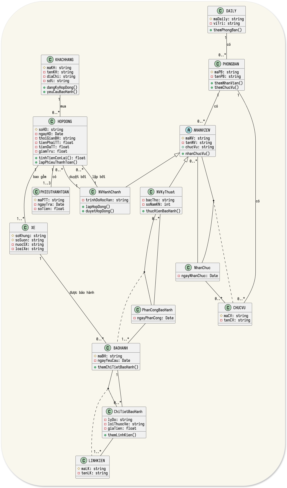

# IE103 - Bài Tập Quá Trình 2 - Nhóm 2

- Mã Lớp: IE103.F12.LT.CNTT
- Mã Môn: IE103
- Tên Môn: Quản Lý Thông Tin
- Giảng Viên: ThS. Nguyễn Thành Luân
- Nhóm: 2 (Omega)

## Nhóm 2 (Omega)

Thành viên của nhóm 2:

|  No |   MSSV   | Họ và Tên             |
| --: | :------: | :-------------------- |
|   1 | 25410291 | Đinh Xuân Sâm         |
|   2 | 25410319 | Đặng Hữu Toàn         |
|   3 | 25410321 | Nguyễn Điền Triết     |
|   4 | 25410204 | Trương Xuân Hậu       |
|   5 | 25410338 | Lê Anh Vũ             |
|   6 | 25410176 | Trần Sơn Bình         |
|   7 | 25410247 | Lê Kim Long           |
|   8 | 25410337 | La Anh Vũ             |
|   9 | 25410209 | Lê Ngọc Hiệp          |
|  10 | 25410271 | Nguyễn Thị Ngọc Nhung |

## Yêu Cầu/Đề Bài

1. Tìm mô hình ERD và Class Diagram cho 2 bài toán sau (2 tasks).  
2. Chuyển 2 mô hình trên sang mô hình logic (1 task).

### Bài 1.

Người ta cần tin học hoá khâu Quản lý các đề tài tốt nghiệp của 1 trường ĐH. Với các thông tin sau:

* Mỗi SV năm 4 sẽ làm đề tài TN.
  * Mỗi đề tài bao gồm Tên DT, giáo viên hướng dẫn, thời gian bắt đầu, kết thúc, thuộc khoa nào.
* Khoa sẽ thành lập hội đồng (HĐ) khoa học, mỗi HĐ gồm:
  * Chủ tịch, 1 thành viên thư ký, ngày bảo vệ tại địa chỉ cụ thể.
* Mỗi đề tài sẽ bảo vệ tại một hội đồng, điểm đề tài là trung bình cộng của:
  * Chủ tịch, 01 GV phản biện, 01 GV hướng dẫn.
* Giáo viên cho điểm theo từng Sinh viên mặc dù các sinh viên có thể làm chung đề tài.
* Trong đợt bảo vệ có thể có nhiều hội đồng, 1 GV có thể hướng dẫn nhiều Đề Tài (ĐT), hay phản biện nhiều ĐT.
  * Chủ tịch HD, thư ký là giáo viên.
  * Mỗi giáo viên cần thông tin: Tên, địa chỉ, SDT, học vị, chuyên ngành.
* Mỗi ĐT có thể tối đa 03 Sinh viên thực hiện.
* SV có điểm Trung Bình (TB) \< 5 sẽ:
  * phải bảo vệ lại với khóa sau, và
  * chỉ được bảo vệ tối đa 2 lần,
  * đề tài lần 1 phải khác lần 2.

### Bài 2.

Người ta cần tin học hoá khâu Quản lý mua bán tại cửa hàng bán xe máy 2 bánh với các thông tin sau:

* Khách hàng có thể mua trả hết hay trả góp, nhiều nhất 3 lần cho mỗi hóa đơn.
* Thông tin chiếc xe gồm:
  * Nước SX, loại xe, Số PK, số khung, số sườn, màu xe.
* Khi mua xe khách hàng được giao HD có:
  * SỐ HD, Ngày HD, Thời gian bảo hành, Tiền phải thanh toán, tiền đã thanh toán, nhân viên lập, kế toán.
  * Ngoài ra còn thông tin KH: Tên, địa chỉ, SDT.
* Nếu trả nhiều lần trên HD sẽ ghi rõ:
  * 2 lần trả kế tiếp, Ngày trả lần 1, ngày trả lần 2.
  * Khi KH thanh toán lần 2 cần lập phiếu thanh toán và ghi rõ:
    * Thanh toán cho HD nào, ngày trả, số tiền, người nhận và người trả.
* Với các HĐ thanh toán 1 lần sẽ giảm 2% cho mỗi HĐ và tỉ lệ này có thể thay đổi.  
* Với khách hàng mua số lượng 1 lần trên 3 chiếc và thanh toán 1 lần sẽ giảm 5% trên HD và tỉ lệ này có thể thay đổi.
* Trường hợp KH yêu cầu bảo hành sẽ có bộ phận kỹ thuật kiểm tra và báo cáo bằng phiếu nhận xét:
  * Ghi rõ tên các linh kiện, lí do BH, lỗi thuộc về khách hay sản phẩm, giá tiền.
* Cửa hàng có nhiều đại lý nằm trên các vị trí khác nhau. Nhân viên bao gồm:
  * Hành chánh (chức vụ, thuộc phòng ban nào, Trình độ học vấn)
  * Kỹ thuật (chức vụ, bậc thợ, số năm kinh nghiệm).

## Bài 1: Quản Lý Đề Tài Tốt Nghiệp

### 1. Phân Tích Yêu Cầu

Qua phân tích đề bài, chúng ta có thể xác định các thực thể và mối quan hệ chính sau:

- Thực thể (Entities):
    - `KHOA`: Đơn vị quản lý (VD: Khoa CNTT).
    - `GIANGVIEN`: a) Người hướng dẫn, b) phản biện, c) chủ tịch, d) thư ký hội đồng.
    - `HOIDONG`: Hội đồng khoa học (chấm điểm).
    - `DETAI`: Đề tài tốt nghiệp.
    - `SINHVIEN`: Sinh viên thực hiện đề tài.
- Mối quan hệ (Relationships):
    - `KHOA` (1) - (n) `DETAI`: `QUANLY_DT`
        - Một khoa có nhiều đề tài.
        - Một đề tài thuộc một khoa cụ thể.
    - `KHOA` (1) - (n) `GIANGVIEN`:`QUANLY_GV`
        - Một khoa có nhiều giảng viên (GV).
        - Mỗi giảng viên thuộc một KHOA cụ thể.
    - `GIANGVIEN` (1) - (n) `DETAI` (HƯỚNG DẪN): `HUONGDAN`
        - Một GV hướng dẫn nhiều đề tài.
        - Mỗi đề tài *chỉ có 1* GV hướng dẫn.
    - `GIANGVIEN` (1) - (n) `DETAI` (PHẢN BIỆN): `PHANBIEN`
        - Một GV phản biện nhiều đề tài.
        - Mỗi đề tài *chỉ có 1* GV phản biện.
    - `GIANGVIEN` (1) - (n) `HOIDONG` (CHỦ TỊCH): `LAM_CHUTICH`
        - Một GV có thể làm chủ tịch nhiều HĐ.
        - Mỗi HĐ *chỉ có 1* chủ tịch.
    - `GIANGVIEN` (1) - (n) `HOIDONG` (THƯ KÝ): `LAM_THUKY`
        - Một GV có thể làm thư ký nhiều HĐ.
        - Mỗi HĐ *chỉ có 1* thư ký.
    - `HOIDONG` (1) - (n) `DETAI`: `CHAM_TAI` (Chấm Tại Hội Đồng)
        - Một HĐ chấm nhiều đề tài.
        - Mỗi đề tài *chỉ thuộc 1* HĐ.
    - `SINHVIEN` (n) - (n) `DETAI` (THỰC HIỆN): `THUCHIEN`
        - Đây là mối quan hệ n-n.
        - Một `DETAI` có tối đa 3 `SINHVIEN`.
        - Một `SINHVIEN` có thể thực hiện tối đa 2 `DETAI` (lần 1 rớt, làm lại lần 2).
        - Mối quan hệ này sẽ trở thành một bảng/thực thể liên kết để lưu điểm và thông tin lần bảo vệ.
        - Bảng `THUCHIEN_DETAI` thể hiện quan hệ này, `UNIQUE(SINHVIEN, DETAI)` để đảm bảo 2 lần là 2 đề tài khác nhau.
- Thuộc tính quan trọng:
    - Điểm được cho bởi 3 người (GVHD, GVPB, Chủ tịch HĐ) và được cho *theo từng sinh viên*. Điều này củng cố việc chúng ta cần bảng liên kết `THUCHIEN_DETAI` để lưu các điểm này.
    - Các quy tắc (SV < 5 điểm, bảo vệ 2 lần, đề tài khác nhau) là các *quy tắc nghiệp vụ (business logic)* sẽ được xử lý ở tầng ứng dụng, nhưng cấu trúc CSDL phải hỗ trợ nó (bảng `THUCHIEN_DETAI` có thể có thuộc tính `LanBaoVe`).

### 2. Mô hình ERD


### 3. Mô hình Class Diagram


### 4. Mô hình Logic

- `KHOA` (<u>MaKhoa</u>, TenKhoa)
- `GIANGVIEN` (<u>MaGV</u>, TenGV, DiaChi, SDT, HocVi, ChuyenNganh, *MaKhoa*)
    - `MaKhoa` (FK) tham chiếu đến `KHOA(MaKhoa)`.
- `HOIDONG` (<u>MaHD</u>, NgayBaoVe, DiaChiCuThe, *MaGV_ChuTich*, *MaGV_ThuKy*)
    - `MaGV_ChuTich` (FK) tham chiếu đến `GIANGVIEN(MaGV)`.
    - `MaGV_ThuKy` (FK) tham chiếu đến `GIANGVIEN(MaGV)`.
- `DETAI` (<u>MaDT</u>, TenDT, TGBatDau, TGKetThuc, *MaKhoa*, *MaGV_HuongDan*, *MaGV_PhanBien*, *MaHD*)
    - `MaKhoa` (FK) tham chiếu đến `KHOA(MaKhoa)`.
    - `MaGV_HuongDan` (FK) tham chiếu đến `GIANGVIEN(MaGV)`.
    - `MaGV_PhanBien` (FK) tham chiếu đến `GIANGVIEN(MaGV)`.
    - `MaHD` (FK) tham chiếu đến `HOIDONG(MaHD)`.
- `SINHVIEN` (<u>MaSV</u>, TenSV, NamHoc, ...)
- `THUCHIEN` (<u>MaSV, MaDT</u>, LanBaoVe, Diem_GVHD, Diem_GVPB, Diem_ChuTich)
    - Khóa chính (PK): (<u>MaSV</u>, <u>MaDT</u>)
    - Ràng buộc: `LanBaoVe <= 2` .
    - Ràng buộc: `UNIQUE(MaSV, MaDT)` để đảm bảo SV không làm cùng 1 đề tài 2 lần.

## Bài 2: Quản Lý Bán Xe Máy

### 1. Phân Tích Yêu Cầu

- Thực thể (Entities):
    - `DAILY`: Nơi nhân viên làm việc.
    - `NHANVIEN`: Người lập hóa đơn, kế toán, kỹ thuật.
    - `KHACHHANG`: Người mua xe.
    - `HOPDONG`: Hợp đồng bán xe (chứa 1 hoặc nhiều xe).
    - `XE`: Thông tin xe (`SoKhung`, `SoSuon` là duy nhất).
    - `PHIEUTHANHTOAN`: Dùng cho các hóa đơn trả góp.
    - `BAOHANH`: Phiếu nhận xét khi khách yêu cầu bảo hành.
    - `LINHKIEN`: Các linh kiện được dùng trong bảo hành.
    - `PHONGBAN`: Phòng Ban, thuộc một đại lý cụ thể và có nhân viên cụ thể.
    - `CHUCVU`: Chức vụ trong mỗi phòng ban.
- Kế thừa (Inheritance):
    - `NHANVIEN` là lớp cha: `ChucVu`, `PhongBan`.
    - `NV_HANHCHANH` là lớp con cho nhân viên Hành Chánh: `TrinhDoHocVan`.
    - `NV_KYTHUAT` là lớp con cho nhân Viên Kỹ Thuật: `BacTho`, `SoNamKinhNghiem`.
- Mối quan hệ (Relationships):
    - `DAILY (1) - (n) PHONGBAN`: `PB_DAILY`
        - Một đại lý có nhiều. phòng ban.
        - Một phòng ban cụ thể thuộc một đại lý.
    - `PHONGBAN (1) - (n) NHANVIEN`: `NV_PB`
        - Một phòng ban có nhiều nhân viên.
        - Một nhân viên thuộc một phòng ban.
        - Nhân viên thuộc đại lý nào có thể được suy ra từ nhân viên thuộc phòng ban nào.
    - `PHONGBAN (1) - (n) CHUCVU`: `CV_PB`
        - Một phòng ban có nhiều chức vụ.
        - Một chức vụ thuộc một phòng ban.
    - `CHUCVU (n) - (n) NHANVIEN`: `CHUCVU_NV`
        - Một chức vụ được gán cho 1 hoặc n nhân viên.
        - Một nhân viên có thể nhận 1 hoặc n chức vụ.
    - `NHANVIEN (1) - (n) HOPDONG`: `LAP_HD`
        - Một HĐ có 1 NV lập.
        - Một NV có thể lập nhiều HĐ.
    - `NHANVIEN (1) - (n) HOPDONG`: `DUYET_HD`
        - Một HĐ có 1 NV kế toán duyệt.
        - Một NV có thể duyệt nhiều HĐ.
    - `KHACHHANG` (1) - (n) `HOPDONG`: `MUA_HANG`
        - Một KH có thể có nhiều HĐ.
        - Một HĐ chỉ thuộc một khách hàng.
    - `HOPDONG` (1) - (n) `XE`: `BAO_GOM`
        - Một HĐ có thể mua 1 hoặc nhiều xe.
        - Một xe cụ thể (duy nhất) chỉ thuộc 1 HĐ.
    - `HOPDONG` (1) - (1..3) `PHIEUTHANHTOAN`: `TRA_GOP`
        - Một HĐ (nếu trả góp) có tối đa 3 phiếu thanh toán.
        - Mỗi phiếu thanh toán chỉ thuộc một HĐ cụ thể.
    - `XE` (1) - (n) `BAOHANH`: `DUOC_BH`
        - Một xe có thể được bảo hành nhiều lần.
        - Một bảo hành chỉ định một xe cụ thể.
    - `BAOHANH` (1) - (n) `LINHKIEN`:`CHITIET_BH`
        - Đây là quan hệ `n-n`, vì
        - 1 phiếu BH có thể dùng nhiều linh kiện cả về loại và số lượng,
        - 1 loại linh kiện có thể được dùng cho nhiều phiếu BH.
        - Bảng liên kết `CHITIET_BH`: Chứa LyDo, LoiThuocVe, GiaTien.
    - `BAOHANH (1) - (n) NHANVIEN`: `THUCHIEN_BH`.
        - Quan hệ `n-n`.
        - Một lần bảo hành có thể thực hiện bởi nhiều nhân viên (Kỹ thuật).
        - Một nhân viên có thể thực hiện nhiều yêu cầu bảo hành.
        - Bảng liên kết `THUCHIEN_BH`: MaNV, MaBH

### 2. Mô hình ERD

- Sử dụng ER Chen notation.
    - Không có quy tắc cho thừa kế (chỉ khả dụng trong EER), chuyển qua biểu diễn tại Class Diagram.
- Hạn chế biểu diễn thuộc tính để đơn giản sơ đồ.
    - Chuyển qua biểu diễn tại Class Diagram.


### 3. Mô hình Class Diagram



### 4. Mô hình Logic

- `DAILY` (<u>MaDaily</u>, ViTri, ...)
- `PHONGBAN` (<u>MaPB</u>, TenPB)
- `NHANVIEN` (<u>MaNV</u>, TenNV,  *MaPB*, *MaCV*, *MaDaily*, LoaiNV)
    - `LoaiNV` dùng để xác định là '`HANHCHANH`' hay '`KYTHUAT`'.
    - `MaDaily` (FK) tham chiếu đến `DAILY(MaDaily)`.
    - `MaCV` (FK) tham chiếu đến `CHUCVU(MaCV)`.
    - `MaPB` (FK) tham chiếu đến `PHONGBAN(MaPB)`.
- `NV_HANHCHANH` (<u>MaNV</u>, TrinhDoHocVan)
    - `MaNV` (PK, FK) tham chiếu đến `NHANVIEN(MaNV)`.
- `NV_KYTHUAT` (<u>MaNV</u>, BacTho, SoNamKinhNghiem)
    - `MaNV` (PK, FK) tham chiếu đến `NHANVIEN(MaNV)`.
- `KHACHHANG` (<u>MaKH</u>, TenKH, DiaChi, SDT)
- `HOPDONG` (<u>SoHD</u>, NgayHD, ThoiGianBH, TienPhaiTT, TienDaTT, GiamTru, *MaKH*, *MaNV_Lap*, *MaNV_KeToan*)
    - `MaKH` (FK) tham chiếu đến `KHACHHANG(MaKH)`.
    - `MaNV_Lap` (FK) tham chiếu đến `NHANVIEN(MaNV)`.
    - `MaNV_KeToan` (FK) tham chiếu đến `NHANVIEN(MaNV)`.
- `XE` (<u>SoKhung, SoSuon</u>, NuocSX, LoaiXe, MauXe, SoPK, *SoHD*)
    - Khóa chính (PK): (<u>SoKhung, SoSuon</u>).
    - `SoHD` (FK) tham chiếu đến `HOPDONG(SoHD)`.
- `PHIEUTHANHTOAN` (<u>MaPTT</u>, NgayTra, SoTien, *SoHD*, *MaNV_NhanTien*)
    - `SoHD` (FK) tham chiếu đến `HOPDONG(SoHD)`.
    - `MaNV_NhanTien` (FK) tham chiếu đến `NHANVIEN(MaNV)`.
- `BAOHANH` (<u>MaBH</u>, NgayYeuCau, *SoKhungXe*, *SoSuonXe*)
    - Khóa ngoại (FK) tham chiếu đến `XE(SoKhung, SoSuon)`.
- `LINHKIEN` (<u>MaLK</u>, TenLK, DonGia)
- `CHITIET_BAOHANH` (<u>MaBH, MaLK</u>, LyDo, LoiThuocVe, GiaTien)
    - Khóa chính (PK): (<u>MaBH, MaLK</u>).
    - `MaBH` (FK) tham chiếu đến `BAOHANH(MaBH)`.
    - `MaLK` (FK) tham chiếu đến `LINHKIEN(MaLK)`.

## Phụ Lục

**Công cụ**:

- PlantUML:  https://plantuml.com/er-diagram
- PlantUML Editor: https://plantuml-editor.kkeisuke.com/#
- Draw.io

### Bài 1. Quản Lý Đề Tài

#### ERD - UML

```ini
@startchen

skinparam defaultFontName "Iosevka"
!pragma layout neato

' --- Entities ---
entity KHOA {
  MaKhoa <<key>>
  TenKhoa
}

entity GIANGVIEN {
  MaGV <<key>>
  TenGV
  DiaChi
  SDT
  HocVi
  ChuyenNganh
}

entity HOIDONG {
  MaHOIDONG <<key>>
  NgayBaoVe
  DiaChiCuThe
}

entity DETAI {
  MaDT <<key>>
  TenDT
  TGBatDau
  TGKetThuc
}

entity SINHVIEN {
  MaSINHVIEN <<key>>
  TenSINHVIEN
  NamHoc
}

' --- Relationships ---
relationship THUOC {
  ' 1 Khoa co nhieu De Tai
}

KHOA -(1,n)- THUOC
DETAI -(1,1)- THUOC

relationship QUANLY_GIANGVIEN {
  ' 1 Khoa co nhieu Giao Vien
}

KHOA -(1,n)- QUANLY_GIANGVIEN
GIANGVIEN -(1,1)- QUANLY_GIANGVIEN

relationship HUONGDAN {
  ' 1 GIANGVIEN huong dan nhieu De Tai
  ' 1 De Tai chi co 1 GIANGVIENHOIDONG
}

GIANGVIEN -(1,n)- HUONGDAN
DETAI -(1,1)- HUONGDAN

relationship PHANBIEN {
  ' 1 GIANGVIEN phan bien nhieu De Tai
  ' 1 De Tai chi co 1 GIANGVIENPB
}

GIANGVIEN -(1,n)- PHANBIEN
DETAI -(1,1)- PHANBIEN

relationship CHAM_TAI {
  ' 1 Hoi Dong cham nhieu De Tai
  ' 1 De Tai chi duoc cham boi 1 HOIDONG
}

HOIDONG -(1,n)- CHAM_TAI
DETAI -(1,1)- CHAM_TAI

relationship LAM_CHUTICH {
  ' 1 GIANGVIEN la Chu Tich nhieu HOIDONG
  ' 1 HOIDONG chi co 1 Chu Tich
}

GIANGVIEN -(1,n)- LAM_CHUTICH
HOIDONG -(1,1)- LAM_CHUTICH

relationship LAM_THUKY {
  ' 1 GIANGVIEN la Thu Ky nhieu HOIDONG
  ' 1 HOIDONG chi co 1 Thu Ky
}

GIANGVIEN -(1,n)- LAM_THUKY
HOIDONG -(1,1)- LAM_THUKY

relationship THUCHIEN {
  ' Quan he n-n giua SINHVIEN va DETAI
  ' Luu diem va lan bao ve
  Diem_GIANGVIENHOIDONG
  Diem_GIANGVIENPB
  Diem_ChuTich
  LanBaoVe
}

SINHVIEN -(1,2)- THUCHIEN
DETAI -(1,3)- THUCHIEN

@endchen
```


#### CD - UML

```ini
@startuml

''skinparam classAttributeIconSize 0
skinparam defaultFontName "Iosevka"

class Khoa {
  - maKhoa: string
  - tenKhoa: string
  + bonhiemTruongKhoa()
  + cungcapDetai()
}

class GiangVien {
  - maGV: string
  - tenGV: string
  - diaChi: string
  - sdt: string
  - hocVi: string
  - chuyenNganh: string
  + huongdanDT()
  + phanbienDT()
}

class HoiDong {
  - maHD: string
  - ngayBaoVe: Date
  - diaChi: string
  + bonhiemChuTich()
  + bonhiemThuKy()
}

class DeTai {
  - maDT: string
  - tenDT: string
  - tgBatDau: Date
  - tgKetThuc: Date
  + getMaDT()
  + getTenDT()
}

class SinhVien {
  - maSV: string
  - tenSV: string
  + tinhDiemTB()
}

' Association Class cho quan he n-n
' De luu diem cua tung SV cho tung DeTai
class ThucHien {
  - diemGVHD: float
  - diemGVPB: float
  - diemChuTich: float
  - lanBaoVe: int
  + tinhdiemTrungBinh(): float
  + getLanBaoVe(): int
}

' --- Associations ---
Khoa "1" -- "0..*" DeTai : "có"
Khoa "1" -- "0..*" GiangVien : "quản lý"

' Quan he n-n giua SinhVien va DeTai
(SinhVien, ThucHien) .. DeTai
SinhVien "1..*" -- ThucHien
ThucHien -- "1" DeTai
' Ghi chu: 1 SV thuc hien 1 DeTai,
' nhung co the thuc hien DeTai khac neu rot.
' 1 DeTai co 1-3 SV.
' SinhVien "1" -- "1..3" DeTai : "Thực hiện (1..3)"
' -> Cach dung Association Class tot hon

DeTai "0..*" -- "1" GiangVien : "hướng dẫn"
DeTai "0..*" -- "1" GiangVien : "phản biện"
DeTai "0..*" -- "1" GiangVien : "bảo vệ tại"

HoiDong "0..*" -- "1" GiangVien : "chủ tịch"
HoiDong "0..*" -- "1" GiangVien : "thư ký"

@enduml
```


### Bài 2. Quản Lý Đại Lý Bán Xe

#### ERD - UML

```ini
@startchen
' Sơ đồ EER (Enhanced ER) cho Bài 2
' Vi ERD co ban khong ho tro Ke thua (Inheritance),
' chung ta su dung ky phap mo rong (EER) voi ky hieu "=>= d"
skinparam defaultFontName "Iosevka"
!pragma layout neato

' --- Entities ---
entity DAILY {
  MaDaily <<key>>
  ViTri
}

entity NHANVIEN {
  MaNV <<key>>
  TenNV
  ChucVu
}

entity NV_HANHCHANH {
  TrinhDoHocVan
  PhongBan
}

entity NV_KYTHUAT {
  BacTho
  SoNamKinhNghiem
}

' --- EER Inheritance ---
' d = disjoint (khong giao nhau)
NHANVIEN =>= d { NV_HANHCHANH, NV_KYTHUAT }

entity KHACHHANG {
  MaKH <<key>>
  TenKH
  DiaChi
  SDT
}

entity HOPDONG {
  SoHD <<key>>
  NgayHD
  ThoiGianBH
  TienPhaiTT
  TienDaTT
  GiamTru
}

entity XE {
  SoKhung <<key>>
  SoSuon <<key>>
  NuocSX
  LoaiXe
  MauXe
  SoPK
}

entity PHIEUTHANHTOAN {
  MaPTT <<key>>
  NgayTra
  SoTien
}

entity BAOHANH {
  MaBH <<key>>
  NgayYeuCau
}

entity LINHKIEN {
  MaLK <<key>>
  TenLK
}

' --- Relationships ---
relationship LAM_TAI {
}

DAILY -(1,n)- LAM_TAI
NHANVIEN -(1,1)- LAM_TAI

relationship LAP_HD {
}

NHANVIEN -(1,n)- LAP_HD
HOPDONG -(1,1)- LAP_HD

relationship DUYET_HD {
  ' NV Ke Toan
}

NHANVIEN -(1,n)- DUYET_HD
HOPDONG -(1,1)- DUYET_HD

relationship MUA {
}

KHACHHANG -(1,n)- MUA
HOPDONG -(1,1)- MUA

relationship GOM {
  ' 1 HD co nhieu Xe
}

HOPDONG -(1,n)- GOM
XE -(1,1)- GOM

relationship TRA_GOP {
  ' 1 HD co max 3 PTT
}

HOPDONG -(1,3)- TRA_GOP
PHIEUTHANHTOAN -(1,1)- TRA_GOP

relationship YEUCAU_BH {
}

XE -(1,n)- YEUCAU_BH
BAOHANH -(1,1)- YEUCAU_BH

relationship CHITIET_BH {
  ' n-n giua BAOHANH va LINHKIEN
  LyDo
  LoiThuocVe
  GiaTien
}

BAOHANH -(1,n)- CHITIET_BH
LINHKIEN -(1,n)- CHITIET_BH

@endchen
```


#### CD - UML

```ini
@startuml

''skinparam classAttributeIconSize 0
skinparam defaultFontName "Iosevka"

class DaiLy {
  - maDaiLy: string
  - viTri: string
}

' --- Inheritance ---
abstract class NhanVien {
  # maNV: string
  # tenNV: string
  # chucVu: string
}
class NVHanhChanh extends NhanVien {
  - trinhDoHocVan: string
  - phongBan: string
}
class NVKyThuat extends NhanVien {
  - bacTho: string
  - soNamKN: int
}
' ------------------

class KhachHang {
  - maKH: string
  - tenKH: string
  - diaChi: string
  - sdt: string
}

class HopDong {
  - soHD: string
  - ngayHD: Date
  - thoiGianBH: string
  - tienPhaiTT: float
  - tienDaTT: float
  - giamTru: float
  + tinhTienConLai()
}

class Xe {
  - soKhung: string
  - soSuon: string
  - nuocSX: string
  - loaiXe: string
}

class PhieuThanhToan {
  - maPTT: string
  - ngayTra: Date
  - soTien: float
}

class BaoHanh {
  - maBH: string
  - ngayYeuCau: Date
}

class LinhKien {
  - maLK: string
  - tenLK: string
}

' --- Association Class ---
class ChiTietBaoHanh {
  - lyDo: string
  - loiThuocVe: string
  - giaTien: float
}

' --- Associations ---
DaiLy "1" -- "0..*" NhanVien : "có"

KhachHang "1" -- "0..*" HopDong : "mua"
HopDong "1" -- "1" NhanVien : "được lập bởi"
HopDong "1" -- "1" NhanVien : "được duyệt bởi (kế toán)"
HopDong "1" -- "1..*" Xe : "bao gồm"
HopDong "1" -- "1..3" PhieuThanhToan : "có"

Xe "1" -- "0..*" BaoHanh : "yêu cầu"
(BaoHanh, ChiTietBaoHanh) .. LinhKien
BaoHanh "1" -- "0..*" ChiTietBaoHanh
ChiTietBaoHanh -- "1..*" LinhKien
@enduml
```

