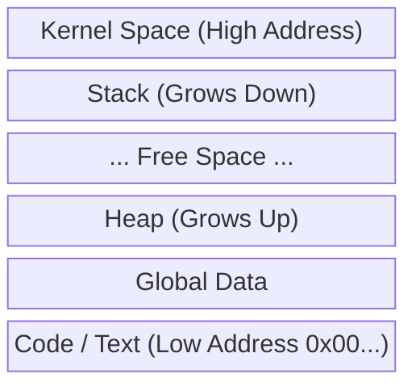

# Chapter 2: The Illusionist

## 1. Ảo giác vĩ đại (The Grand Illusion)

Trong Chapter 1, chúng ta đã thấy Stack nằm ở địa chỉ `0x7ff...` (hàng nghìn tỷ), trong khi máy tính của bạn có thể chỉ có 8GB hoặc 16GB RAM.

Làm thế nào một biến `int` có thể nằm ở địa chỉ vượt xa dung lượng vật lý thực tế của thanh RAM?

Câu trả lời là: **Con số đó là giả.**

Hệ điều hành (OS) là một kẻ lừa đảo đại tài. Nó đưa cho mỗi chương trình (process) chạy trên máy tính một "tấm bản đồ" giả mạo.

- Chương trình của bạn tin rằng nó sở hữu một dải bộ nhớ khổng lồ, liên tục từ 0 đến $2^{64}-1$ (trên máy 64-bit).
- Chương trình tin rằng nó là kẻ duy nhất làm chủ sân chơi này.

Cơ chế này được gọi là **Virtual Memory (Bộ nhớ ảo)**.

## 2. Bản thiết kế của Kẻ lừa đảo (The Blueprint)

Tại sao Hệ điều hành lại sắp xếp Global, Heap và Stack theo vị trí kỳ lạ như chúng ta thấy ở Chapter 1? Đó không phải ngẫu nhiên, mà là một quy hoạch đô thị cực kỳ thông minh.

Hãy nhìn vào sơ đồ quy hoạch tiêu chuẩn của một tiến trình trên Linux/Unix:

1. **Vùng thấp (Low Address - `0x0...`):**
    - Đây là nơi ở của **Text Segment** (Code lệnh máy) và **Data Segment** (Biến toàn cục `globalVar`).
    - _Tại sao ở thấp?_ Vì chúng có kích thước cố định. Code của bạn khi chạy sẽ không sinh thêm dòng code mới. Chúng nằm yên ở "móng nhà".
2. **Vùng cao (High Address - `0x7ff...`):**
    - Đây là nơi ở của **Stack**.
    - _Tại sao ở trên đỉnh?_ Để dành chỗ cho Kernel (Hệ điều hành) nằm ở trên cùng (vùng cấm), và Stack bắt đầu ngay dưới đó.
3. **Vùng giữa (The Void):**
    - Đây là khoảng trống mênh mông giữa Heap (mọc từ dưới lên) và Stack (mọc từ trên xuống).
    - **Lý do của việc "Mọc ngược":** Sự linh hoạt tối đa.
        - Nếu chương trình đệ quy sâu? Stack dài ra, lấn xuống dưới.
        - Nếu chương trình `malloc` file ảnh 1GB? Heap phình to, lấn lên trên.
        - Chúng chia sẻ chung một "bể bơi" tự do ở giữa. Nếu Stack và Heap chạm nhau? **Stack Overflow** (Tràn bộ nhớ) - Game Over.

## 3. Tại sao lại cần nói dối? (Isolation)

Hãy tưởng tượng bạn chạy 2 bản của chương trình `memory_anomaly.c` cùng một lúc.

Cả hai chương trình đều sẽ in ra địa chỉ `stackVar1` na ná nhau (ví dụ đều là 0x7ff...).

Nếu đây là địa chỉ vật lý thật sự trên RAM, thì chương trình A ghi đè lên dữ liệu của chương trình B ngay lập tức! Máy tính sẽ sập (crash) liên tục.

Nhờ lớp ảo hóa (The Illusionist):

- **Process A:** "Tôi muốn ghi vào địa chỉ `0x1000`".
- **OS:** "Được thôi" (nhưng lén ghi vào RAM vật lý ô số **5**).
- **Process B:** "Tôi cũng muốn ghi vào địa chỉ `0x1000`".
- **OS:** "Vô tư đi" (nhưng lén ghi vào RAM vật lý ô số **99**).

Mỗi chương trình sống trong một vũ trụ song song riêng biệt, an toàn và cô lập.

## 4. Câu hỏi dẫn nhập (The Next Step)

Chúng ta đã biết OS vẽ ra một tấm bản đồ ảo (Virtual Memory) để đánh lừa chương trình.

Nhưng hãy nghĩ xem: CPU thực hiện hàng tỷ lệnh mỗi giây.

Nếu với mỗi lệnh truy xuất bộ nhớ, Hệ điều hành đều phải đứng ra làm cảnh sát giao thông: "Dừng lại! Để tôi tra sổ xem địa chỉ ảo này ứng với RAM thật chỗ nào...", thì máy tính sẽ chậm như rùa bò.

Cần phải có một **cỗ máy phần cứng** làm việc này với tốc độ ánh sáng, không cần OS can thiệp vào từng dòng lệnh.

Trong chương tiếp theo, chúng ta sẽ mở nắp thùng máy ra và nhìn vào **The Machine (Cỗ máy)**: MMU và Bảng trang.
