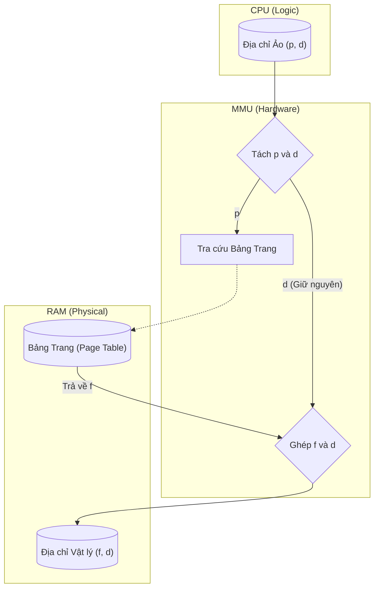

# Chapter 3: The Machine

## 1. Người phiên dịch siêu tốc (The High-Speed Translator)

Ở Chapter 2, chúng ta biết rằng địa chỉ mà chương trình nhìn thấy (`0x7ff...`) là giả. Địa chỉ thật (`0x100...`) nằm đâu đó trên RAM.

Nhưng có một vấn đề hóc búa về hiệu năng:

- CPU chạy ở tốc độ hàng tỷ chu kỳ mỗi giây (GHz). Nếu với mỗi lần truy cập biến, CPU đều phải dừng lại hỏi Hệ điều hành (phần mềm): "Này, địa chỉ ảo này nằm ở đâu trên RAM thật?", thì máy tính sẽ chậm đi hàng nghìn lần. Phần mềm quá chậm so với phần cứng.

Giải pháp là **đưa sự thông minh xuống Silicon**.

Chúng ta cần một con chip chuyên dụng nằm ngay giữa CPU và RAM, làm nhiệm vụ phiên dịch địa chỉ tức thời. Con chip đó gọi là **MMU (Memory Management Unit)**.

## 2. Kỹ thuật "Chia để trị": Paging

MMU không thể lưu trữ bản đồ cho từng byte một (quá tốn kém). Thay vào đó, nó chia bộ nhớ thành các khối có kích thước cố định.

- Bên phía Ảo (Virtual): Gọi là **Trang (Page)**.
- Bên phía Vật lý (Physical): Gọi là **Khung (Frame)**.

Kích thước tiêu chuẩn của một Trang/Khung thường là **4KB** (4096 bytes).

> **Tư duy hình ảnh:** Hãy tưởng tượng bộ nhớ như một cuốn sách. Thay vì nhớ vị trí của từng chữ cái (byte), ta chỉ cần nhớ "Nó nằm ở **Trang 5**, **dòng thứ 10**". Dù Trang 5 có bị xé ra và dán vào bất cứ đâu trên tường (RAM vật lý), thì dòng thứ 10 vẫn luôn là dòng thứ 10 trong trang đó.

## 3. Giải phẫu một địa chỉ (The Anatomy of an Address)

Khi bạn viết lệnh `mov eax, [0x12345678]`, MMU sẽ không nhìn con số đó như một khối thống nhất. Nó xẻ địa chỉ đó ra làm hai phần: $p$ và $d$.

- **$p$ (Page Number):** Số hiệu trang. Đây là phần cần phải phiên dịch.
- **$d$ (Offset):** Độ dời (địa chỉ tương đối). Đây là phần được giữ nguyên.

Chúng ta hãy xem sơ đồ hoạt động của "Nhà máy MMU":



- **Bước 1:** CPU gửi địa chỉ ảo $(p, d)$.
- **Bước 2:** MMU dùng $p$ để tra trong **Bảng trang (Page Table)** xem trang này đang nằm ở khung $(f)$ nào trên RAM6.
- **Bước 3:** MMU ghép khung $f$ mới tìm được với độ dời $d$ cũ để tạo ra địa chỉ vật lý.
- **Bước 4:** Gửi địa chỉ vật lý đến RAM để lấy dữ liệu.

## 4. Bảng trang (The Map)

Bảng trang (Page Table) chính là cuốn sổ tay ghi chép: _"Trang ảo số 1 nằm ở Khung vật lý số 5"_.

Điều thú vị là: Bảng trang cũng nằm trên RAM.

Để CPU biết bảng trang của tiến trình hiện tại nằm ở đâu, có một thanh ghi đặc biệt (trên Intel x86 gọi là CR3 hoặc PTBR - Page-Table Base Register) lưu địa chỉ gốc của bảng này.

### Bằng chứng thực nghiệm (Code)

Làm sao chúng ta biết máy tính dùng trang 4KB? Hãy hỏi Hệ điều hành.

```c
#include <stdio.h>
#include <unistd.h>

int main() {
    // 1. Kiểm tra Kiến trúc (Architecture)
    printf("=== SYSTEM INFO ===\n");
    #if defined(__x86_64__)
        printf("Architecture: x86_64 (Intel/Rosetta)\n");
    #elif defined(__aarch64__)
        printf("Architecture: arm64 (Apple Silicon)\n");
    #else
        printf("Architecture: Unknown\n");
    #endif

    // 2. Kiểm tra Kích thước Trang (Page Size)
    // Hàm sysconf trả về cấu hình runtime của hệ thống
    long pageSize = sysconf(_SC_PAGESIZE); 
    
    printf("Page Size   : %ld bytes\n", pageSize);
    printf("Tương đương : %ld KB\n", pageSize / 1024);
    
    return 0;
}
```

Nếu chạy đoạn code này trên hầu hết các máy Linux/macOS, bạn sẽ nhận được con số **4096 bytes**. Đó là đơn vị cơ bản mà MMU làm việc.

```ini
=== SYSTEM INFO ===
Architecture: x86_64 (Intel/Rosetta)
Page Size : 4096 bytes
Tương đương : 4 KB
```

## 5. Vấn đề phát sinh: Cái giá của sự tiện lợi

Cơ chế này rất hay, nhưng nó có một điểm yếu chết người được gọi là "Vấn đề 2 lần truy cập":

Để lấy một biến soNguyen, máy tính phải truy cập RAM hai lần:

1. Lần 1: Truy cập Bảng trang (trên RAM) để dịch địa chỉ.
2. Lần 2: Truy cập địa chỉ vật lý thực sự để lấy dữ liệu.

Truy cập RAM rất chậm so với tốc độ CPU. Làm thế nào để giải quyết?

Câu trả lời là TLB (Translation Look-aside Buffer) - một bộ nhớ đệm cực nhanh nằm ngay trong MMU để "học thuộc lòng" các trang vừa truy cập. Nhưng đó là câu chuyện tối ưu hóa chúng ta sẽ bàn sau.

**Note: The Apple Silicon Anomaly** Ngay cả khi phần cứng dùng trang 16KB, Hệ điều hành vẫn có thể "ảo hóa" kích thước trang thành 4KB cho các ứng dụng cũ để đảm bảo chúng không bị sập. Đây là quyền năng tối thượng của "The Illusionist".

Trong chương tới, chúng ta sẽ xem xét khía cạnh quan trọng nhất của quản lý bộ nhớ hiện đại: **Sự An Toàn**. Làm sao MMU ngăn chặn Hacker?
