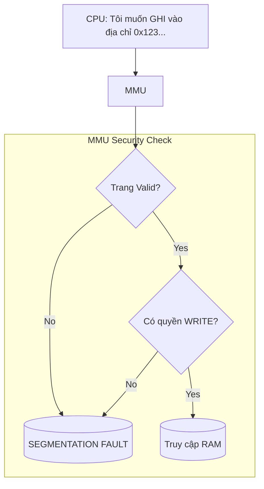

# Chapter 4: The Guardian

## 1. Cú ngã huyền thoại (The Legendary Crash)

Nếu bạn đã từng viết code C, chắc chắn bạn đã gặp thông báo lỗi "cộc lốc" và đáng sợ nhất mọi thời đại:

```ini
Segmentation fault (core dumped)
```

Đa số mọi người sẽ nghĩ rằng: "Máy tính bị lỗi rồi" hoặc "Code mình sai cú pháp".

Nhưng thực tế, đây là Hệ thống phòng thủ đang hoạt động.

Trong Chapter 3, chúng ta đã biết MMU (Memory Management Unit) là kẻ phiên dịch địa chỉ. Nhưng MMU còn một nghề tay trái quan trọng hơn: **Vệ sĩ (The Guardian)**.

Nó đứng gác ngay cổng RAM. Mọi yêu cầu truy cập (`READ`, `WRITE`, `EXECUTE`) đều phải xuất trình "thẻ căn cước". Nếu vi phạm quy tắc? **BÙM!** MMU gửi tín hiệu giết chết chương trình ngay lập tức để bảo vệ hệ thống.

## 2. Những lá cờ quyền lực (The Protection Bits)

Làm sao MMU biết được đâu là hành vi hợp lệ?

Quay lại Bảng trang (Page Table) ở Chapter 3. Bên cạnh cột "Số khung" (Frame Number), Bảng trang thực tế còn chứa các cột siêu dữ liệu (Metadata) cực kỳ quan trọng gọi là Protection Bits (Các bit bảo vệ).

Theo tài liệu lý thuyết hệ điều hành, các thuộc tính này bao gồm:

- **R (Read-Only):** Chỉ được đọc. (Dành cho hằng số).
- **RW (Read-Write):** Được đọc và ghi. (Dành cho biến `int`, `stack`, `heap`).
- **X (Execute-Only):** Chỉ được thực thi. (Dành cho mã lệnh Code/Text segment).

Ngoài ra còn có bit **Valid/Invalid**.

- **Valid:** Trang này thuộc về bạn, mời vào.
- **Invalid:** Trang này không thuộc về bạn (hoặc chưa được nạp), cấm vào.

Chúng ta hãy xem sơ đồ quy trình kiểm tra an ninh:



## 3. Bằng chứng thực nghiệm (The Evidence)

Chúng ta sẽ cố tình chọc tức "Người bảo vệ" bằng cách cố gắng ghi dữ liệu vào một vùng nhớ được đánh dấu là "Chỉ đọc" (Read-Only).

Trong C, chuỗi ký tự (String Literal) như `"Hello"` thường được lưu trong vùng nhớ hằng số (`.rodata`).

```c
#include <stdio.h>

int main() {
    // 1. Khai báo một con trỏ trỏ tới chuỗi hằng (String Literal)
    // Chuỗi này nằm ở vùng .rodata (Read-Only Data)
    char *s = "Hello World";
    
    printf("Chuỗi ban đầu: %s\n", s);
    printf("Địa chỉ của chuỗi: %p\n", (void*)s);

    // 2. Cố gắng thay đổi ký tự đầu tiên ('H' -> 'M')
    // Về mặt cú pháp C: Hoàn toàn đúng (Pointer trỏ đến char).
    // Về mặt Logic: Sai.
    printf("Đang cố ghi đè dữ liệu...\n");
    
    s[0] = 'M'; // <--- TAI NẠN SẼ XẢY RA TẠI ĐÂY

    // Dòng này sẽ không bao giờ được in ra
    printf("Chuỗi sau khi sửa: %s\n", s);
    
    return 0;
}
```

```ini
$ ./hello 
Chuỗi ban đầu: Hello World
Địa chỉ của chuỗi: 0x102180500
Đang cố ghi đè dữ liệu...
[1]    56397 bus error  ./hello
```

### Điều gì xảy ra bên dưới Silicon?

1. **Compiler:** Vẫn biên dịch thành công (nếu không bật cờ cảnh báo khắt khe), vì về mặt ngôn ngữ, `char *` là một địa chỉ.
2. **Loader:** Khi chạy chương trình, OS đánh dấu trang nhớ chứa chuỗi `"Hello World"` là **Read-Only** trong Bảng trang.
3. **Runtime:**
    - CPU gặp lệnh `s[0] = 'M'`.
    - CPU gửi địa chỉ và tín hiệu `WRITE` tới MMU.
    - MMU tra bảng, thấy bit bảo vệ là `R` (Read-only).
    - **MMU phát còi báo động:** Gửi ngắt (Hardware Exception) tới Hệ điều hành.
    - Hệ điều hành gửi tín hiệu `SIGSEGV` tới tiến trình -> **Kill Process**.

## 4. Tấm khiên "No-Execute" (NX Bit)

Không chỉ ngăn chặn lỗi lập trình, MMU còn là tấm khiên chống Hacker.

Một kỹ thuật tấn công kinh điển là Buffer Overflow: Hacker tiêm mã độc vào vùng nhớ Stack (nơi chứa biến cục bộ) và lừa CPU chạy mã đó.

Tuy nhiên, Stack là nơi chứa dữ liệu, không phải mã lệnh.

Người bảo vệ hiện đại sử dụng **NX Bit (No-Execute)**:

- Đánh dấu vùng `Stack` là **RW-** (Đọc/Ghi, nhưng **Không thực thi**).
- Nếu Hacker cố tình nhảy vào Stack để chạy mã? **SEGFAULT**.

## 5. Lời kết cho Volume 1

Chúng ta đã đi một hành trình dài từ một dòng code C đơn giản `int soNguyen = 10;`:

1. **The Anomaly:** Thấy sự sắp xếp bộ nhớ kỳ lạ.
2. **The Illusionist:** Hiểu về bản đồ ảo mà OS vẽ ra.
3. **The Machine:** Thấy cách MMU và Paging hiện thực hóa bản đồ đó.
4. **The Guardian:** Thấy cách phần cứng bảo vệ chúng ta khỏi chính mình.

Nhưng... `Segmentation Fault` xảy ra khi chương trình _đang chạy_ (Runtime). Lúc đó thì đã quá muộn, server đã sập, khách hàng đã mất kết nối.

Liệu có cách nào bắt lỗi này ngay từ khi chúng ta gõ phím không? Có cách nào loại bỏ hoàn toàn khái niệm "Con trỏ không an toàn"?

Đó là lúc chúng ta cần một tư duy mới. Trong Volume tiếp theo, chúng ta sẽ nói về **The Modern Way** và sự trỗi dậy của **Rust** - ngôn ngữ lập trình sinh ra để làm bạn thân với Người bảo vệ.
