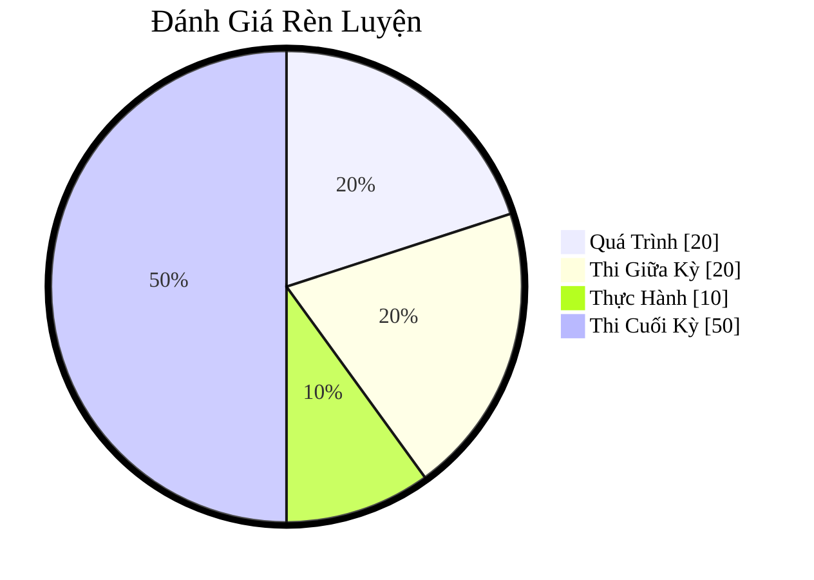

# IT007 - Operating Systems

- [IT007.F12.LT - Learning Log](https://docs.google.com/spreadsheets/d/1oWKOpVdh_Y75Lb1kADHt6oSrrNl94uMD8GQCtopeVBw/edit?usp=sharing)

## Thời Khóa Biểu

- Bắt đầu lớp lúc 6.30pm, GMT+7.
- LƯU Ý:
    - KHÔNG ĐIỂM DANH HẰNG NGÀY.
    - ĐIỂM DANH BẤT CHỢT THÔNG QUA YÊU CẦU PHÁT BIỂU.

- [Học Kỳ 1, 2025 - 2026 ](../../../2025-2026-HK1.md)

## Moodle:

- [IT007.F12.LT.CNTT](https://elearning.citd.vn/course/view.php?id=1226#section-0)

## eLearning

1. [Chương 1. Tổng Quan về Hệ Điều Hành](elearning/IT007-elearning-ch01.md)
2. [Chương 2. Các Thành Phần Trong Hệ Điều Hành](elearning/IT007-elearning-ch02.md)

## Thực Hành

- Ngôn ngữ C (không Java, Python, etc).
- Dùng những công cụ đã được giảng viên dạy (mutex lock, semaphore).
- Giải thích trực tiếp trong Notebook Colab: text block (Markdown).
- Báo cáo: 3 phần.
    - Giới thiệu giải pháp.
    - Giải thích giải pháp.
    - Kết quả của giải pháp.

## Textbook

- Thư mục: `textbook`.
- Title: Operating System Concepts
- Homepage: https://www.os-book.com/OS10/
- Book (in this vault): [Operating System Concepts PDF](textbook/Operating-System-Concepts-Wiley-Global-Education.pdf)
- Slides:
    - Pages: https://www.os-book.com/OS10/slide-dir/index.html
    - In this vault: `uit/courses/IT007/textbook/slides/`

Tips: To download all the slides in the same folder named `PPTX-dir`.

```shell
wget -r -np -nH --cut-dirs=2 'https://www.os-book.com/OS10/slide-dir/PPTX-dir/'
```

## Tài Nguyên Khác

- [Operating Systems: Three Easy Pieces](https://pages.cs.wisc.edu/~remzi/OSTEP/)
- [Home - Old Man Programmer - Courses](https://oldmanprogrammer.net/courses.php)
- [bootlin - training - courses](https://bootlin.com/training/)
- [Low-Level Process Hunting on macos](https://themittenmac.com/low-level-process-hunting-on-macos/)
    - [Threat Hunting macOS](https://themittenmac.com/threat-hunting-book/)
- [CS 4394: Implementation of Modern OS](https://personal.utdallas.edu/~sxa173731/ios/)

## Đánh Giá Rèn Luyện

- Quá Trình: 20%
    - Hoàn thành bài giảng các chương trên Moodle
    - Hoàn thành các bài kiểm tra trong quá trình học
    - Điểm cộng/trừ hoạt động trên Classpoint và các lần **điểm danh bất kỳ**
- Thi Giữa Kỳ: 20%
    - Thi tập trung
    - Tự luận + Trắc nghiệm
    - Thời gian 45 phút – 60 phút
- Thực Hành: 10%
    - Hoàn thành 01 bài LAB: deadline là **2 tuần tính từ ngày đăng**.
- **Thi Cuối Kỳ: 50%**
    - Thi tập trung
    - Tự luận + Trắc nghiệm
    - Thời gian 60 phút – 90 phút

Trực quan:



## Lộ Trình

### Thi Cuối Kỳ

- Chương: 5, 7, 8.
- Tham khảo: Chương 6.

### 251218

- Chuẩn bị nội dung 7.4 - 7.6
- Bài tiểu kết chương 5: sẽ mở ở cuối buổi học sau.

### 251225

- Chuẩn bị nội dung 8.1 - 8.2
- Bài thực hành sẽ đăng lên sau buổi học này.
    - Tính thời gian từ lúc đăng bài.
    - Deadline: 2 tuần.
