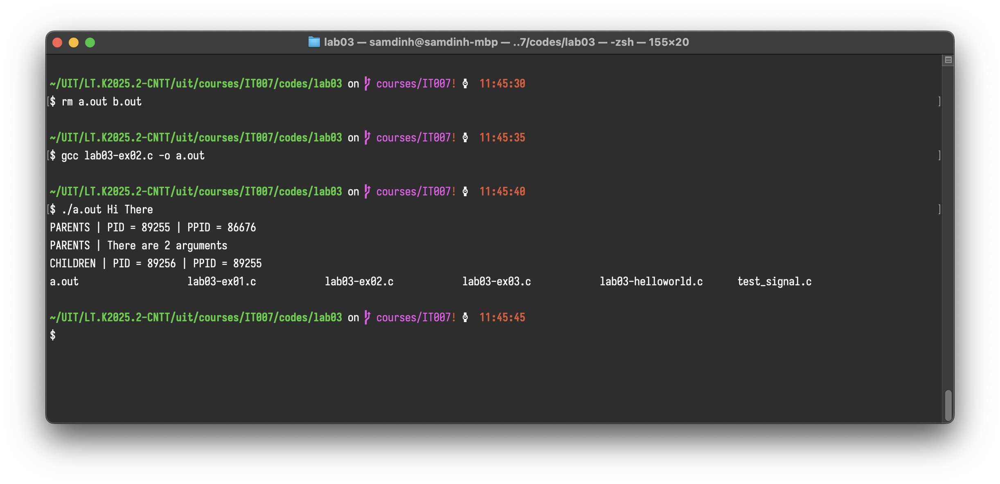
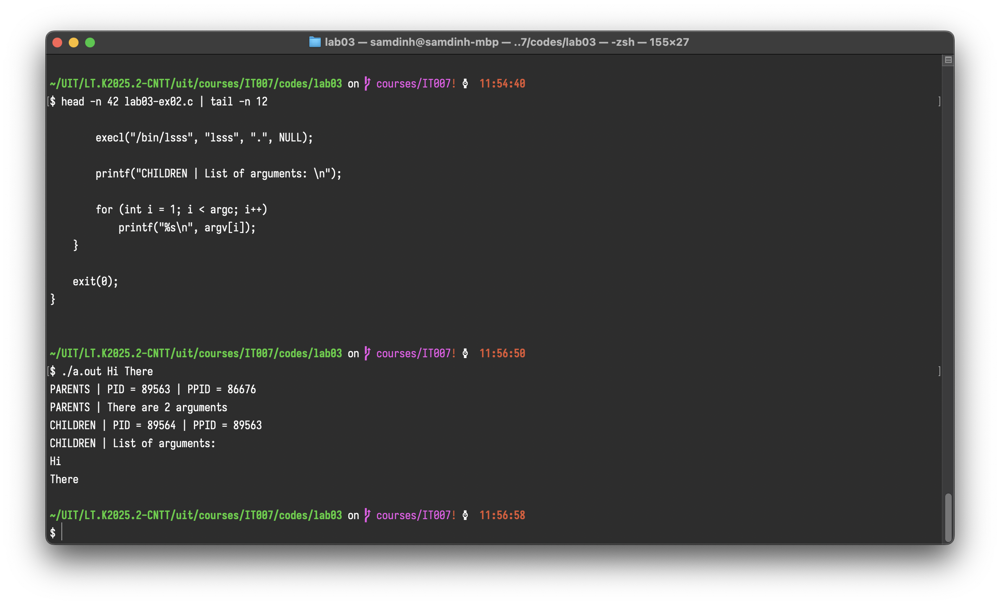
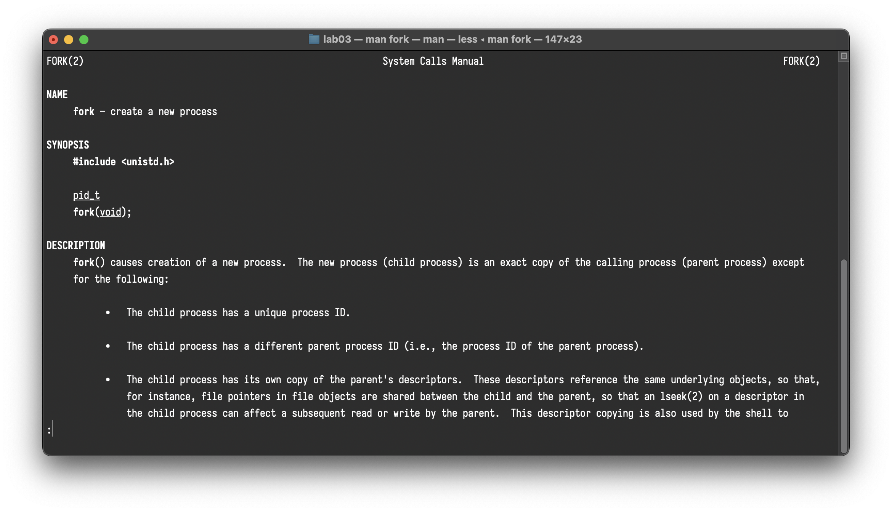
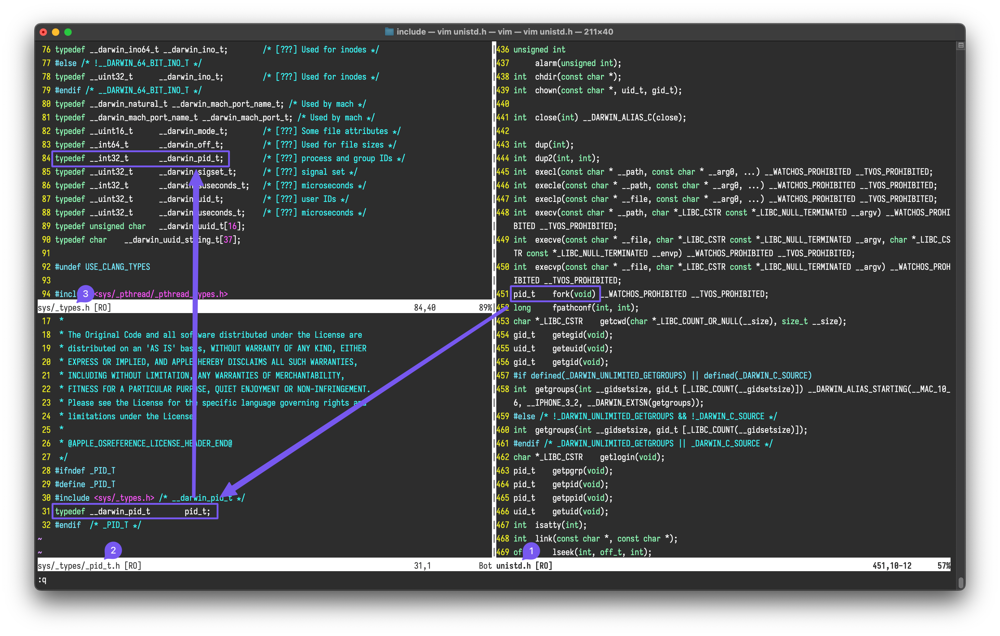

# fork(), execl() và câu chuyện đằng sau

>   **Báo cáo ngắn**
>   Môn: IT007

**Tóm tắt:**

Báo cáo này phân tích các lời gọi hệ thống (system calls) `fork()` và `execl()`, vốn là nền tảng cho việc tạo lập tiến trình trong các hệ điều hành tương tự UNIX. Chúng ta sẽ xem xét một đoạn mã C mẫu, đi sâu vào cơ chế nhân bản tiến trình của `fork()` và thay thế hình ảnh tiến trình của `exec()`.

Báo cáo cũng làm sáng tỏ cơ chế đặc biệt giúp `fork()` trả về các giá trị khác nhau cho tiến trình cha và con, và kết thúc bằng một cái nhìn tổng quan về toàn bộ vòng đời của một tiến trình, từ khi hệ thống khởi động đến khi chấm dứt.

[TOC]

## Phân tích Mã nguồn

Chúng ta bắt đầu bằng việc phân tích một chương trình C sử dụng cả `fork()` và `execl()`.

`a.c`:

```c
#include <stdio.h>
#include <stdlib.h>
#include <unistd.h>
#include <sys/wait.h>
#include <sys/types.h>

int main(int argc, char* argv[])
{
    pid_t pid; // Lưu ý: pid_t là kiểu POSIX chuẩn, __pid_t là kiểu nội bộ
    pid = fork();

    if (pid > 0)
    {
        // --- Mã của TIẾN TRÌNH CHA ---
        printf("PARENTS | PID = %ld | PPID = %ld\n",
               (long) getpid(), (long)getppid());
        if (argc >= 2)
            printf ("PARENTS | There are %d arguments\n", argc - 1);
        
        // Cha đợi con (nay đã là 'ls') hoàn thành
        wait(NULL); 
        printf("PARENTS | Child process finished. Parent is exiting.\n");
    }
    else if (pid == 0)
    {
        // --- Mã của TIẾN TRÌNH CON ---
        printf("CHILDREN | PID = %ld | PPID = %ld\n",
               (long)getpid(), (long)getppid());

        // Con "biến hình" thành chương trình /bin/ls
        // Nó sẽ liệt kê các tệp trong thư mục hiện tại (dấu ".")
        execl("/bin/ls", "ls", ".", NULL);

        // --- CÁC DÒNG SAU SẼ KHÔNG BAO GIỜ CHẠY NẾU EXECL THÀNH CÔNG ---
        // Một lời gọi exec() chỉ trả về (với giá trị -1) nếu nó thất bại.
        perror("CHILDREN | execl failed"); 
        
        // Đoạn code này chỉ chạy nếu execl thất bại
        printf("CHILDREN | List of arguments (only if exec fails): \n");
        for (int i = 1; i < argc; i++)
            printf("%s\n", argv[i]);
        
        exit(1); // Thoát với mã lỗi nếu exec thất bại
    }
    else
    {
        // --- XỬ LÝ LỖI ---
        // pid < 0, fork() đã thất bại
        perror("fork failed");
        exit(1);
    }

    // Chỉ có tiến trình cha (sau khi wait) mới chạy đến đây
    exit(0);
}
```

**Giải thích hoạt động:**

- Chương trình gọi `fork()` để tạo một tiến trình con. (Lưu ý: `pid_t` là kiểu POSIX chuẩn cho ID tiến trình; `__pid_t` thường là kiểu nội bộ của `glibc`/kernel Linux).
- **Khối `if (pid > 0)`:** Đây là mã được thực thi bởi **tiến trình cha**.
    - Nó nhận được `pid` của tiến trình con (một số nguyên dương).
    - Nó in ra PID và PPID của mình.
    - Sau đó, nó gọi `wait(NULL)` để tạm dừng, chờ đợi tiến trình con (hiện đã *trở thành* `ls`) kết thúc trước khi nó tiếp tục và thoát.

- **Khối `else if (pid == 0)`:** Đây là mã được thực thi bởi **tiến trình con**.
    -   Nó in ra PID và PPID của mình (lưu ý PPID của nó chính là PID của cha).
    -   Ngay sau đó, nó gọi `execl("/bin/ls", "ls", ".", NULL)`. Lệnh này yêu cầu kernel **thay thế** hoàn toàn hình ảnh (mã và dữ liệu) của tiến trình con bằng chương trình `/bin/ls`.
    -   Nếu `execl` thành công, tiến trình con *trở thành* `ls`. Nó sẽ liệt kê các tệp trong thư mục hiện tại (`.`) và sau đó tự thoát (với mã thoát của `ls`).
    -   **Quan trọng:** Các dòng mã *bên dưới* `execl` (như `perror`, `printf`, và vòng lặp `for`) sẽ **không bao giờ** được thực thi, vì hình ảnh của chương trình đã bị thay thế hoàn toàn. `execl` chỉ trả về (với giá trị `-1`) nếu nó thất bại (ví dụ: không tìm thấy `/bin/ls`).
- **Khối `else` (pid < 0):** Xử lý trường hợp `fork()` thất bại, ví dụ như hệ thống hết bộ nhớ hoặc đạt giới hạn tiến trình.

Ví dụ: Khi `execl()` thành công, kết quả đầu ra của con là chương trình được gọi, ở đây là `/bin/ls`.



Ví dụ: khi `execl()` thất bại vì `/bin/lsss` không tồn tại, các đoạn sau của con tiếp tục chạy, in ra tham số của cha từ thứ tự 1 cho đến hết.



## Lời gọi hệ thống fork()

Lời gọi hệ thống `fork()` là cơ chế cơ bản để tạo tiến trình mới trong các hệ điều hành UNIX-like. Khi `fork()` được gọi, hệ điều hành (kernel) thực hiện các bước sau:

1. Tạo một tiến trình con (child process) bằng cách **nhân bản** (duplicate) tiến trình gọi nó (parent process).
2. Tiến trình con nhận được một bản sao gần như chính xác của không gian địa chỉ, các mô tả tệp (file descriptors) đang mở, và các tài nguyên khác của tiến trình cha.
3. Mặc dù là bản sao, tiến trình con có một mã định danh tiến trình (PID) duy nhất.

Trong các hệ thống hiện đại, `fork()` thường được tối ưu hóa bằng kỹ thuật **Copy-on-Write (CoW)**. Thay vì sao chép toàn bộ không gian bộ nhớ ngay lập tức, kernel cho phép cả cha và con chia sẻ cùng một trang bộ nhớ vật lý. Một trang chỉ bị sao chép khi một trong hai tiến trình cố gắng **ghi** (write) vào nó. Điều này làm cho `fork()` trở nên cực kỳ hiệu quả.

## Họ Lời gọi execl() và gia đình exec()

`execl` là **bước logic tiếp theo**. Trong khi `fork()` tạo ra một bản sao, gia đình các lời gọi `exec()` (bao gồm `execl`, `execv`, `execlp`, v.v.) thì không.

-   Một lời gọi `exec()` **thay thế** hình ảnh (image) của tiến trình hiện tại bằng một chương trình mới.
-   Nó tải mã và dữ liệu của chương trình mới vào không gian bộ nhớ của tiến trình đang chạy.
-   **PID không thay đổi**, nhưng mọi thứ khác—mã, dữ liệu, stack—đều bị ghi đè.

Mô hình phổ biến nhất để chạy một chương trình mới trong Linux là `fork()`-then-`exec()`:

1. `fork()`: Một tiến trình cha (ví dụ: `bash` shell) tự nhân bản để tạo ra một tiến trình con.
2. `exec()`: Tiến trình con sau đó gọi `execl()` (hoặc tương tự) để "biến hình" thành chương trình mới (ví dụ: `/bin/ls` hoặc chương trình của chúng ta).
3. `wait()`: Tiến trình cha (vẫn là `bash` shell) gọi `wait()` để chờ chương trình mới hoàn thành.

## Câu chuyện về giá trị trả về của fork()

Một câu hỏi kinh điển là: Làm thế nào `int fork(void)`, một hàm được khai báo chỉ trả về một `int`, lại có thể trả về các giá trị khác nhau (`0`, PID, `-1`)?

-   Câu trả lời nằm ở chỗ `fork()` là một lời gọi hệ thống được gọi **một lần** (trong tiến trình cha) nhưng **trả về hai lần** (một lần trong tiến trình cha, và một lần trong tiến trình con).

Đây là cách kernel thực hiện điều đó:

- **Bối cảnh 1:** Lỗi (Trả về `-1`)
    - Nếu kernel thất bại trong việc tạo tiến trình con (ví dụ: hết bộ nhớ, đạt giới hạn tiến trình), không có tiến trình con nào được tạo ra.
    - `_do_fork()` (hoặc tương đương trong kernel) trả về một mã lỗi âm (ví dụ: `-ENOMEM`).
    - Thư viện C chuyển đổi mã lỗi này thành `-1` và đặt biến `errno` **toàn cục**.
    - Chỉ có tiến trình cha nhận được giá trị này.
    
- **Bối cảnh 2:** Thành công (Trả về `> 0` và `0`)
  1. Tiến trình cha gọi `fork()`, một ngắt (trap) xảy ra, và CPU chuyển sang chế độ kernel.
    2. Kernel thực thi `copy_process()`. Nó tạo một cấu trúc `task_struct` mới cho tiến trình con.
    3. Tại thời điểm này, kernel có **hai** tiến trình gần giống hệt nhau. Cả hai đều đang ở chế độ kernel, chuẩn bị quay trở lại chế độ người dùng (user mode) ngay sau lệnh `fork()`.
    4. **Đây là mấu chốt:** Trước khi cho phép các tiến trình tiếp tục, kernel **thiết lập thủ công giá trị trả về** (thường được lưu trong thanh ghi `RAX` trên x86-64) cho _từng_ tiến trình:
        - **Đối với tiến trình con:** Kernel đặt thanh ghi `RAX` thành `0`.
        - **Đối với tiến trình cha:** Kernel đặt thanh ghi `RAX` thành PID của tiến trình con vừa tạo.
        - Xem thêm ở mục Tham Khảo.
    5. Khi bộ lập lịch/định thời (scheduler) của CPU cho phép mỗi tiến trình chạy, chúng tiếp tục ở chế độ người dùng. Tiến trình cha thấy giá trị trong `RAX` là PID của con. Tiến trình con thấy giá trị trong `RAX` là `0`.

Vì vậy, `fork()` không "trả về" nhiều giá trị theo nghĩa thông thường. Nó là một hàm được gọi bởi một luồng thực thi, nhưng luồng đó bị nhân bản, và kernel thiết lập các trạng thái kết thúc khác nhau cho bản gốc và bản sao.

## Toàn cảnh: Từ lúc nhấn nút nguồn

Để hiểu đầy đủ bối cảnh, chúng ta hãy tóm tắt toàn bộ quá trình ở mức độ cao.

1. **Nút nguồn & BIOS/UEFI:**
    -   Bạn nhấn nút nguồn.
    -   Firmware của bo mạch chủ (BIOS hoặc UEFI) thực thi, chạy Kiểm tra tự bật nguồn (POST).

2. **Bootloader:**
    -   BIOS/UEFI tìm một thiết bị có khả năng khởi động (ví dụ: ổ cứng) và tải giai đoạn đầu của **Bootloader** (ví dụ: GRUB, vốn có 2 stage/giai đoạn) vào bộ nhớ và thực thi nó.

3. **Tải Kernel:**
    -   Bootloader tải hình ảnh **Linux Kernel** (ví dụ: `vmlinuz`) và `initramfs` (hệ thống tệp RAM ban đầu) vào bộ nhớ. Sau đó, nó chuyển quyền điều khiển cho kernel.

4. **Khởi tạo Kernel:**
    -   Kernel "giải nén" chính nó, khởi tạo các hệ thống con cốt lõi: quản lý bộ nhớ, bộ lập lịch (scheduler), trình điều khiển thiết bị (drivers) từ `initramfs`.

5. **Tiến trình `init` (PID 1):**
    -   Sau khi hoàn tất khởi tạo, kernel khởi chạy tiến trình không gian người dùng (user-space) _đầu tiên_.
    -   Đây là tiến trình `init` (thường là `systemd` trên các hệ thống hiện đại).
    -   Nó có PID là 1 và là **tổ tiên của mọi tiến trình khác**.

6. **Khởi tạo User-space:** `init` (PID 1) đọc các tệp cấu hình của nó và bắt đầu khởi chạy tất cả các dịch vụ hệ thống khác. Về cơ bản, `init` (ví dụ: `systemd`) sẽ lặp đi lặp lại chu trình `fork()`-then-`exec()`:
    - `init` gọi `fork()` để tạo một tiến trình con mới.
    - Tiến trình con này (vẫn đang chạy mã của `init`) gọi `exec()` để thay thế chính nó bằng một dịch vụ mới tương ứng, hoàn toàn tùy cấu hình:
        - dịch vụ quản lý mạng `NetworkManager`,
        - dịch vụ đăng nhập `login` (`getty`),
        - Web server (`httpd`),
        - DB server (`mysql`),
        - SSH (`sshd`)
        - vv...
    - `init` (tiến trình cha, PID 1) tiếp tục chạy, giám sát các tiến trình con của nó và khởi chạy các dịch vụ tiếp theo.
7. **Đăng nhập & Shell (Ví dụ về cây tiến trình):** Các dịch vụ này tự chúng lại tạo ra các tiến trình con, hình thành một cây.
    - `init` (PID 1) `fork()` và `exec()` để chạy **Display Manager** (ví dụ: `gdm3`, `lightdm`).
    - Display Manager `fork()` và `exec()` để chạy **Xorg server** (máy chủ đồ họa) (rồi các tiến trình liên quan ví dụ: sound server (Pulse Audio)).
    - Sau khi bạn đăng nhập, Display Manager `fork()` và `exec()` để chạy **Window Manager** (ví dụ: `gnome-shell`, `plasma_shell`).
    - Window Manager (hoặc một dịch vụ con của nó) `fork()` và `exec()` để chạy ứng dụng **Terminal** (ví dụ: `gnome-terminal`).
    - Ứng dụng Terminal `fork()` và `exec()` để chạy **Shell** của bạn (ví dụ: `bash`).
    - `bash` shell (giờ là cha) đang chờ bạn nhập lệnh.
8. **Chạy chương trình của chúng ta:** Khi bạn gõ `./a.out` (tên mặc định cho mã đã biên dịch) và nhấn Enter:
    - Shell `bash` (tiến trình cha) gọi `fork()` để tạo một bản sao của chính nó.
    - Tiến trình `bash` con gọi `execlp("./a.out", ...)` để thay thế chính nó bằng chương trình của bạn.
    - Tiến trình `bash` cha gọi `wait()` để chờ chương trình của bạn hoàn thành.
9. **Bên trong chương trình của chúng ta:**
    -   Chương trình `./a.out` bắt đầu thực thi.
    -   Nó đến lệnh `pid = fork();`.

10. **`fork()` của chúng ta:**
    -   Kernel tạo một bản sao của `./a.out`.
    -   Giờ đây, chúng ta có hai tiến trình `./a.out` đang chạy.

11. **Thực thi song song:** Cả hai tiến trình (cha và con của `./a.out`) tiếp tục chạy.
     - Con (`pid == 0`) dùng `execl()` để gọi `/bin/ls`:
         - Nếu `execl()` thành công, bản thân `ls` sẽ `exit()`. Và các dòng sau dòng `execl()` không được thực thi.
         - Nếu `execl()` thất bại, và các dòng sau dòng `execl()` sẽ được thực thi, khi đó tiến trình con có exit code = 1 (thất bại).
     - Cha (`pid > 0`) in thông tin của nó và bị chặn tại `wait(NULL)`.
12. **Kết thúc (Termination):**
     - Khi tiến trình con gọi `exit(1)` hoặc return code từ tiến tình được gọi bởi `execl()` (return code là `0`, `0` có nghĩa là OK, không lỗi), nó sẽ chấm dứt.
     - Lời gọi `wait(NULL)` trong tiến trình cha được mở khóa.
     - Tiến trình cha tiếp tục, thực thi xong khối `if`, và gọi `exit(0)`.
13. **Quay lại Shell:**
     -   Tiến trình cha (`./a.out`) chấm dứt.
     -   Lời gọi `wait()` trong `bash` shell ban đầu giờ đã hoàn tất.
     -   Kernel thu hồi tài nguyên của `./a.out`.
     -   Shell `bash` hiển thị lại dấu nhắc lệnh, sẵn sàng cho lệnh `execlp()` tiếp theo.


Lưu ý:

-   Terminal/Shell có thể được gọi bởi Window Manager/Desktop Environment (như đề cập) hoặc một chương trình bất kỳ, ví dụ VSCode (từ thẻ Terminal của VSCode).

## Kết luận

`fork()` và `exec()` là hai trong số các lời gọi hệ thống mạnh mẽ và thanh lịch nhất trong thiết kế UNIX. `fork()` nhân bản, `exec()` thay thế. Sự kết hợp này cung cấp một cơ chế linh hoạt và hiệu quả để tạo và quản lý các tác vụ đồng thời. Hiểu rõ cách kernel điều khiển các giá trị trả về và cách các tiến trình này phù hợp với bức tranh lớn hơn của hệ điều hành là kỹ năng thiết yếu cho bất kỳ lập trình viên hệ thống nào.

## Tham Khảo

- Blog:
    - [Disillusioning the Magic of the fork System Call](https://blog.codingconfessions.com/p/the-magic-of-fork?ref=dailydev)
- Mã nguồn Kernel Linux (GitHub):
    - `kernel/fork.c`: Chứa mã nguồn cho `_do_fork()`, `copy_process()` và logic cốt lõi của `fork()`. (https://github.com/torvalds/linux/blob/master/kernel/fork.c)
    - `fs/exec.c`: Chứa logic để xử lý các lời gọi `exec()` và tải các tệp nhị phân. (https://github.com/torvalds/linux/blob/master/fs/exec.c)
- Trang Man Pages:
    - `man 2 fork`: "fork - create a child process"
    - `man 3 exec`: "execv, execvp, execvpe, execl, execlp, execle - execute a file"
    - `man 2 wait`: "wait, waitpid, waitid - wait for process to change state"



- Header files:
    - `unistd.h`: gọi `fork()`
    - `sys/_types/_pid_t.h`: định nghĩa `pid_t`
    - `sys/_types.h`: cho biết loại/kích thước của `pid_t`
    - Lưu ý: Đây là thư viện trên macOS nên có sự thay đổi ít nhiều, ví dụ cách đặt tên.



## Từ Khóa

Để tìm hiểu sâu hơn, bạn có thể nghiên cứu các từ khóa sau:

- `init`
- `systemd`
- `openRC`
- `runit`
- `bootloader`
- `GRUB`
- `Copy-on-Write (CoW)`
- `task_struct`
- `Xorg`
- `Display Manager`
    - GDM
    - LightDM
    - SDDM
- `Window Manager`:
    - Tiling: Awesome, i3, vv…
    - Floating/Cascading: GNOME Shell, Kwin, Openbox, …

## Fun Facts

-   Vì sao `fork()` trả về 0 cho con?
    -   Tiến trình con luôn có thể tìm thấy cha mình bằng cách gọi `getppid()`. Tuy nhiên, tiến trình cha có thể có nhiều con và không biết PID của con trước khi `fork()` trả về.
    -   Việc trả về `0` cho con cung cấp một cách đơn giản, đáng tin cậy để nó biết "Tôi là tiến trình con". Tiến trình cha nhận được PID của con để có thể quản lý nó (ví dụ: `waitpid(...)`).
-   `vfork()`:
    -   Người anh em "nhanh nhưng nguy hiểm" của `fork()`. `vfork()` được tạo ra vì `fork()` (trước thời CoW) rất chậm do phải sao chép toàn bộ bộ nhớ. `vfork()` không sao chép bộ nhớ; nó chia sẻ không gian bộ nhớ của cha và treo (*suspend*) tiến trình cha cho đến khi con gọi `exec()` hoặc `_exit()`. Có nghĩa, tiết kiệm bộ nhớ, nhưng tiến trình cha bị tạm dừng.
    -   Nếu tiến trình con sửa đổi bất kỳ dữ liệu nào trước khi `exec()` (gọi một chương trình khác), nó đang làm hỏng bộ nhớ của cha mình. Có nghĩa không nên thay đổi bất kỳ biến/giá trị gì trước khi gọi `exec()`.
    -   `vfork()` gần như lỗi thời nhờ CoW nhưng vẫn tồn tại.
-   Tiến trình Zombie (Thây ma):
    -   Khi một tiến trình con kết thúc, mục nhập của nó trong bảng tiến trình của kernel (một phần của `task_struct`) vẫn được giữ lại cho đến khi tiến trình cha "thu dọn" nó bằng cách gọi `wait()`. Điều này cho phép cha đọc trạng thái kết thúc (exit status) của con.
    -   Một tiến trình con đã kết thúc nhưng chưa được cha `wait()` được gọi là "zombie". Nó đã "chết" nhưng vẫn chiếm một vị trí trong bảng tiến trình.
    -   Đây là một tình trạng khá nhức đầu đối với các sysadmin. Mặc dù một vài zombie đơn lẻ là vô hại, một tiến trình cha bị lỗi (không gọi `wait()`) có thể tạo ra hàng ngàn zombie, làm cạn kiệt tài nguyên (như PID) và làm lộn xộn bảng tiến trình, ngăn cản các tiến trình mới khởi động.
-   Tiến trình Orphan (Mồ côi):
    -   Nếu một tiến trình cha kết thúc trước khi con của nó kết thúc, tiến trình con trở thành "mồ côi". Các tiến trình này không bị bỏ mặc; chúng ngay lập tức được "*nhận nuôi*" bởi tiến trình `init` (PID 1). Một trong những nhiệm vụ của `init` là gọi `wait()` cho bất kỳ đứa con mồ côi nào mà nó nhận nuôi, đảm bảo chúng không bao giờ trở thành zombie khi kết thúc.
    -   Bạn **không thể** `kill -9` một tiến trình zombie! Lệnh `kill` dùng để chấm dứt một tiến trình *đang chạy*. Zombie là tiến trình đã chết; nó không còn mã nào để thực thi hay nhận tín hiệu. Cách duy nhất để dọn dẹp zombie là để tiến trình cha (parent) gọi `wait()`, hoặc bạn `kill` chính tiến trình cha đó (khiến con zombie thành mồ côi và được `init` (PID 1) dọn dẹp ngay lập tức).
-   Cuộc chiến Init (Init Wars):
    -   Trong cộng đồng Linux, có một cuộc tranh luận triết học (đôi khi rất gay gắt) về hệ thống `init` nào là tốt nhất. Một bên là `systemd` (mặc định trên hầu hết các bản phân phối lớn hiện nay), vốn mạnh mẽ, phức tạp và quản lý song song nhiều dịch vụ. Bên kia là các hệ thống `init` tuân theo triết lý UNIX truyền thống là "làm một việc và làm tốt" (ví dụ: `SysVinit`, `OpenRC`, `runit`). Mặc dù không lớn bằng "cuộc chiến trình soạn thảo" (Vi vs. Emacs), nhưng vốn cũng là một chủ đề nóng trong khoảng 10 năm trở lại đây.
    -   Tương tự: GNOME vs KDE, Tiling vs. Floating/Cascading, vv…
-   Daemons vs Zoombie:
    -   Service trong Linux được gọi là `daemon`:
    -   Mọi thứ trên Linux đều có thể cần một server/service/`daemon`: `httpd` (web server), `mysqld` (db), `pulseaudio` (âm thanh/sound server), `xorg` (đồ họa/display server), v.v..
    -   Và, Daemon sinh ra Zombie là *rất hợp lý* nhưng **rõ ràng không phải ai cũng thích**.
    
-   Black Myth Wukong:
    -   **Ngưu Ma Vương (Daemon):**
        -   Một "Quỷ Vương".
        -   Huynh đệ của Ngộ Không.
    -   **Hồng Hài Nhi (fork()):**
        -   Nghĩa là “Đứa trẻ có màu đỏ” (vì là tộc Dạ Soa, yêu tinh).
        -   Là con của Ngưu Ma Vương (mặc dù không hoàn toàn là huyết thống mà là linh hồn của Thái Tử tộc Dạ Soa, do vợ của Ngưu Ma Vương là Thiết Phiến Công Chúa bị ép uống nước sông Tử Mẫu mà sinh ra).
    -   **Dạ Soa Vương (Zombie):**
        -   Hồng Hài Nhi sau đó (cướp Căn Nguyên Khí của Ngộ Không) hóa thành Dạ Soa Vương (một dạng "zombie") và bị Thiên Mệnh Nhân đánh bại.
        -   Cuối cùng tự kết liễu (tự `kill`/`exit()`).
    -   **wait() thất bại:** Ngưu Ma Vương (cha) cuối cùng đã không thể "thu dọn" hay cứu rỗi được Hồng Hài Nhi (con), một bi kịch tương tự như việc tiến trình cha không thể `wait()` được tiến trình con đã chết.

