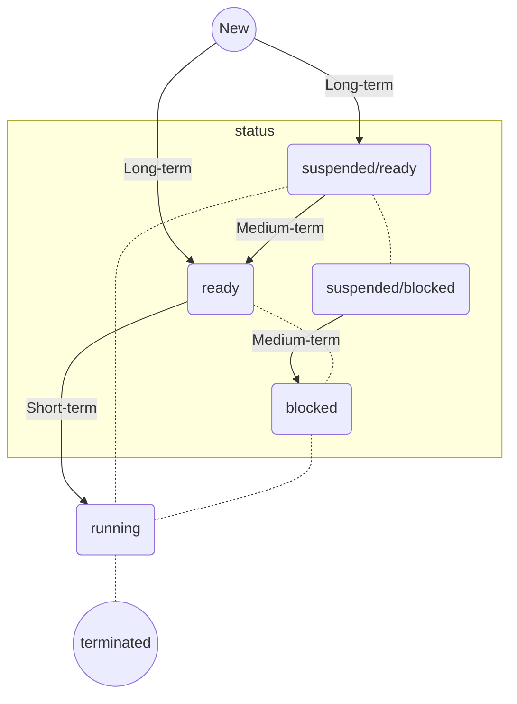

# Định Thời CPU (Phần 1)

## Mục Tiêu

1. Các khái niệm cơ bản về định thời.
2. Các tiêu chuẩn định thời CPU.
3. Các giải thuật định thời.
4. Vận dụng các giải thuật định thời.
    - First-Come, First-Served (FCFS)

## Các Khái Niệm Cơ Bản về Định Thời

### Định Thời (Scheduling)

> Định Thời: Scheduling, là chiến lược lựa chọn tiến trình phù hợp để được thực thi sao cho đạt được hiệu quả cao nhất.

- Multitasking:
    - Cho phép thực thi nhiều chương trình.
    - Nhằm tăng hiệu suất hệ thống.
    - Nhiều chương trình được nạp vào bộ nhớ.
    - Tại mỗi thời điểm $t$, chỉ có một tiến trình trình $p$ được thực thi.
- Challenges:
    - Vấn đề phân chia, lựa chọn tiến trình thực thi.
    - Mục tiêu: Đạt được hiệu quả cao nhất.
- Cần có các phương pháp lựa chọn phù hợp.

### Chu Kỳ CPU - I/O

- Service time:
    - Lượng thời gian một tiến trình cần CPU trong một chu kỳ CPU - I/O
    - Còn gọi là *Burst time*.
- CPU-bound:
    - Các tiến trình có *service time* lớn.
    - Các tiến trình hướng CPU.

### Tiến Trình Hướng CPU (CPU-bound)

- Tiến trình yêu cầu thời gian thực thi nhiều trên CPU.
- Thời gian hoàn thành chương trình phụ thuộc vào tốc độ thực thi của CPU.
    - Và, thuật toán của tiến trình.

```c
#include <stdio.h>

int main() {
    long long start = 1, end = 1000000;
    total = 0;
    // Chiếm rất nhiều CPU (và RAM)
    for (long long i = start; i <= end; i++) {
        total += i;
    }
    
    printf("Sum of numbers from %lld to %lld is %lld\n", start, end, total);
    return 0;
}
```

### Tiến Trình Hướng I/O (I/O-bound)

- Thời gian thực thi nhiều trên I/O (đọc/ghi, ngoại vi, vv...)
- Thời gian hoàn thành phụ thuộc vào chu kỳ đợi cho thao tác I/O

```c
#include <stdio.h>

int main() {
    FILE *fp;
    char filename[] = "example.txt";
    int total = 0, ch;
    fp = fopen(filename, "r");
    
    if (fp == NULL) {
        printf("Failed to open file %s\n", filename);
        return 1;
    }
    
    // Chiếm nhiều I/O
    while ((ch = fgetc(fp)) != EOF) {
        total++;
    }
    
    fclose(fp);
    
    printf("Total number of characters in file %s is %d\n", filename, total);
    
    return 0;
}
```

## Các Loại Định Thời

- Long-term scheduling
- Medium-term scheduling
- Short-term scheduling



### Long-term scheduling

### Medium-term scheduling

### Short-term scheduling


