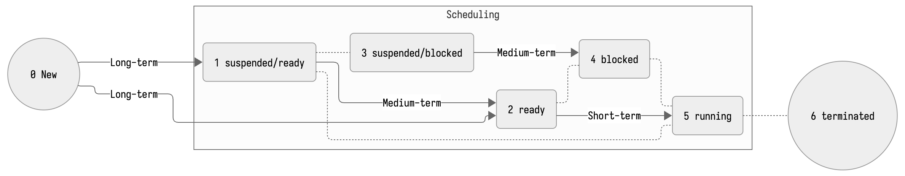
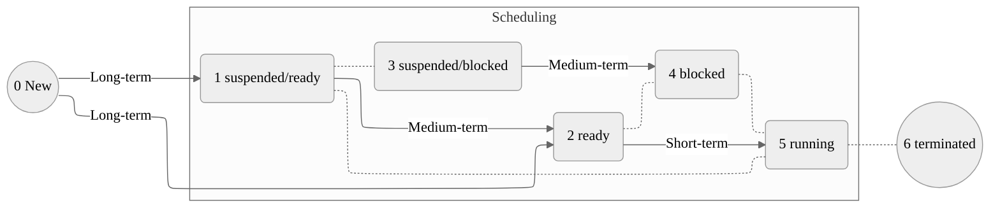
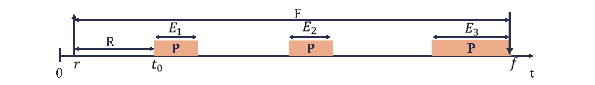

# Định Thời CPU (Phần 1)

## Mục Tiêu

1. Các khái niệm cơ bản về định thời.
2. Các tiêu chuẩn định thời CPU.
3. Các giải thuật định thời.
4. Vận dụng các giải thuật định thời.
    - First-Come, First-Served (FCFS)

## Các Khái Niệm Cơ Bản về Định Thời

### Định Thời (Scheduling)

> Định Thời: Scheduling, là chiến lược lựa chọn tiến trình phù hợp để được thực thi sao cho đạt được hiệu quả cao nhất.

- Multitasking:
    - Cho phép thực thi nhiều chương trình.
    - Nhằm tăng hiệu suất hệ thống.
    - Nhiều chương trình được nạp vào bộ nhớ.
    - Tại mỗi thời điểm $t$, chỉ có một tiến trình trình $p$ được thực thi.
- Challenges:
    - Vấn đề phân chia, lựa chọn tiến trình thực thi.
    - Mục tiêu: Đạt được hiệu quả cao nhất.
- Cần có các phương pháp lựa chọn phù hợp.

### Chu Kỳ CPU - I/O

- Service time:
    - Lượng thời gian một tiến trình cần CPU trong một chu kỳ CPU - I/O
    - Còn gọi là *Burst time*.
- CPU-bound:
    - Các tiến trình có *service time* lớn.
    - Các tiến trình hướng CPU.

### Tiến Trình Hướng CPU (CPU-bound)

- Tiến trình yêu cầu thời gian thực thi nhiều trên CPU.
- Thời gian hoàn thành chương trình phụ thuộc vào tốc độ thực thi của CPU.
    - Và, thuật toán của tiến trình.

```c
#include <stdio.h>

int main() {
    long long start = 1, end = 1000000;
    total = 0;
    // Chiếm rất nhiều CPU (và RAM)
    for (long long i = start; i <= end; i++) {
        total += i;
    }
    
    printf("Sum of numbers from %lld to %lld is %lld\n", start, end, total);
    return 0;
}
```

### Tiến Trình Hướng I/O (I/O-bound)

- Thời gian thực thi nhiều trên I/O (đọc/ghi, ngoại vi, vv...)
- Thời gian hoàn thành phụ thuộc vào chu kỳ đợi cho thao tác I/O

```c
#include <stdio.h>

int main() {
    FILE *fp;
    char filename[] = "example.txt";
    int total = 0, ch;
    fp = fopen(filename, "r");
    
    if (fp == NULL) {
        printf("Failed to open file %s\n", filename);
        return 1;
    }
    
    // Chiếm nhiều I/O
    while ((ch = fgetc(fp)) != EOF) {
        total++;
    }
    
    fclose(fp);
    
    printf("Total number of characters in file %s is %d\n", filename, total);
    
    return 0;
}
```

## Các Loại Định Thời

- Long-term scheduling
- Medium-term scheduling
- Short-term scheduling



Mermaid:



### Long-term scheduling

- Định thời dài
- Xác định chươing trình nào được nạp vào hệ thống để thực thi.
    - *Điều khiển mức độ đa chương của hệ thống.*
- Cố gắng duy trì xen lẫn giữa tiến tình CPU-bound và I/O bound.

### Medium-term scheduling

- Định thời vừa/trung.
- Quyết định tiến trình nào được đưa vào (*swap in*) và đưa ra khỏi (*swap out*) bộ nhớ chính trong quá trình thực thi.
- Được thực hiện bởi bộ phận quản lý bộ nhớ (Main Memory Management).

### Short-term scheduling

- Định thời ngắn/cục bộ.
- CPU scheduling (Định thời CPU).
- Xác định tiến trình nào trong hàng đợi sẵn sàng (*ready queue*) sẽ được chiếm CPU để thực thi tiếp theo.
- Multithreaded kernel: việc định thời CPU là do OS chọn *kernel thread* được chiếm CPU.
- Được gọi khi lệnh ngắt (*interupt*) xẩy ra:
    - Ngắt thời gian: *clock interrupt*.
    - Ngắt ngoại vi: *I/O interrupt*.
    - Lời gọi hệ thống: *sys call*.
    - Tín hiệu đồng bộ hóa (Chương 5).
- Bộ định thời (scheduler) chuyển CPU cho tiến trình được lựa chọn thực thi.
- Quá trình chuyển đổi:
    - Chuyển ngữ cảnh (*context switch*): sử dụng thông tin ngữ cảnh trong FCB.
    - Chuyển chế độ người dùng.
    - Nhảy đến vị trí thích hơp trong chương trình úng dụng để khởi động lại chương trình.
        - Sử dụng thông tin địa chỉ tại *program counter* trong FCB.
- Overhead (tổn phí):
    - *Dispatch latency*: thời gian mà bộ định thời dừng một tiến trình và khởi động một tiến trình khác.

## Các Tiêu Chuẩn Định Thời CPU

### Hướng Người Dùng (User-Oriented)

- Thời gian đáp ứng (*Response Time*):
    - từ lúc tiến trình gửi yêu cầu thực thi đến khi được đáp ứng yêu cầu.
    - time-sharing, interactive system: cực tiểu (*min*)
- Thời gian hoàn thành (*Turnaround Time*):
    - từ lúc một tiến trình được nạp vào hệ thống cho đến khi kết thúc.
    - Mục tiêu: *min*.
- Thời gian đợi (*Waiting Time*):
    - TỔNG thời gian một tiến trình đợi trong *ready queue*
    - Lưu ý: tiến trình có thể được chuyển trạng thái *ready*/*running*/*suspended* nhiều lần.
    - Mục tiêu: *min*.

### Cách Xác Định Các Thông Số Định Thời

```mermaid
---
config:
  theme: default
  themeVariables:
    fontFamily: "Iosevka"
---
gantt
    title CPU Scheduling (Process P)
    dateFormat S
    axisFormat %S

    section Timeline
    Arrival (r) : milestone, m1, 1, 0s
    Wait        : done, w1, after m1, 2s
    P (E1)      : active, p1, after w1, 2s
    Gap         : crit, g1, after p1, 2s
    P (E2)      : active, p2, after g1, 2s
    Gap 2       : crit, g2, after p2, 2s
    P (E3)      : active, p3, after g2, 3s
    Finish (f)  : milestone, m2, after p3, 0s
```





- **$r$ (Release/Arrival Time):**
  - The moment the process enters the system (ready queue).
- **$t_0$ (Start Time):**
  - The moment the CPU actually begins executing the process for the first time.
- **$f$ (Finish Time):**
  - The moment the process completes its execution and exits the system.
- **$P$ (Process):**
  - The orange blocks represent the CPU bursts (execution time).
- **$E_1, E_2, E_3$:**
  - These are "Execution chunks".
  - The gaps between them imply the process was **preempted** (paused) to let another process run, or it was waiting for I/O.
  - $E = E_1 + E_2 + E_3 + \ldots + E_n$
- **$R$ (Response Time):**
  - The time duration from arrival ($r$) to the first execution ($t_0$).
  - $R = t_0 - r$.
- **$F$ (Flow Time / Turnaround Time):**
  - The total time spent in the system, from arrival to completion.
  - $F = f - r$.
- *W* (**Waiting Time**):
  - Total waiting time.
  - $W = f - r - E = F - E$

### Hướng Hệ Thống (System-Oriented)

- Hiệu năng sử dụng (*processor utilization*):
  - Định thời sao cho CPU càng bận càng tốt.
  - Mục tiêu: *max*.
  - $min_{idle}$
- Tính công bằng (*fairness*):
  - Tất cả các tiến trình phải được *đối xử như nhau*.
- Thông lượng (*throughput*):
  - Số tiến trình hoàn tất trong một đơn vị thời gian.
  - Mục tiêu: *max*

## Các Giải Thuật Định Thời

### Giải Thuật Định Thời

Thường bao gồm 2 yếu tố:

1. Hàm chọn lựa (*selection function*):
   - Mô tả cách thức (căn cứ) để lựa chọn tiến trình nào trong *ready queue* được thực thi.
   - Ví dụ: độ ưu tiên, yêu cầu về tài nguyên, đặc điểm thực thi, vv..
2. Chế độ quyết định (*decision mode*):
   - Quyết định thời điểm thực hiện hàm chọn lựa để định thời.

### Các Chế Độ Quyết Định

Thường có 2 chế độ:

- Không trưng dụng (*non-preemptive*):
  - Khi ở trạng thái *running* (5), tiến trình sẽ được thực thi cho đến khi kết thúc (6. terminated), hoặc bị ngắt (*blocked*) (4) do yêu cầu I/O.
- Trưng dụng (*preemptive*):
  - Tiến trình đang thực thi (*running*) có thể bị ngắt giữa chừng, và chuyển về trạng thái *ready* (2).
  - Chi phí cao hơn chế động non-preemptive.
  - Nhưng có thời gian đáp ứng ($r_0$) tốt hơn.
    - Không có trường hợp một tiến trình độc chiếm CPU quá lâu.

### Thời Điểm Thực Thi Hàm Chọn Lựa

1. Có tiến trình chuyển trạng thái từ *running* sang *waiting*.
2. Có tiến trình chuyển trạng thái từ *running* sang *ready*.
3. Có tiến trình chuyển từ trạng thái *waiting*, *new* sang *ready*.
4. Kết thúc thực thi của một tiến trình (*6. terminated*).

Đánh giá:

- 1 và 4: không cần lựa chọn loại định thời.
  - Không phụ thuộc vào loại giải thuật định thời.
  - Thường áp dụng chế độ không trưng dụng (non-preemptive).
- 2 và 3 cần:
  - Phục thuộc vào loại giải thuật định thời.
  - Thường áp dụng chế độ trưng dụng.

*Thực hiện cơ chế nào khó hơn? Tại sao?*

### Các Giải Thuật Định Thời

- First-Come, First-Served (FCFS)
- Shortest Job First (SJF)
- Shortest Remaining Time First (SRTF)
- Round-Robin (RR)
- Priority Scheduling.
- Highest Response Ratio Next (HRRN)
- Multilevel Queue
- Multilevel Feedback Queue

### First-Come, First-Served (FCFS)

- **Hàm Lựa Chọn**
  - Tiến trình nào yêu cầu CPU trước sẽ được cấp phát trước.
  - Tiến trình sẽ thực thi đến khi kết thúc hoặc bị *blocked* bởi I/O
- **Chế Độ Quyết Định**
  - Không trưng dụng.
- Hiện thực:
  - Sử dụng hàng đợi FIFO (First In, First Out queues)
  - Tiến trình mới xuất hiện được thêm vào cuối hàng đợi.
  - Tiến trình được lựa chọn để xử lý được lấy từ đầu của hàng đợi.

```mermaid
---
config:
  theme: default
  themeVariables:
    fontFamily: "Iosevka"
---
gantt
    title FCFS
    dateFormat SS
    axisFormat %S

    section Timeline
    P1 ready : milestone, m1, 0, 0s
    P1        : active, w1, after m1, 2s
    P2 ready : milestone, m2, after m1, 2s
    P2        : active, p1, after w1, 3s
    P3 ready : milestone, m3, after m2, 2s
    P3         : active, g1, after p1, 2s
    P4 ready : milestone, m4, after m3, 3s
    P4      : active, p2, after g1, 2s
    P5 ready : milestone, m5, after m4, 1s
    P5       : active, g2, after p2, 2s
    Finish (f)  : milestone, f1, after p3, 0s
```



### Shortest Job First (SJF)

### Shortest Remaining Time First (SRTF)

### Round-Robin (RR)

### Priority Scheduling.

### Highest Response Ratio Next (HRRN)

### Multilevel Queue

### Multilevel Feedback Queue
