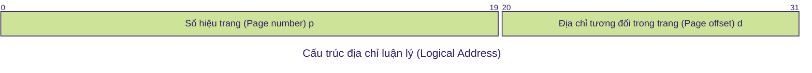

# Quản Lý Bộ Nhớ

Mục tiêu:

1. Khái niệm cơ sở về bộ nhớ.
2. Các kiểu địa chỉ nhớ và cách chuyển đổi giữa các kiểu này.
3. Các cơ chế và mô hình quản lý bộ nhớ.

Nội dung:

1. Khái niệm cơ sở.
2. Các kiểu địa chỉ nhớ.
3. Chuyển đổi địa chỉ nhớ.
4. Mô hình quản lý bộ nhớ.
5. Cơ chế phân trang.
6. Cơ chế swapping.

## Khái niệm cơ sở về bộ nhớ

### VIDEO: KHÁI NIỆM CƠ SỞ VỀ BỘ NHỚ

Trình bày giới thiệu quản lý bộ nhớ, trình bày mục tiêu và nội dung chương 7 - Quản lý bộ nhớ và trình bày giới thiệu các khái niệm cơ sở về bộ nhớ.

- [[Hệ điều hành] Chương 7.1: Khái niệm cơ sở về bộ nhớ](https://www.youtube.com/watch?v=6PiPe10l9E4)

- Chương trình phải được mang vào tỏng bộ nhớ và đặt nó trong một tiến trình để được xử lý.
- Input Queue: Một tập hợp của những tiến trình trên đĩa mà đang chờ để được mang vào trong bộ nhớ để thực thi.
- User programs trải qua nhiều bước trước khi được xử lý.
- Quản lý bộ nhớ: là công việc của hệ điều hành với sự hỗ trợ của phần cứng nhằm phân phối, sắp xếp các tiến trình trong bộ nhớ sao cho hiệu quả.
- Mục tiêu cần đạt được: là nạp càng nhiều tiến trình vào bộ nhớ càng tốt (gia tăng mức độ đa chương).
- Trong hầu hết các hệ thống, **kernel sẽ chiếm một phần cố định của bộ nhớ**; phần còn lại phân phối cho các tiến trình.
- Các yêu cầu đối với việc quản lý bộ nhớ:
    - Cấp phát bộ nhớ cho các tiến trình
    - Tái định vị (relocation): khi swapping,…
    - Bảo vệ: kiểm tra truy xuất bộ nhớ có hợp lệ không
    - Chia sẻ: cho phép các tiến trình chia sẻ vùng nhớ chung
    - Kết gán địa chỉ nhớ luận lý của user vào địa chỉ thực

### Slide: Khái niệm cơ sở về bộ nhớ

### Quiz: Khái niệm cơ sở về bộ nhớ

> [!NOTE]
> Chọn phát biểu đúng khi nói về việc quản lý bộ nhớ?
> 
> - [ ] Chương trình ứng dụng chỉ làm việc với địa chỉ luận lý và không bao giờ nhìn thấy địa chỉ vật lý thực sự
> - [x] Tất cả các đáp án đều đúng
> - [ ] Địa chỉ bộ nhớ trong mã nguồn được biểu diễn dưới dạng ký hiệu (symbolic)
> - [ ] Việc liên kết địa chỉ sẽ được thực hiện trong giai đoạn thực thi nếu chương trình cần truy cập đến một vị trí nào đó trong bộ nhớ chính

> [!NOTE]
> Chọn phát biểu đúng trong các phát biểu sau?
> 
> - [ ] Tất cả đều đúng
> - [ ] Input queue là một tập các tiến trình trên RAM đang chờ được cấp CPU
> - [x] Chương trình cần phải được nạp vào bộ nhớ chính và được cấp phát CPU cùng với các tài nguyên khác thì mới có thể được thực thi
> - [ ] Chương trình chỉ cần được cấp CPU là có thể được thực thi

> [!NOTE]
> Những yêu cầu nào sau đây KHÔNG phải là yêu cầu dành cho quản lý bộ nhớ?
> 
> - [ ] Kiểm tra việc truy xuất bộ nhớ có hợp lệ không
> - [ ] Cấp phát/thu hồi bộ nhớ cho các tiến trình
> - [ ] Cho phép các tiến trình chia sẻ vùng nhớ chung
> - [ ] Tái định vị
> - [ ] Chuyển địa chỉ luận lý thành địa chỉ thực
> - [x] Cho phép các tiến trình được tự chia sẻ vùng nhớ chung

## Các kiểu địa chỉ nhớ

### VIDEO: CÁC KIỂU ĐỊA CHỈ NHỚ

- [[Hệ điều hành] Chương 7.2: Các kiểu địa chỉ nhớ](https://www.youtube.com/watch?v=Cy_G0zSfJLU)

#### Các kiểu địa chỉ nhớ

Trình bày về các kiểu địa chỉ nhớ bao gồm địa chỉ vật lý, địa chỉ luận lý, các khái niệm liên quan đến linking và địa chỉ bộ nhớ khi linking.

- Địa chỉ vật lý (**physical address**) (địa chỉ thực): là một vị trí thực trong bộ nhớ chính.
- Địa chỉ luận lý (**logical address**): là một vị trí nhớ được diễn tả trong một chương trình (còn gọi là địa chỉ ảo - virtual address).
    - Các trình biên dịch (compiler) tạo ra mã lệnh chương trình mà trong đó mọi tham chiếu bộ nhớ đều là địa chỉ luận lý.
- Địa chỉ tuyệt đối (**absolute address**): địa chỉ tương đương với địa chỉ thực.
- Địa chỉ tương đối (**relative address**) (địa chỉ khả tái định vị, relocatable address) là một kiểu địa chỉ luận lý trong đó các địa chỉ được biểu diễn tương đối so với một vị trí xác định nào đó trong chương trình.
    - Ví dụ: 12 byte so với vị trí bắt đầu chương trình,…

Ví dụ:

```c
#include <stdio.h>

int main() {
    int soNguyen = 10;
    printf("Giá trị của soNguyen: %d\n", soNguyen);
    printf("Vị trí của soNguyen trong bộ nhớ: %p\n", &soNguyen);
    return 0;
    
    // TODO: Đây là địa chỉ vật lý hay logic hay tương đối?
}
```

#### Nạp chương trình vào bộ nhớ 

- Linker: kết hợp các object module thành một file nhị phân khả thực thi gọi là load module.
- Loader: nạp (load) module vào bộ nhớ chính.

#### Cơ chế thực hiện linking

### Slide: Các kiểu địa chỉ nhớ

### Quiz: Các kiểu địa chỉ nhớ

> [!NOTE]
> Không gian địa chỉ luận lý là gì?
> 
> - [x] Tập hợp tất cả các địa chỉ luận lý được tạo ra bởi một chương trình
> - [ ] Địa chỉ được tạo ra bởi CPU, còn được gọi là địa chỉ ảo
> - [ ] Địa chỉ được tạo ra bởi RAM, còn được gọi là địa chỉ ảo
> - [ ] Tập hợp tất cả các địa chỉ vật lý được tạo ra bởi một chương trình

> [!NOTE]
> Một kiểu địa chỉ trong đó các địa chỉ được biểu diễn tương đối so với một vị trí xác định nào đó trong chương trình là?
> 
> - [ ] Địa chỉ luận lý
> - [ ] Địa chỉ vật lý
> - [x] Địa chỉ tương đối
> - [ ] Địa chỉ tuyệt đối

## Chuyển đổi địa chỉ nhớ

### VIDEO: CHUYỂN ĐỔI ĐỊA CHỈ NHỚ

Trình bày về các vấn đề liên quan đến chuyển đổi địa chỉ nhớ khi biên dịch và thực thi chương trình.

#### Chuyển đổi địa chỉ

- Là quá trình ánh xạ một địa chỉ từ không gian địa chỉ này sang không gian địa chỉ khác
- Biểu diễn địa chỉ nhớ:
    - Trong source code: symbolic (các biến, hằng, pointer,…)
    - Trong thời điểm biên dịch: thường là địa chỉ khả tái định vị.
        - Ví dụ: a ở vị trí 12 byte so với vị trí bắt đầu module.
    - Thời điểm linking/loading: có thể là địa chỉ thực.
        - Ví dụ: dữ liệu nằm tại địa chỉ bộ nhớ thực 2030.
- Địa chỉ lệnh và dữ liệu được chuyển đổi thành địa chỉ thực có thể xảy ra tại ba thời điểm khác nhau.
    - **Compile time:** nếu biết trước địa chỉ bộ nhớ của chương trình thì có thể kết gán địa chỉ tuyệt đối lúc biên dịch.
        - Ví dụ: chương trình `.COM` của MS-DOS.
        - Khuyết điểm: phải biên dịch lại nếu thay đổi địa chỉ nạp chương trình.
    - **Load time:** vào thời điểm loading, loader phải chuyển đổi địa chỉ khả tái định vị thành địa chỉ thực dựa trên một địa chỉ nền.
        - Địa chỉ thực được tính toán vào thời điểm nạp chương trình.
        - Phải tiến hành reload nếu địa chỉ nền thay đổi.
    - Sinh địa chỉ tuyệt đối vào thời điểm dịch
    - Sinh địa chỉ tuyệt đối vào thời điểm nạp
- **Execution time:** khi trong quá trình thực thi, tiến trình có thể được di chuyển từ segment này sang segment khác trong bộ nhớ thì quá trình chuyển đổi địa chỉ được trì hoãn đến thời điểm thực thi.
    - Cần sự hỗ trợ của phần cứng cho việc ánh xạ địa chỉ
        - Ví dụ: Trường hợp địa chỉ luận lý là relocatable thì có thể dùng thanh ghi base và limit, …
    - Sử dụng trong đa số các OS đa dụng trong đó có các cơ chế swapping, paging, segmentation, …

#### Dynamic linking

- Quá trình link đến một module ngoài (external module) được thực hiện sau khi đã tạo xong load module (i.e. file có thể thực thi, executable).
    - Ví dụ trong Windows: module ngoài là các file `.DLL` còn trong Unix, các module ngoài là các file `.so` (shared library).
- Load module chứa các stub tham chiếu (refer) đến routine của external module.
    - Lúc thực thi, khi stub được thực thi lần đầu (do process gọi routine lần đầu), stub nạp routine vào bộ nhớ, tự thay thế bằng địa chỉ của routine và routine được thực thi.
    - Các lần gọi routine sau sẽ xảy ra bình thường.
- Stub cần sự hỗ trợ của OS (như kiểm tra xem routine đã được nạp vào bộ nhớ chưa).
- Ưu điểm:
    - Thông thường, external module là một thư viện cung cấp các tiện ích của OS. Các chương trình thực thi có thể dùng các phiên bản khác nhau của external module mà không cần sửa đổi, biên dịch lại.
    - Chia sẻ mã (code sharing): một external module chỉ cần nạp vào bộ nhớ một lần. Các tiến trình cần dùng external module này thì cùng chia sẻ đoạn mã của external module ⇒ tiết kiệm không gian nhớ và đĩa.
    - Phương pháp dynamic linking cần sự hỗ trợ của OS trong việc kiểm tra xem một thủ tục nào đó có thể được chia sẻ giữa các tiến trình hay là phần mã của riêng một tiến trình (bởi vì chỉ có OS mới có quyền thực hiện việc kiểm tra này).
- Cơ chế:
    - chỉ khi nào cần được gọi đến thì một thủ tục mới được nạp vào bộ nhớ chính ⇒ tăng độ hiệu dụng của bộ nhớ bởi vì các thủ tục không được gọi đến sẽ không chiếm chỗ trong bộ nhớ.
    - Rất hiệu quả trong trường hợp tồn tại khối lượng lớn mã chương trình có tần suất sử dụng thấp, không được sử dụng thường xuyên (ví dụ các thủ tục xử lý lỗi).
    - Hỗ trợ từ hệ điều hành
        - Thông thường, user chịu trách nhiệm thiết kế và hiện thực các chương trình có dynamic loading.
        - Hệ điều hành chủ yếu cung cấp một số thủ tục thư viện hỗ trợ, tạo điều kiện dễ dàng hơn cho lập trình viên.

### Slide: Chuyển đổi địa chỉ nhớ

### Quiz: Các kiểu địa chỉ nhớ

> [!NOTE]
> Khi trong quá trình thực thi, process có thể được di chuyển từ segment này sang segment khác trong bộ nhớ thì quá trình chuyển đổi địa chỉ được trì hoãn đến?
> 
> - [ ] Compile time
> - [ ] Load time
> - [x] Execution time

> [!NOTE]
> Quá trình ánh xạ một địa chỉ từ không gian địa chỉ này sang không gian địa chỉ khác là?
> 
> - [ ] Phân tích địa chỉ nhớ
> - [ ] Biểu diễn địa chỉ nhớ
> - [ ] Tính toán địa chỉ
> - [x] Chuyển đổi địa chỉ

## Mô hình quản lý bộ nhớ

### VIDEO: MÔ HÌNH QUẢN LÝ BỘ NHỚ

Trình bày về các mô hình quản lý bộ nhớ, đi sâu trình bày về cơ chế phân chia cố định, cơ chế phân chia động và các chiến lược placement một tiến trình vào vùng nhớ tương ứng với từng cơ chế trên. Đồng thời, phần này cũng trình bày những khái niệm liên quan đến phân mảnh nội, phân mảnh ngoại

- [[Hệ điều hành] Chương 7.4: Mô hình quản lý bộ nhớ](https://www.youtube.com/watch?v=sg7O2-XXJ_k)

#### Mô hình quản lý bộ nhớ

- Trong chương này, mô hình quản lý bộ nhớ là một mô hình đơn giản, không có bộ nhớ ảo.
- Một tiến trình phải được nạp hoàn toàn vào bộ nhớ thì mới được thực thi.
- Các cơ chế quản lý bộ nhớ:
    - Phân chia cố định (fixed partitioning)
    - Phân chia động (dynamic partitioning)
    - Phân trang đơn giản (simple paging)
    - Phân đoạn đơn giản (simple segmentation)

#### Phân mảnh (Fragmentation)

- Phân mảnh ngoại (external fragmentation)
    - Kích thước không gian nhớ còn trống đủ để thỏa mãn một yêu cầu cấp phát, tuy nhiên không gian nhớ này không liên tục ⇒ có thể dùng cơ chế kết khối (compaction) để gom lại thành vùng nhớ liên tục.
- Phân mảnh nội (internal fragmentation)
    - Kích thước vùng nhớ được cấp phát có thể hơi lớn hơn vùng nhớ yêu cầu.
        - Ví dụ: cấp một khoảng trống 18,464 bytes cho một tiến trình yêu cầu 18,462 bytes.
    - Hiện tượng phân mảnh nội thường xảy ra khi bộ nhớ thực được chia thành các khối kích thước cố định (fixed-sized block) và các tiến trình được cấp phát theo đơn vị khối.
        - Ví dụ: cơ chế phân trang (paging).

#### Fixed Partitioning

- Khi khởi động hệ thống, bộ nhớ chính được chia thành nhiều phần rời nhau gọi là các partition có kích thước bằng nhau hoặc khác nhau.
- Tiến trình nào có kích thước nhỏ hơn hoặc bằng kích thước partition thì có thể được nạp vào partition đó.
- Nếu chương trình có kích thước lớn hơn partition thì phải dùng cơ chế overlay.
- Nhận xét
    - Không hiệu quả do bị phân mảnh nội: một chương trình dù lớn hay nhỏ đều được cấp phát trọn một partition.

#### Fixed Partitioning - Placement Strategy

- Partition có kích thước bằng nhau
    - Nếu còn partition trống ⇒ tiến trình mới sẽ được nạp vào partition đó.
    - Nếu không còn partition trống, nhưng trong đó có tiến trình đang bị blocked ⇒ swap tiến trình đó ra bộ nhớ phụ nhường chỗ cho tiến trình mới
- Partition có kích thước không bằng nhau: giải pháp 1
    - Gán mỗi tiến trình vào partition nhỏ nhất phù hợp với nó.
    - Có hàng đợi cho mỗi partition.
    - Giảm thiểu phân mảnh nội.
    - Vấn đề: có thể có một số hàng đợi trống không (vì không có tiến trình với kích thước tương ứng) và hàng đợi dày đặc
- Partition có kích thước không bằng nhau: giải pháp 2
    - Chỉ có một hàng đợi chung cho mọi partition.
    - Khi cần nạp một tiến trình vào bộ nhớ chính ⇒ chọn partition nhỏ nhất còn trống.

#### Dynamic Partitioning

- Số lượng partition không cố định và partition có thể có kích thước khác nhau.
- Mỗi tiến trình được cấp phát chính xác dung lượng bộ nhớ cần thiết.
- Gây ra hiện tượng phân mảnh ngoại.

#### Dynamic Partitioning - Placement Strategy

- Dùng để quyết định cấp phát khối bộ nhớ trống nào cho một tiến trình.
- Mục tiêu: giảm chi phí compaction.
- Các chiến lược placement
    - Best-fit: chọn khối nhớ trống nhỏ nhất.
    - First-fit: chọn khối nhớ trống phù hợp đầu tiên kể từ đầu bộ nhớ.
    - Next-fit: chọn khối nhớ trống phù hợp đầu tiên kể từ vị trí cấp phát cuối cùng.
    - Worst-fit: chọn khối nhớ trống lớn nhất.
### Slide: Mô hình quản lý bộ nhớ

### Quiz: Mô hình quản lý bộ nhớ

> [!NOTE]
> Chọn phát biểu đúng khi nói về hiện tượng phân mảnh nội?
> 
> - [x] Bộ nhớ cấp phát lớn hơn một ít so với yêu cầu cấp phát bộ nhớ
> - [ ] Chênh lệch kích thước giữa vùng nhớ được cấp phát và yêu cầu cấp phát
> - [ ] Tất cả đều sai
> - [ ] Tổng dung lượng còn lại trong không gian bộ nhớ đủ để thỏa mãn yêu cầu cấp phát nhưng lại không liên tục

> [!NOTE]
> Hiện tượng phân mảnh ngoại có thể được giải quyết bằng phương pháp kết khối (compaction). Chọn phát biểu khi nói về phương pháp này?
> 
> - [ ] Phương pháp kết khối chỉ khả thi chỉ khi hệ thống có thể linh hoạt việc tái định vị địa chỉ
> - [ ] Việc kết khối được thực hiện trong giai đoạn thực thi
> - [x] Tất cả đều đúng
> - [ ] Các vùng nhớ được trộn để gom tất cả vùng nhớ trống lại với nhau để hình thành một vùng nhớ trống lớn

"One solution to the problem of external fragmentation is **compaction**. The goal is to shuffle the memory contents so as to place all free memory together in one large block. Compaction is not always possible, however. If relocation is static and is done at assembly or load time, compaction cannot be done. It is possible only if relocation is dynamic and is done at execution time. If addresses are relocated dynamically, relocation requires only moving the program and data and then changing the base register to reflect the new base address. When compaction is possible, we must determine its cost. The simplest compaction algorithm is to move all processes toward one end of memory; all holes move in the other direction, producing one large hole of available memory. This scheme can be expensive."

> [!NOTE]
> Cho process P1 có kích thước là 240 KByte, cấp phát trong bộ nhớ theo phân hoạch có thứ tự như sau:
> - 1 (250 KByte),
> - 2 (100 KByte),
> - 3 (200 KByte),
> - 4 (400 KByte).
> 
> Biết con trỏ đang nằm ở vùng nhớ thứ 2, vùng nhớ thứ 2 đã được cấp phát và vùng nhớ 1, 3 và 4 vẫn còn trống. Hỏi process P1 sẽ được cấp phát trong vùng nhớ nào, nếu dùng giải thuật **next-fit**?
> 
> - [ ] 3
> - [ ] 1
> - [x] 4
> - [ ] 2

## Cơ chế phân trang

Trình bày về cơ chế phân trang trong quản lý bộ nhớ, các chuyển đổi địa chỉ trong cơ chế phân trang.

- [[Hệ điều hành] Chương 7.5.1: Cơ chế phân trang (Phần 1/2)](https://www.youtube.com/watch?v=aJkxtT2qQ2c)

### Cơ chế phân trang

- Cơ chế cấp phát bộ nhớ không liên tục.
- Chia bộ nhớ vật lý thành các khối cố định gọi là các khung trang (frames).
    - Kích thước của frame là lũy thừa của 2, từ khoảng 512 byte đến 16MB.
- Chia bộ nhớ luận lý thành các khối nhớ bằng nhau gọi là các trang (pages).
    - Kích thước của page bằng kích thước của frame.
- Chương trình có N trang cần N khung trống (free frames) trong bộ nhớ để nạp vào.
- Thiết lập bảng phân trang (page table) để ánh xạ địa chỉ luận lý thành địa chỉ thực.

### Chuyển đổi địa chỉ trong paging

- Địa chỉ luận lý gồm có:
    - Số hiệu trang (Page number): $p$
    - Địa chỉ tương đối trong trang (Page offset): $d$
- Nếu kích thước của không gian địa chỉ ảo là $2^m$, và kích thước của trang là $2^n$ (đơn vị là byte hay word tùy theo kiến trúc) thì:
    - $d$: $n$ bits (định vị từ $0$ đến $2^{n} - 1$)
    - $p$: $m - n$ bits (định vị từ $0$ đến $2^{m - n} - 1$)



- Bảng trang sẽ có tổng cộng: $\frac{2^m}{2^n} = 2^{m - n}$ mục (entry)

### Quiz: Cơ chế phân trang P1

> [!NOTE]
> Xét 1 máy tính có không gian địa chỉ luận lý 32 bit, và kích thước 1 trang là 2 KByte. Hỏi bảng trang (page table) có bao nhiêu mục (entry)?
> 
> - [ ] $2^{20}$
> - [x] $2^{21}$
> - [ ] $2^{22}$
> - [ ] $2^{23}$

Giải thích:

- 32 bit $\to m = 32$
- 2 KByte = 2048 byte = $2^{11}$ bits $\to n = 11$ 
- $p = m - n = 32 - 11 = 21 \to 2^{21}$

> [!NOTE]
> Hiện tượng nào sau đây có thể xảy ra trong giải thuật phân trang?
> 
> - [ ] Tất cả đều đúng
> - [ ] Phân mảnh ngoại
> - [ ] Các mảnh bộ nhớ có kích thước thay đổi
> - [x] Phân mảnh nội

> [!NOTE]
> Cho biết kích thước của page và frame là 1KB. Hỏi địa chỉ ảo là bao nhiêu để có được địa chỉ vật lý là 4100 sau khi ánh xạ (bảng ánh xạ như hình vẽ)?
> 
> 
> 
> - [ ] 1024
> - [ ] 5124
> - [x] 1028
> - [ ] 4100

### Cài đặt bảng trang (paging hardware)

- Bảng phân trang thường được lưu giữ trong bộ nhớ chính:
    - Thanh ghi page-table base (PTBR) trỏ đến bảng phân trang.
    - Thanh ghi page-table length (PTLR) biểu thị kích thước của bảng phân trang (có thể được dùng trong cơ chế bảo vệ bộ nhớ).
- Theo cơ chế cài đặt này thì một thao tác truy cập lệnh hoặc dữ liệu cần đến **2 lần truy cập bộ nhớ chính**.
    - Lần 1 cho bảng trang.
    - Lần 2 cho lệnh hoặc dữ liệu
- Thường dùng một bộ phận cache phần cứng có tốc độ truy xuất và tìm kiếm cao, gọi là thanh ghi kết hợp (associative register) hoặc translation look-aside buffers (TLBs).

#### Dùng thanh ghi Page-Table Base Register (PTBR)

#### Dùng TLB

### Effective Access Time (EAT)

- Tính thời gian truy xuất hiệu dụng (effective access time - EAT)
- Thời gian tìm kiếm trong TLB (associative lookup): $\epsilon$
- Thời gian một chu kỳ truy xuất bộ nhớ: $x$
- Hit ratio ($\alpha$): tỉ số giữa số lần chỉ số trang được tìm thấy (hit) trong TLB và số lần truy xuất khởi nguồn từ CPU.
- Thời gian cần thiết để có được chỉ số frame:
    - Khi chỉ số trang có trong TLB (hit): $\epsilon + x$
    - Khi chỉ số trang không có trong TLB (miss): $\epsilon + x + x$
- Thời gian truy xuất hiệu dụng:

$$
EAT = (\epsilon + x) \alpha + (\epsilon + 2x)(1 - \alpha) = (2 - \alpha) x + \epsilon
$$
Ví dụ 1:
- Associate lookup = 20
- Memory access = 100
- Hit ratio: 0.8
- $EAT = (100 + 20) \times 0.8 + (200 + 20) \times 0.2 = 1.2 \times 100 + 20 = 140$

Ví dụ 2:
- Associate lookup = 20
- Memory access = 100
- Hit ratio: 0.98
- $EAT = (2 - 0.98) \times 100 + 20 = 1.02 \times 100 + 20 = 102 + 20 = 122$

## Cơ chế hoán vị

## Bài kiểm tra tiểu kết
