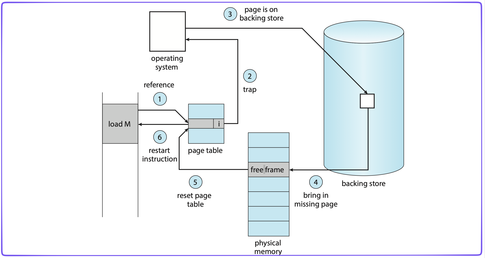

# Chương 8. Bộ Nhớ Ảo

## Tổng Quan Về Bộ Nhớ Ảo

Ôn tập các chương trước và dẫn nhập giới thiệu bộ nhớ ảo, trình bày mục tiêu và nội dung chương 8 - Bộ nhớ ảo và trình bày giới thiệu tổng quan về bộ nhớ ảo.

Mục tiêu:

- Khái niệm tổng quan về bộ nhớ ảo.
- Hiểu và vận dụng các kỹ thuật cài đặt bộ nhớ ảo: demand paging, demand segmentation.
- Hiểu các vấn đề: frames, thrashing.

Nội dung:

- Tổng quan về bộ nhớ ảo.
- Cài đặt bộ nhớ ảo: demand paging
- Các giải thuật thay trang (Page Replacement Algorithms).
- Vấn đề cấp phát Frames.
- Vấn đề Thrashing.

### Tổng Quan Về Bộ Nhớ Ảo

#### Nhắc Lại Cơ Chế Dynamic Loading

- Cơ chế:
    - Chỉ khi nào cần được gọi đến thì một thủ tục mới được nạp vào bộ nhớ chính.
    - Tăng độ hiệu dụng của bộ nhớ bởi vì các thủ tục không được gọi đến sẽ không chiếm chỗ trong bộ nhớ.
- Rất hiệu quả trong trường hợp:
    - Tồn tại khối lượng mã lớn
    - Có tần suất sử dụng thấp
    - Không được sử dụng thường xuyên.
- Hỗ trợ từ hệ điều hành:
    - Thông thường, user chịu trách nhiệm thiết kế và thực hiện các chương trình có dynamic loading.
    - Hệ điều hành chủ yếu cung cấp một số thủ tục thư viện hỗ trợ, tạo điều kiện dễ dàng hơn cho lập trình viên.

#### Tổng Quan Về Bộ Nhớ Ảo

- Nhận xét:
    - Không phải tất cả các phần của một process cần thiết phải được nạp vào bộ nhớ chính tại cùng một thời điểm.
- Ví dụ:
    - Đoạn mã điều khiển các lỗi hiếm khi xẩy ra.
    - Các arrays, list, table được cấp phát bộ bộ nhớ (tĩnh) nhiều hơn yêu cầu thực sự.
    - Các tính năng ít khi được dùng của một chương trình.
    - Cả chương trình thì cũng có đoạn chưa được dùng.
- Ưu điểm:
    - Số lượng process trong bộ nhớ nhiều hơn.
    - Một process có thể thực thi ngay cả khi kích thước của nó lớn hơn bộ nhớ thực.
    - Giảm nhẹ công việc của lập trình viên.
- Không gian tráo đổi giữa bộ nhớ chính và bộ nhớ phụ (swap space)
    - swap partition trong Linux.
    - `pagefile.sys` trong Windows.

### Quiz: Tổng Quan Về Bộ Nhớ Ảo

> [!NOTE]
> Phát biểu sau đúng hay sai? “Nếu như hệ thống không cần nạp toàn bộ tiến trình vào bộ nhớ vật lý để thực thi, hệ thống có thể tận dụng dung lượng bộ nhớ còn lại để chạy nhiều tiến trình khác?
> 
> - [x] True
> - [ ] False

> [!NOTE]
> Những yêu cầu nào sau đây KHÔNG phải là ưu điểm của bộ nhớ ảo?
> 
> - [ ] Giảm nhẹ công việc của lập trình viên
> - [ ] Một process có thể thực thi ngay cả khi kích thước của nó lớn hơn bộ nhớ thực
> - [ ] Số lượng process trong bộ nhớ nhiều hơn
> - [x] Cho phép các tiến trình được tự chia sẻ vùng nhớ chung

> [!NOTE]
> Bộ nhớ ảo là một kỹ thuật cho phép xử lý?
> 
> - [ ] Một tiến trình phải được nạp toàn bộ vào bộ nhớ vật lý
> - [ ] Chương trình chỉ cần nằm trên ổ cứng là có thể thực thi
> - [x] Một tiến trình không được nạp toàn bộ vào bộ nhớ vật lý
> - [ ] Tất cả đều đúng

## Cài Đặt Bộ Nhớ Ảo - Demand Paging

- Có 2 kỹ thuật:
    - Phân trang theo yêu cầu: Demand Paging.
    - Phân đoạn theo yêu cầu: Demand Segmentation.
- Phần cứng memory management phải hỗ trợ paging và/hoặc segmentation.
- OS phải quản lý sự di chuyển của trang/đoạn giữa bộ nhớ chính và bộ nhớ thứ cấp.
- Trong chương này:
    - Demand Paging.
    - Phần cứng hỗ trợ thực hiện bộ nhớ ảo.
    - Các giải thuật của hệ điều hành.

[[Hệ điều hành] Chương 8.2: Cài đặt bộ nhớ ảo](https://www.youtube.com/watch?v=pVdtFsBKB24)

### Cơ Chế Phân Trang

- Demand Paging:
    - các trang của tiến trình chỉ được nạp vào bộ nhớ chính khi được yêu cầu.
    - Khi có một tham chiếu đến một trang mà không có trong bộ nhớ chính (valid bit) thì phần cứng sẽ gây ra một ngắt (page-fault trap) kích khởi page-fault service routing (PFSR) của hệ điều hành.
    - PFSR:
        - 1. Chuyển process về trạng thái `blockd`.
        - 2. Phát ra một yêu cầu đọc đĩa để nạp trang được tham chiếu vào một frame trống; trong khi đợi I/O, một process khác được cấp CPU để thực thi.
            - Xác định vị trí trên đĩa của trang đang cần.
            - Tìm một frame trống:
                - Nếu có frame trống thì dùng nó.
                - Nếu không có frame trống thì dùng một giải thuật thay trang để chọn một trang hi sinh (victim page).
                - Ghi victim page ra đĩa, cập nhật page table và frame table tương ứng.
            - Đọc trang đang cần vào frame trống vừa tìm ra/tạo ra.
        - 3. Sau khi I/O hoàn tất, đĩa gây ra một ngắt đến hệ điều hành; PFSR cập nhật page table và chuyển process và trạng thái `ready`.

Hai vấn đề chủ yếu:

- Frame-allocation algorithm
    - Cấp phát cho process bao nhiêu frame của bộ nhớ thực
- Page-replacement algorithm
    - Chọn frame của process sẽ được thay thế trang nhớ.
    - Mục tiêu: số lượng page-fault nhỏ nhất.
    - Được đánh giá bằng cách thực thi giải thuật đối với một chuỗi tham chiếu bộ nhớ (memory reference string) và xác định số lần xảy ra page fault.

### Quiz: Cài đặt bộ nhớ ảo - Demand Paging

> [!NOTE]
> Hoàn thiện câu sau bằng cách điền vào chỗ trống?
> 
> Ở bước 3 khi thực hiện page-fault service routine, sau khi I/O hoàn tất, đĩa gây ra một `____` đến hệ điều hành; PFSR cập nhật page table và chuyển process về trạng thái ready
> 
> - ngắt

> [!NOTE]
> Công việc nào KHÔNG phải là một công việc của Page-fault service routine?
> 
> - [x] Chuyển tất cả các trang của tiến trình ra khỏi bộ nhớ chính
> - [ ] Chuyển tiến trình về trạng thái blocked.
> - [ ] Phát ra một yêu cầu đọc đĩa để nạp trang được tham chiếu vào một frame trống
> - [ ] Sau khi I/O hoàn tất, đĩa gây ra một ngắt đến hệ điều hành; PFSR cập nhật page table và chuyển process về trạng thái ready

> [!NOTE]
> Hệ điều hành phải hỗ trợ cả 2 cơ chế Demand Paging (phân trang theo yêu cầu) và Demand Segmentation (phân đoạn theo yêu cầu) để có thể hiện thực được bộ nhớ ảo?
> 
> - [ ] True    
> - [x] False
