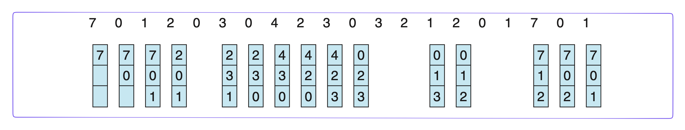
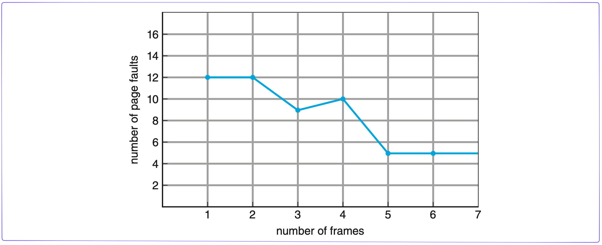
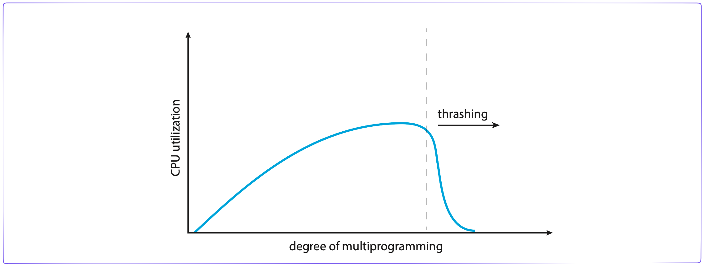

# Chương 8. Bộ Nhớ Ảo

Trong chương trước, chúng ta đã thảo luận về các chiến lượng quản lý bộ nhớ trong hệ thống máy tính. Tất cả những chiến lược này đều có một mục tiêu chung: giữ càng nhiều tiến trình chạy đồng thời trong bộ nhớ chính càng tốt để cho phép đa chương (multiprogramming). Dù vậy, những chiến lược này có xu hướng nạp toàn bộ tiến trình vào trong bộ nhớ chính trước khi nó được thực thi.

Bộ nhớ ảo là một kỹ thuật cho phép tiến trình được thực thi mà không cần được nạp toàn bộ vào trong bộ nhớ chính. Ưu điểm chính của mô hình này là các chương trình có thể có dung lượng lớn hơn cả bộ nhớ vật lý. Hơn nữa, bộ nhớ ảo trừu tượng hóa bộ nhớ chính thành một mảng lưu trữ thống nhất, cực kỳ lớn, tách bộ nhớ luận lý dưới góc độ của lập trình viên khỏi bộ nhớ vật lý. Kỹ thuật này giải phóng các lập trình viên khỏi lo lắng về vấn đề giới hạn dung lượng của bộ nhớ chính. Bộ nhớ ảo cũng cho phép các tiến trình chia sẻ các file, thư viện và hiện thực mô hình bộ nhớ chia sẻ. Ngoài ra, nó cũng cung cấp một cơ chế hiệu quả để tạo tiến trình. Tuy vậy, việc hiện thực bộ nhớ ảo không hề dễ dàng và có thể gây giảm hiệu suất nghiêm trọng nếu như được dùng không cẩn thẩn. Trong chương này, chúng ta sẽ thảo luận chi tiết về bộ nhớ ảo, cách hiện thực nó và tìm hiểu về độ phức tạp dũng như các lợi ích của mô hình này.

Ôn tập các chương trước và dẫn nhập giới thiệu bộ nhớ ảo, trình bày mục tiêu và nội dung chương 8 - Bộ nhớ ảo và trình bày giới thiệu tổng quan về bộ nhớ ảo.

Mục tiêu:

- Khái niệm tổng quan về bộ nhớ ảo.
- Hiểu và vận dụng các kỹ thuật cài đặt bộ nhớ ảo: demand paging, demand segmentation.
- Hiểu các vấn đề: frames, thrashing.

Nội dung:

- Tổng quan về bộ nhớ ảo.
- Cài đặt bộ nhớ ảo: demand paging
- Các giải thuật thay trang (Page Replacement Algorithms).
- Vấn đề cấp phát Frames.
- Vấn đề Thrashing.

## Tổng Quan Về Bộ Nhớ Ảo

### Tổng Quan Về Bộ Nhớ Ảo

#### Nhắc Lại Cơ Chế Dynamic Loading

- Cơ chế:
    - Chỉ khi nào cần được gọi đến thì một thủ tục mới được nạp vào bộ nhớ chính.
    - Tăng độ hiệu dụng của bộ nhớ bởi vì các thủ tục không được gọi đến sẽ không chiếm chỗ trong bộ nhớ.
- Rất hiệu quả trong trường hợp:
    - Tồn tại khối lượng mã lớn
    - Có tần suất sử dụng thấp
    - Không được sử dụng thường xuyên.
- Hỗ trợ từ hệ điều hành:
    - Thông thường, user chịu trách nhiệm thiết kế và thực hiện các chương trình có dynamic loading.
    - Hệ điều hành chủ yếu cung cấp một số thủ tục thư viện hỗ trợ, tạo điều kiện dễ dàng hơn cho lập trình viên.

#### Tổng Quan Về Bộ Nhớ Ảo

- Nhận xét:
    - Không phải tất cả các phần của một process cần thiết phải được nạp vào bộ nhớ chính tại cùng một thời điểm.
- Ví dụ:
    - Đoạn mã điều khiển các lỗi hiếm khi xẩy ra.
    - Các arrays, list, table được cấp phát bộ bộ nhớ (tĩnh) nhiều hơn yêu cầu thực sự.
    - Các tính năng ít khi được dùng của một chương trình.
    - Cả chương trình thì cũng có đoạn chưa được dùng.
- Ưu điểm:
    - Số lượng process trong bộ nhớ nhiều hơn.
    - Một process có thể thực thi ngay cả khi kích thước của nó lớn hơn bộ nhớ thực.
    - Giảm nhẹ công việc của lập trình viên.
- Không gian tráo đổi giữa bộ nhớ chính và bộ nhớ phụ (swap space)
    - swap partition trong Linux.
    - `pagefile.sys` trong Windows.

### Quiz: Tổng Quan Về Bộ Nhớ Ảo

> [!NOTE]
> Phát biểu sau đúng hay sai? “Nếu như hệ thống không cần nạp toàn bộ tiến trình vào bộ nhớ vật lý để thực thi, hệ thống có thể tận dụng dung lượng bộ nhớ còn lại để chạy nhiều tiến trình khác?
> 
> - [x] True
> - [ ] False

> [!NOTE]
> Những yêu cầu nào sau đây KHÔNG phải là ưu điểm của bộ nhớ ảo?
> 
> - [ ] Giảm nhẹ công việc của lập trình viên
> - [ ] Một process có thể thực thi ngay cả khi kích thước của nó lớn hơn bộ nhớ thực
> - [ ] Số lượng process trong bộ nhớ nhiều hơn
> - [x] Cho phép các tiến trình được tự chia sẻ vùng nhớ chung

> [!NOTE]
> Bộ nhớ ảo là một kỹ thuật cho phép xử lý?
> 
> - [ ] Một tiến trình phải được nạp toàn bộ vào bộ nhớ vật lý
> - [ ] Chương trình chỉ cần nằm trên ổ cứng là có thể thực thi
> - [x] Một tiến trình không được nạp toàn bộ vào bộ nhớ vật lý
> - [ ] Tất cả đều đúng

## Cài Đặt Bộ Nhớ Ảo - Demand Paging

- [[Hệ điều hành] Chương 8.2: Cài đặt bộ nhớ ảo](https://www.youtube.com/watch?v=pVdtFsBKB24)

- Có 2 kỹ thuật:
    - Phân trang theo yêu cầu: Demand Paging.
    - Phân đoạn theo yêu cầu: Demand Segmentation.
- Phần cứng memory management phải hỗ trợ paging và/hoặc segmentation.
- OS phải quản lý sự di chuyển của trang/đoạn giữa bộ nhớ chính và bộ nhớ thứ cấp.
- Trong chương này:
    - Demand Paging.
    - Phần cứng hỗ trợ thực hiện bộ nhớ ảo.
    - Các giải thuật của hệ điều hành.

### Cơ Chế Phân Trang

- Demand Paging:
    - các trang của tiến trình chỉ được nạp vào bộ nhớ chính khi được yêu cầu.
    - Khi có một tham chiếu đến một trang mà không có trong bộ nhớ chính (valid bit) thì phần cứng sẽ gây ra một ngắt (page-fault trap) kích khởi page-fault service routing (PFSR) của hệ điều hành.
    - PFSR:
        - 1. Chuyển process về trạng thái `blockd`.
        - 2. Phát ra một yêu cầu đọc đĩa để nạp trang được tham chiếu vào một frame trống; trong khi đợi I/O, một process khác được cấp CPU để thực thi.
            - Xác định vị trí trên đĩa của trang đang cần.
            - Tìm một frame trống:
                - Nếu có frame trống thì dùng nó.
                - Nếu không có frame trống thì dùng một giải thuật thay trang để chọn một trang hi sinh (victim page).
                - Ghi victim page ra đĩa, cập nhật page table và frame table tương ứng.
            - Đọc trang đang cần vào frame trống vừa tìm ra/tạo ra.
        - 3. Sau khi I/O hoàn tất, đĩa gây ra một ngắt đến hệ điều hành; PFSR cập nhật page table và chuyển process và trạng thái `ready`.

Hai vấn đề chủ yếu:

- Frame-allocation algorithm
    - Cấp phát cho process bao nhiêu frame của bộ nhớ thực
- Page-replacement algorithm
    - Chọn frame của process sẽ được thay thế trang nhớ.
    - Mục tiêu: số lượng page-fault nhỏ nhất.
    - Được đánh giá bằng cách thực thi giải thuật đối với một chuỗi tham chiếu bộ nhớ (memory reference string) và xác định số lần xảy ra page fault.

### Quiz: Cài đặt bộ nhớ ảo - Demand Paging

> [!NOTE]
> Hoàn thiện câu sau bằng cách điền vào chỗ trống?
> 
> Ở bước 3 khi thực hiện page-fault service routine, sau khi I/O hoàn tất, đĩa gây ra một `____` đến hệ điều hành; PFSR cập nhật page table và chuyển process về trạng thái ready
> 
> - ngắt

> [!NOTE]
> Công việc nào KHÔNG phải là một công việc của Page-fault service routine?
> 
> - [x] Chuyển tất cả các trang của tiến trình ra khỏi bộ nhớ chính
> - [ ] Chuyển tiến trình về trạng thái blocked.
> - [ ] Phát ra một yêu cầu đọc đĩa để nạp trang được tham chiếu vào một frame trống
> - [ ] Sau khi I/O hoàn tất, đĩa gây ra một ngắt đến hệ điều hành; PFSR cập nhật page table và chuyển process về trạng thái ready

> [!NOTE]
> Hệ điều hành phải hỗ trợ cả 2 cơ chế Demand Paging (phân trang theo yêu cầu) và Demand Segmentation (phân đoạn theo yêu cầu) để có thể hiện thực được bộ nhớ ảo?
> 
> - [ ] True    
> - [x] False

### Các Giải Thuật Thay Thế Trang

Trình bày về các giải thuật thay thế trang phổ biến trong kỹ thuật phân trang theo yêu cầu bao gồm giải thuật thay trang FIFO, OPT và LRU.

- [[Hệ điều hành] Chương 8.3: Các giải thuật thay trang](https://www.youtube.com/watch?v=UiLPxEu1Plg)

Các giải thuật thay thế trang

- Các giải thuật
    - FIFO
    - OPT
    - LRU
- Các dữ liệu ban đầu:
    - Số khung trang.
    - Trình trạng ban đầu.
    - Chuỗi tham chiếu.

### FIFO

- Thay thế trang nhớ có thời gian sớm nhất trong các trang nhớ trong 3 khung trang.

Ví dụ:
- Một tiến trình có 8 trang, chuỗi tham chiếu:
    - 7, 0, 1, 2, 0, 3, 4, 2, 3, 0, 3, 2, 1, 2, 0, 1, 7, 0, 1
- Số khung trang: 3 frames
- Tình trạng ban đầu: các khung trang đều trống.

#### Nghịch Lý Belady

- 3 khung trang: 9 lỗi.
- 4 khung trang: 10 lỗi.

### OPT

- Thay thế trang nhớ sẽ được tham chiếu trễ nhất trong tương lai
    - Cần biết trước các trang sẽ được tham chiếu trong tương lai.

### LRU

- Mỗi trang được ghi nhận (trong bảng phân trang) thời điểm được tham chiếu
    - Trang LRU là trang nhớ có thời điểm tham chiếu nhỏ nhất
    - OS tốn chi phí tìm kiếm trang nhớ LRU này mỗi khi có page fault.
- Do vậy, LRU cần sự hỗ trợ của phần cứng và chi phí cho việc tìm kiếm.
    - Ít CPU cung cấp đủ sự hỗ trợ phần cứng cho giải thuật LRU.

### So sánh LRU vs FIFO

### Quiz: Các Giải Thuật Thay Thế Trang

> [!NOTE]
> Giả sử một tiến trình được cấp 4 khung trang trong bộ nhớ vật lý và 8 trang trong bộ nhớ ảo. Tại thời điểm nạp tiến trình vào, 4 khung trang trên bộ nhớ vật lý này đang trống. Tiến trình truy xuất 8 trang (`1, 2, 3, 4, 5, 6, 7, 8`) trong bộ nhớ ảo theo thứ tự như sau:
> 
> - `1 4 2 6 8 8 7 1 5 2 3 5 1 4 2 1 3 4 8 7`
> 
> Tại thời điểm tiến trình truy xuất trang nhớ số 3 lần đầu tiên, có tất cả bao nhiêu lỗi trang đã xảy ra (không tính lỗi trang xảy ra khi nạp trang nhớ số 3 vào), nếu sử dụng giải thuật thay thế trang OPT?
> 
> - [x] 7 lỗi trang
> - [ ] 6 lỗi trang
> - [ ] 8 lỗi trang
> - [ ] 9 lỗi trang

> [!NOTE]
> Hoàn thiện câu sau bằng cách điền vào chỗ trống?
> 
> Giả sử một tiến trình được cấp 4 khung trang trong bộ nhớ vật lý và 8 trang trong bộ nhớ ảo. Tại thời điểm nạp tiến trình vào, 4 khung trang trên bộ nhớ vật lý này đang trống. Tiến trình truy xuất 8 trang (1, 2, 3, 4, 5, 6, 7, 8) trong bộ nhớ ảo theo thứ tự như sau:
> 
> `1 4 2 6 8 8 7 1 5 2 3 5 1 4 2 1 3 4 8 7`
> 
> Nếu áp dụng chiến lược OPT, có tổng cộng `____`  lỗi trang sẽ xuất hiện.
> - 11

> [!NOTE]
> Trong kỹ thuật phân trang theo yêu cầu, số lượng lỗi trang sẽ bị ảnh hưởng bởi CÁC yếu tố nào sau đây?
> 
> - [x] Số khung trang tiến trình được cấp phát
> - [x] Chiến lược thay thế trang
> - [ ] Tốc độ truy xuất của bộ nhớ chính 
> - [ ] Tốc độ xử lý của CPU
> 
> Hoàn thiện câu sau bằng cách điền vào chỗ trống?

> [!NOTE]
> Giả sử một tiến trình được cấp 4 khung trang trong bộ nhớ vật lý và 8 trang trong bộ nhớ ảo. Tại thời điểm nạp tiến trình vào, 4 khung trang trên bộ nhớ vật lý này đang trống. Tiến trình truy xuất 8 trang (1, 2, 3, 4, 5, 6, 7, 8) trong bộ nhớ ảo theo thứ tự như sau:
> 
> 1 4 2 6 8 8 7 1 5 2 3 5 1 4 2 1 3 4 8 7
> 
> Nếu áp dụng chiến lược OPT, trang nhớ số `____` là trang nhớ tồn tại trong bộ nhớ chính ngắn nhất.
> 
> - 6

Bài giải:

| Alg   | OPT | 1   | 4   | 2   | 6   | 8   | 8   | 7   | 1   | 5   | 2   | 3   | 5   | 1   | 4   | 2   | 1   | 3   | 4   | 8   | 7   |
| ----- | --- | --- | --- | --- | --- | --- | --- | --- | --- | --- | --- | --- | --- | --- | --- | --- | --- | --- | --- | --- | --- |
| 1     |     | 1   | 1   | 1   | 1   | 1   | 1   | 1   | 1   | 1   | 1   | 1   | 1   | 1   | 1   | 1   | 1   | 1   | 1   | 1   | 1   |
| 2     |     |     | 4   | 4   | 4   | 4   | 4   | 4   | 4   | 4   | 4   | 3   | 3   | 3   | 3   | 3   | 3   | 3   | 3   | 3   | 7   |
| 3     |     |     |     | 2   | 2   | 2   | 2   | 2   | 2   | 2   | 2   | 2   | 2   | 2   | 2   | 2   | 2   | 2   | 2   | 2   | 2   |
| 4     |     |     |     |     | 6   | 8   | 8   | 7   | 7   | 5   | 5   | 5   | 5   | 5   | 4   | 4   | 4   | 4   | 4   | 8   | 8   |
| Total | 11  | *   | *   | *   | *   | *   |     | *   |     | *   |     | *   |     |     | *   |     |     |     |     | *   | *   |

## Vấn Đề Cấp Phát Frames

Trình bày về vấn đề cấp phát Frames trong kỹ thuật phân trang theo yêu cầu như số lượng Frames và các chiến lược cấp phát

- [[Hệ điều hành] Chương 8.4: Vấn đề cấp phát Frames](https://www.youtube.com/watch?v=6AgN-w2XLAY)

### Số Lượng Frame Cấp Cho Process

- OS phải quyết định cấp cho mỗi process bao nhiêu frame.
    - Cấp ít frame => nhiều page fault.
    - Cấp nhiều frame => giảm mức độ multiprogramming.
- Chiến lượng cấp phát tĩnh (fixed-allocation)
    - Số frame cấp cho mỗi process không đổi.
    - Được xác định vào thời điểm loading.
    - Có thể phụ thuộc vào từng ứng dụng.
- Chiến lược cấp phát động (variable-allocation)
    - Số frame cấp cho mỗi process có thể thay đổi trong khi nó chạy.
        - Nếu tỉ lệ page fault cao: cấp thêm frame.
        - Nếu tỉ lệ page fault thấp: giảm bớt frame.
- OS phải mất chi phí để ước định các process.

### Cấp Phát Tĩnh

- Cấp phát bằng nhau:
    - Tổng frames / tổng tiến trình.
    - Ví dụ có 1000 frames và 5 process -> mỗi process 20 frames.
- Cấp phát theo tỉ lệ:
    - dựa vào kích thước process.
    - $s_i$ : kích thước của process $p_i$
    - $S = \Sigma S_i$
    - $m$: tổng số lượng frames
    - $a_i$: số lượng cấp cho $p_i$

$$
a_i = \frac{s_i}{S} \times m
$$

- Ví dụ:
    - $m = 64; s_i = 10; s_2 = 127$
    - $a_1 = \frac{10}{137} \times 64 \approx 5$
    - $a_2 = \frac{127}{137} \times 64 \approx 59$

- Cấp phát theo độ ưu tiên.

### Quiz: Vấn Đề Cấp Phát Frames

> [!NOTE]
> Phát biểu “Số frame cấp cho mỗi process không đổi, được xác định vào thời điểm loading và có thể tùy thuộc vào từng ứng dụng (kích thước của nó)” là chiến lược cấp phát frame theo phương pháp?
> 
> - [ ] Chiến lược cấp phát động
> - [ ] Chiến lược cấp phát tùy chọn
> - [x] Chiến lược cấp phát tĩnh
> - [ ] Tất cả đều sai

> [!NOTE]
> Giả sử một hệ thống có bộ nhớ chính được chia thành 120 frames chứa 3 tiến trình theo chiến lược cấp phát tĩnh theo tỷ lệ. Trong đó kích thước các tiến trình lần lược là P1 - 50 pages, P2 - 100 pages, P3 - 90 pages, hỏi tiến trình P3 sẽ được cấp bao nhiêu frames?
> 
> - [ ] 50
> - [ ] 40
> - [x] 45
> - [ ] 25

- $a_3 = \frac{90}{240} x 120 = 45$

## Vấn Đề Thrashing

Trình bày về vấn đề trì trệ trên toàn bộ hệ thống (thrashing) khi mà các trang nhớ của một process bị hoán chuyển vào/ra liên tục. Sau đó trình bày về mô hình cục bộ để hạn chế tình trạng thrashing.

### Trì trệ trên toàn bộ hệ thống

- Nếu một process không có đủ số frame cần thiết thì tỉ lệ page fault/sec rất cao.
- Thrashing: hiện tượng các trang nhớ của một process bị hoán chuyển vào/ra liên tục.

### Mô hình cục bộ

- Để hạn chế thrashing:
    - OS phải cung cấp cho process càng "đủ" frame càng tốt.
    - Bao nhiêu là đủ cho một process cụ thể để thực thi hiệu quả?
- Nguyên lý locality (locality principle)
    - Locality là tập các trang được tham chiếu gần nhau.
    - Một process gồm nhiều locality, và trong quá trình thực thi, process sẽ chuyển từ locality này sang locality khác.
- Vì sao xuất hiện thrashing
    - Khi $\Sigma ~size~of~locality > memory~size$

### Giải pháp tập làm việc (working-set)

- Được thiết kế dựa trên nguyên lý locality.
- Xác định xem process thực sự sử dụng bao nhiêu frame.
- Định nghĩa:
    - $WS(t)$: các tham chiếu trang nhớ của process gần đây nhất được quan sát.
    - $\Delta$: khoảng thời giant ham chiếu.
- Ví dụ:
    - $\Delta = 10$
    - $P_i$: Tiến trình $i$
    - $WS(i)$: Working set của $P_i$
        - $WS(t_1) = {1, 2, 5, 6, 7}$
        - $WS(t_2) = {3, 4}$

- Nhận xét:
    - Nếu $\Delta$ quá nhỏ: không đủ bao phủ toàn bộ locality.
    - Nếu $\Delta$ quá lớn: bao phủ nhiều locality khác nhau.
    - Nếu $\Delta = \infty$ : bao gồm tất cả các trang được sử dụng; có nghĩa không có locality.
- Dùng một working set của một process để xấp xỉ locality của nó.
- Định nghĩa:
    - $WSSi$: kích thước của working set của $P_i$.
    - $WSSi$ = số lượng các trang trong $WSi$.
    - $WS(i)$: Working set của $P_i$
        - $WS(t_1) = {1, 2, 5, 6, 7}$
            - $WSSi = 5$
        - $WS(t_2) = {3, 4}$
            - $WSSi = 2$
- Đặt $D = \Sigma WSSi$ = tổng các working-set size của mọi process trong hệ thống:
    - Nếu $D > m$: sẽ xảy ra thrashing.
- Giải pháp working set:
    - Khi khởi tạo một tiến trình: cung cấp cho tiến trình số lượng frame thỏa mãn working-set size của nó.
    - Nếu $D > m \Rightarrow$ tạm dựng một trong các process.
        - Các trang của tiến trình được chuyển ra đĩa cứng và các frame của nó được thu hồi.
- WS loại trừ được tình trạng trì trệ mà vẫn đảm bảo mức độ đa chương.
    - Theo vết các $WSx \Rightarrow WS~xấp~xỉ$.
- Đọc thêm:
    - Hệ thống tập tin.
    - Hệ thống nhập xuất.
    - Hệ thống phân tán.
